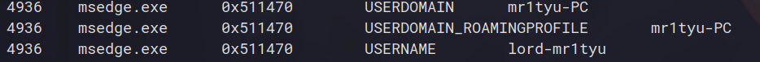

## Challenge Name : Infant Mem
Category: Forensics
Points:  58
Difficulty: Beginner

Artifact files:
* [mr1tyu.raw](https://drive.google.com/drive/folders/1-vLg1QfKqWjPlQXrzX16ZwwlKiE6Ja3Q)

Description: Here is that one last minute chall....because of-course I can't skip Memory Analysis!! Find the Device Name of my OS followed by name of Local User!!
Remember to enclose it around flag format!!

Flag Format : 0CTF{devicename-XX_local-user}

### Quick solve

This challenge was actually really simple as all we are asked to give is the device's name and the local user.
The file that is given to us is a windows dump that can be analyzed using tools like volatility.

In order to solve this challenge, all you had to do was run the command `vol -f mr1tyu.raw windows.envars`
which would print out all the environment variables which contain a lot of references to the username and
the device's name:

This gives us the two values we needed : 
- the local user's name : lord-mr1tyu
- the device's name mr1tyu-PC

Together giving us the flag : 0CTF{mr1tyu-PC_lord-mr1tyu}

[Back](../../README.md)