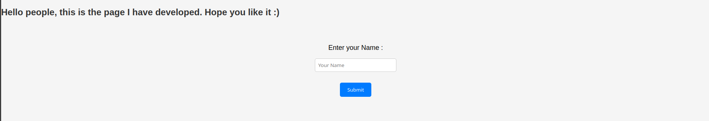
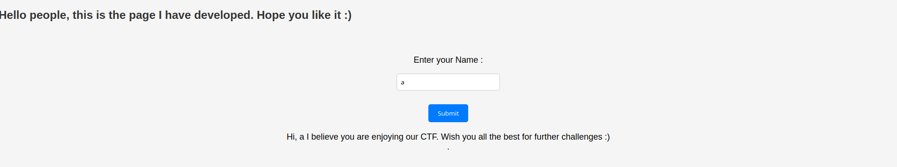
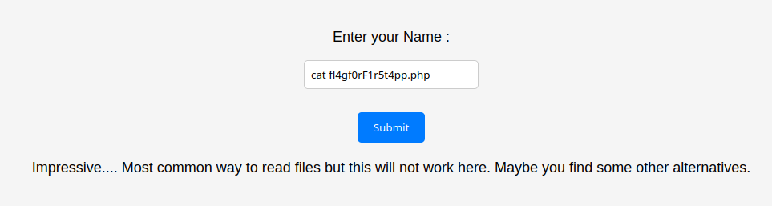
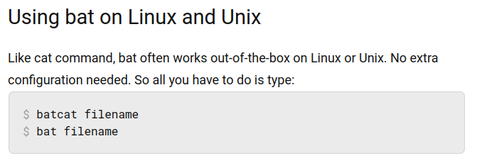
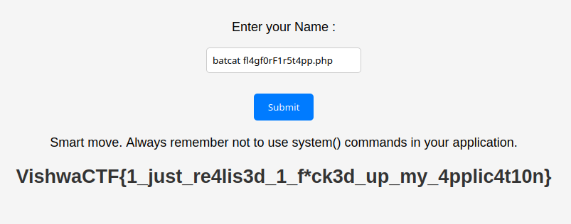

## Challenge Name: First App
Category: Web
Points: 100
Solves: 12
Author: Ankush Kaudi (@itsbunny07)

Challenge Description: 
After struggling for 2 days finally made my first web page. Still wondering why did I use Linux to host this.

Website:
https://ch170136859.ch.eng.run/

### Observations

At first when coming onto the site we are met with a simple form asking for our name.
When a string is given it'll return it as such : 

Looking inside the code we can see that using this form makes a POST request to the endpoint /fl4gf0rF1r5t4pp.php !
Clearly this is where we're supposed to find the flag. 

However since the challenge didn't give much other info on the website I got lost for a WHILE here just trying a bunch
of different inputs and ideas none of them really worked out so I ended up going back to reading the challenge description.

What really stands out in the description is how they point out the fact that the host is running **linux**. Pointing
us towards a potential *Command Injection*. After trying different string escape command injection it turned out that just trying
to read the php file by typing `cat fl4gf0rF1r5t4pp.php` sends us a different message ! 

Mmmm an alternative to cat command. If we just google "alternative to cat command linux" we instantly get "bat" as a popular alternative
Looking further into this and trying the same input but with "bat" instead of "cat" didn't lead to anything but with further research
I found that "batcat" is also a command with the "bat" module:

Now let's try using "batcat fl4gf0rF1r5t4pp.php" as our payload.

### Solve

Well, I guess that was it lol. A quite confusing challenge overall which took way too much time as it should have.
Flag: VishwaCTF{1_just_re4lis3d_1_f*ck3d_up_my_4pplic4t10n}

---
[Back to home](../../README.md)
