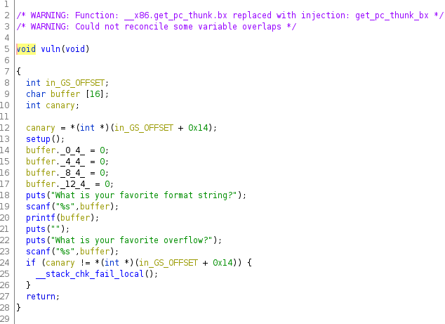

## Challenge Name: String0
Category: PWN
Points: 374
Solves: 60

Challenge Description: 
What type of string again?

Artifact Files:
* [String0](String0)

### Observations

This time we're not given any direct source code to know what's happening behind the scene so we'll have to find out ourselves !
For this challenge I used ghidra to see the source code (I didn't want to bother myself too much with assembly when I did this challenge at 3AM).
So let's see what we get once we open Ghidra !

We can see that just like the previous challenge, we have a **print_flag()** function.

(Note that the string value of the flag in the decompiler is just a fake flag that's given in the source code because this is pwning not reversing haha).

Now let's take a look at what other function we have...

The main function is calling a **vuln()** function which is likely to be where the interesting stuff happens....
Let's follow that and look at that said function :

So we can see a buffer is being defined at the beginning of the function with type **char[16]**, after which we see an int that I renamed "*canary*" within the ghidra editor since I suspected it to be a stack Canary (or Stack Cookie). We can make sure that's the case by using the **checksec** command on the binary.

So we indeed have a canary to protect against Stack Smashing in the binary! It's also interesting to note for later that this binary is a 32bit ELF binary (i386).

Continuing with the rest of the program we have a call to **puts()** that prints "*What is your favorite format string?*" to the screen before taking input from the user and placing it into our buffer (**!!!Without any checks of length!!!**), it then prints our input back in a **VERY INTERESTING** way (more on that later). Then we have another call to **puts()** that prints "*What is your favorite overflow?*" this time and again takes user input and putting it into our buffer without any checks of input length.

Both of the messages that are sent by the program before input are clear hints of what this challenge is all about, we first have a **Format String Vulnerability** followed by a **Stack Buffer Overflow**. We can see that by the fact that **printf(buffer);** is called with user input as the format string argument which can lead to memory leak or more but in our case we will only need to use of the memory leak aspect of the vulnerability.

Then we can use the **Stack Buffer Overflow** to overwrite **EIP** (instruction pointer) and make it return to the **print_flag()** function ! Buuuut there's a catch this challenge isn't that easy also it would be a little weird to just do the exact same challenge twice in a single ctf. 

Remember, we have a **Stack Canary** protection applied to this binary. The canary value is an arbitrarly choosen random value which is put by the compiler at the beginning of the stack usually when a function is called and rechecked at the end of that function to see if a **Stack Smashing** happened (in other words, if the value was overwritten from an overflow in the stack). This is problematic since if we just tried to overwrite **EIP** without caring about this the program will detect that we are overwriting memory in the stack and instantly terminate before we get to call **print_flag()**.

**So how do we deal with that ????**

Well, we can use the memory leak from the **Format String Vulnerability** !!

As you can see, when using the **%x** format in our format string the **printf()** function tries to get arguments to replace the **%x** but since the function doesn't provide any it tries to grab data from the stack, thus leaking stack memory for us !!!

To just show one DWORD (4 bytes) of data from the stack at a time we can use the **%i$x** with **i** being the "index" of the 4 bytes we want to grab from the stack memory. 

**So now let's find the index that leaks us the canary value !**

We can use GDB to search for that and set a breakpoint when the canary is loaded from the **gs** register so that we can compare it with the output from our Format String payload and try different indexes.

Now let's run the program and see if our setup is working.

Since we put a breakpoint when the canary was loaded in **EAX** register we can check the value of **EAX** when we hit the breakpoint and it should display the value of the canary (at least for that execution of the program since the canary is set to a new value everytime the **vuln()** function is called).

In this case we can see that the canary is set to **0x305ee200** !

Now let's try to find it with our format string and see if we have a match
I tried, %1$x, %2$x, %3$x... until I got a matching value at **%11$x**

As you can see the value that's being displayed does fit the value we got in **EAX** register which means that **%11$x** will leak us the canary !

Now, knowing that the idea would be to include the canary in our buffer overflow payload so that the canary gets overwritten with it's own value thus not triggering the stack smashing protection...

We can see from those assembly instructions that the canary is stored at address **ebp-0xc** and our input buffer is stored at address **ebp-0x1c**
We can calculate the offset to the canary from the start of our buffer by substracting the canary address to the buffer address :

*0x1c - 0xc = 29 - 13 = 16 bytes*

So we know the offset to the canary is exactly **16 bytes** !

Now let's try to find the offset to **EIP** for our Buffer Overflow exploit, fortunately gdb allows us to just ignore the stack check at the end of the function so that we can find the offset to EIP

Let's first set a breakpoint before the stack check.

Then run the program, leak the stack canary (so that we can put it back in it's place after the overflow) and overflow the buffer with a cyclic pattern to calculate the offset with gdb-peda. If everything goes as planned it should hit the breakpoint before the stack check !

Pattern : *AAA%AAsAABAA$AAnAACAA-AA(AADAA;AA)AAEAAaAA0AAFAAbA*

Then we hit our breakpoint and replace the canary address with the value we leaked earlier so that the stack_check doesn't detect our overflow !

Now all we have to do is continue the debugging and we should run into a **SIGSEGV** after which we'll run the **pattern search** command and get the offset to **EIP** :D

And we find the **EIP** offset to be **32 bytes** after the buffer ! which means we're all set to go the exploitation phase now :)

### Exploitation

Now it's time to code an exploit script ! For this i'm gonna use python3 and pwntools :)
First thing first, let's setup the context and load the ELF data of the binary so that we can extract the address of **print_flag()**

I also put all the data we got from our analysis of the binary into variables to make it easier to understand.

Now, let's connect to the remote server and send the **%11$x** payload to leak the canary and load it into a variable in our program !

Now all that's left is to craft our buffer overflow payload with our canary to successfully manipulate **EIP** and return to **print_flag()** !
The payload we want to craft will look like this : 

And that's our script ! In it's entirety it should look something like this : 

And if everything goes well, the program will call the **print_flag()** function and print us the flag !
Let's try it out on the ctf remote host :)

And we got the flag ! We successfully bypassed the stack canary and manipulated **EIP** to return to the **print_flag()** function !!!
Flag : **wsc{W3_w4nt_m0R3_PWNS!}**

### Reflections

This was a really fun challenge, Great way to introduce to a canary bypass by memory leak and I had a lot of fun pwning this challenge although this must have been tough for beginners in binary exploitation (even tho i'm no expert myself haha). Great challenge as always ! 

I hope you enjoyed this writeup which took me a looooooot of time to write and I also hope it wasn't too dense in explanations haha
  
Have a nice day :D
---
[Back to home](../../README.md)