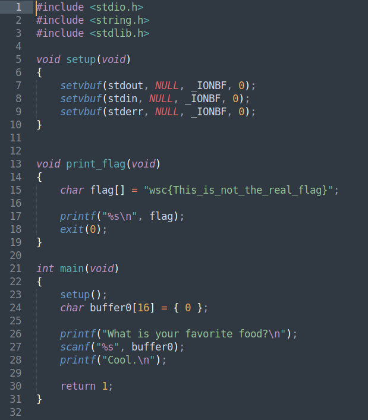
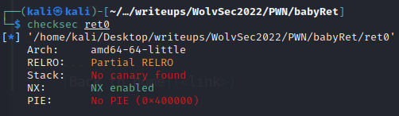
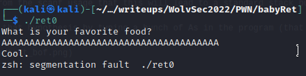
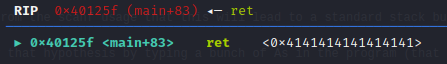
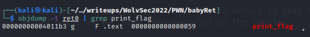
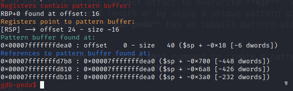
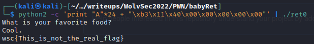
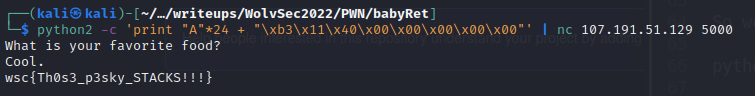
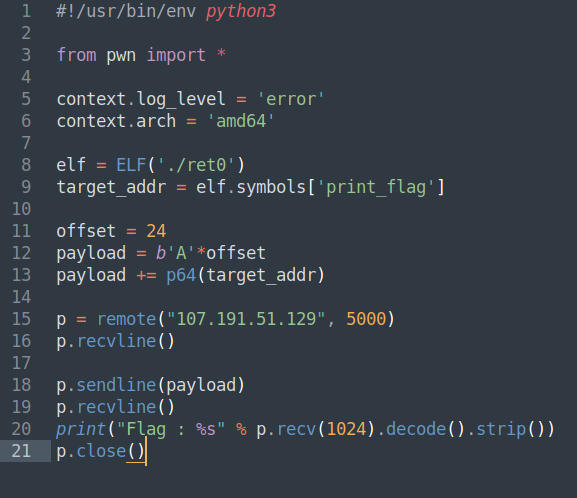
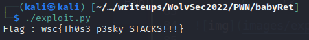

## Challenge Name: babyRet
Category: PWN
Points: 244
Solves: 107

Challenge Description: 
As promised a pwn challenge...

Artifact Files:
* [ret0](ret0)
* [ret0.c](ret0.c)

### Observations

The challenge gives us direct access to the source code of the program, so let's take a look at it !

We see that a **print_flag()** function is defined in the program but never used which is pretty peculliar let's say...

Looking at **main()** we can see that a **char[16]** buffer is created on the stack before the program prints *What is your favorite food?* to the user. It then takes input using **scanf("%s", buffer);** to load user input into our buffer.

The important thing to notice here is that there is absolutely no size check for the user input, while our buffer is limited to **16** chars of length. 

This program is an ELF x64 bits and does not seem to have a lot of securities activated as shown here:

So our hypothesis is that any input longer than **16** of length might cause a Stack Buffer Overflow and lead to potential manipulation of **RIP** (instruction pointer).

We can test that out by inputing a bunch of As into our program and see if we get a **SEGFAULT**

And we do ! Let's check in gdb if we can overwrite **RIP** and control the program's execution flow.

Perfect ! Now we just have to manipulate rip to return to that **print_flag()** function which should print us the flag when executed on the remote.

### Exploitation

**1. Command line**

So first of all in order to return to **print_flag()** we need to know it's address. For that we can use *objdump -t ./ret0 | grep print_flag* 

So we know the address of print_flag is 0x00000000004011b3 !

Now we need to find the correct offset to overwrite **RIP**, we can do this just by playing around with the payload length or by using a unique pattern so that we can find the exact offset by calculation. **gdb-peda** has an inbuilt pattern utility tool to help us do such a thing.

We can use the **pattern create 40** command to create a pattern of length 40 which should be enough to overflow our memory in this case.

Pattern : 
*AAA%AAsAABAA$AAnAACAA-AA(AADAA;AA)AAEAAa*

Let's input it in the program and use **pattern search** to get the correct offset

We can see that we have a **24** offset until we reach the desired memory location we want to write to.

So we can build a payload with python as such : 

python2 -c 'print "A"\*24 + "\xb3\x11\x40\x00\x00\x00\x00\x00"' | ./ret0

Let's try it out and see if we get to call the **print_flag()** function !

And it works ! Now we just need to pipe it into the remote host to get the actual flag of the challenge.

And we got our flag : **wsc{Th0s3_p3sky_STACKS!!!}**

**2. Python Script**

Just for good practice I wanted to include a python script to solve this challenge. The method is still the exact same, I just use the pwn.ELF() class from pwntools to load elf symbols and addresses from the binary and build the same payload :)

The *exploit.py* script : 

And we get the same result just with a script and with a much cooler display :O

### Reflections

This is a beginner buffer overflow exploit challenge that's always nice and chill to solve when they're in the competition and teaches a lot to the new comers to the CTF scene, really lovely as usual !

That's it for this WriteUp of **babyRet** from *WolvSec 2022CTF*, I really hoped you enjoyed it since this is my first writeup ever so yeaaaah ! I'll probably try to do the other pwn challenges since I managed to pwn all of them so see ya in the next challenges I suppose :D

---
[Back to home](../README.md)